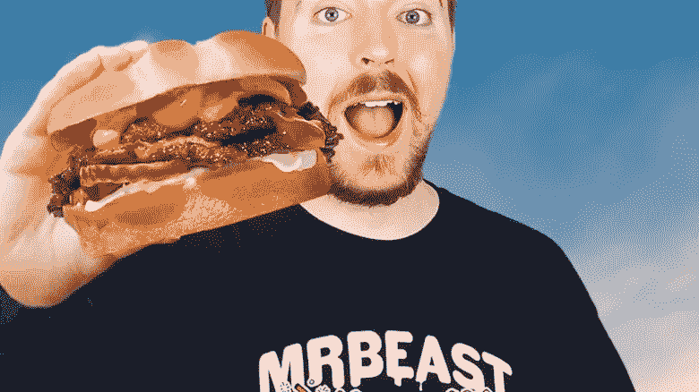
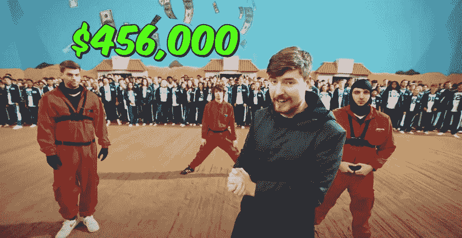
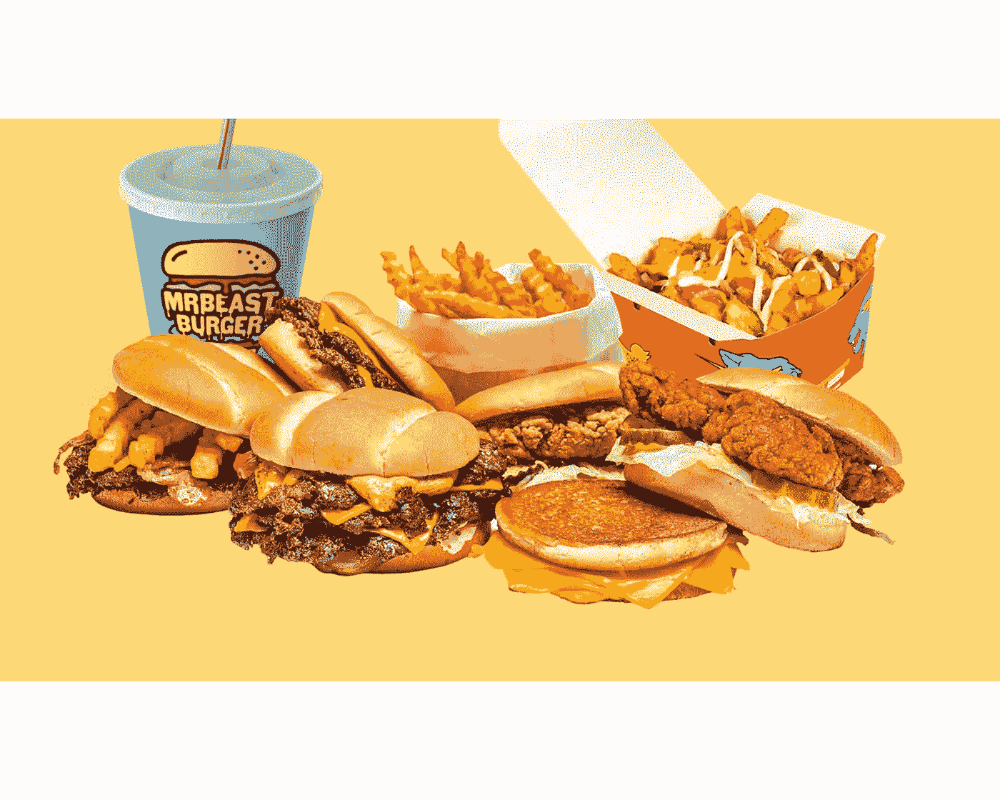

# 那个把他的汉堡店扩大到 1700 个地点却没有店铺的 YouTuber。

> 原文：<https://medium.com/coinmonks/the-youtuber-who-scaled-his-burger-restaurant-to-1-700-locations-and-has-no-store-f1932996535e?source=collection_archive---------35----------------------->

MrBeast is a beast of a content machine and a social media superstar.

MrBeast 是 YouTube 上的明星，因其令人发指的视频和特技而声名鹊起。

他的真名叫吉米·唐纳森，来自堪萨斯州。

他可能认识《绿野仙踪》里的多萝西。

这家伙的一切都很棒。

我们都爱数据，不是吗？

这里有一些你味觉的数据。

他在 Youtube 上有 1.04 亿用户。

他在众多 YouTube 频道上总共拥有 1.84 亿订户。

他在主频道上观看了 17B 次，总共观看了 27B 次。

2021 年，他的收入接近 7500 万美元(在所有 YouTube 创作者中最高)。

他每年仅在内容制作上就花费 6500 万美元。

他最昂贵的视频是花费了他 350 万美元的乌贼游戏娱乐特技

MrBeast Squid Game video was completely out of this world in terms of budget and scale.

奖金为 45.6 万美元现金，有 456 人参加。

***“我只想要钱，这样我才能做出更好的视频，这样我才能壮大我的渠道……我不在乎赚钱，我不在乎时间，我只想做出这个星球上最好的视频。”***

他已经为几个不同的慈善机构和组织筹集了超过 1 亿美元的资金。

2012 年，13 岁的他开始在 YouTube 上发布视频。

哦，他今天刚刚 24 岁，和我大学毕业时一样大。

不同的是，我没有他的人气，也没有他的钱。

但他并没有就此止步。

MrBeast Burger menu is simple, effective and no-frills.

野兽先生像病毒一样有进取心。

他开始经营自己的巧克力棒，现在卖汉堡。

在 Covid 期间，购物中心是一个逐渐消失的现象，因为人们开始习惯于不经常光顾它，随后，购物中心可以提供的大部分东西都可以在网上获得。

需要午餐吗？超级大餐。需要杂货吗？任何主要的连锁杂货店都提供网上送货服务。

难怪购物中心正在消亡。

但是当 MrBeast 在新泽西州的美国梦超级购物中心开了一家汉堡店时，有 10，000 人到场。

是的，野兽汉堡先生是他的最新投资。

它最初是一个虚拟厨房，只提供牛肉和鸡肉汉堡。

“自 2020 年末推出以来，MrBeast Burger 已经开设了超过 1700 家“虚拟”地点”。

MrBeast Burger did a pop-up at a mall and brought in a eye-popping 10,000 people.

女士们先生们，这就是你如何扩展业务。

谁说 F&B 的企业不可扩展？

凭借 MrBeast 的影响力和庞大的受众，他的外卖汉堡已经起飞，并让他迅速在全国各地建立了幽灵厨房。

按照这种速度，超级影响者似乎可以创建自己的品牌，并利用他们的观众与麦当劳和多米诺披萨等传统品牌竞争。

哪个更难实现？

做汉堡还是建立 1 亿粉丝群？

现在我想试试 MrBeast Burger，看看它是否比 In-and-Out 更好。

-

你想尝尝野兽汉堡吗？

-

# startups # business # startupx # growth # success # social media # culture # entrepreneurs # strategy # eth # BTC # crypto # opensea # markets # bear market # NFT # profits # NFT market

> 交易新手？试试[加密交易机器人](/coinmonks/crypto-trading-bot-c2ffce8acb2a)或者[复制交易](/coinmonks/top-10-crypto-copy-trading-platforms-for-beginners-d0c37c7d698c)