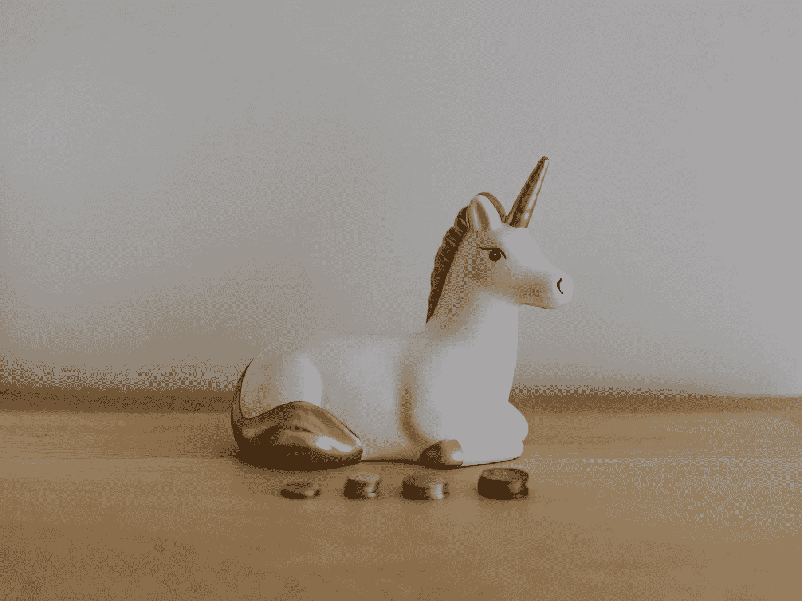

# 只有这么多

> 原文：<https://medium.com/coinmonks/there-is-only-so-many-ebd48c26d248?source=collection_archive---------36----------------------->

> 一只独角兽诞生了

who gets what

**事实(代码):**
21，000，000 个比特币曾经存在过……真的曾经存在过。
到 2140 年，所有比特币都将被开采。
世界上大约有 80 亿人。

**the math(realization):**
如果所有的比特币被平均分配给世界上所有的公民，这是你必须明白的。
2100 万比特币除以 80 亿人等于平均分配的数量，即如果我们一次发给每个人，每个人会得到多少。
等式[21，000，000 / 8，000，000，000 = 0.00262500]
每个人将获得不到**1%的比特币，换句话说，每个公民将获得 262，500 个 satoshis。
再说一遍，再也不会有比特币了。认真考虑一下。
让我们换一种说法，颠倒数学变量。
80 亿人/2100 万比特币= 380 人争夺每一整枚比特币。
我们正在进入另一个“拥有游艇和没有游艇”的新世界，与我们现在所处的世界没有太大的不同，但这个世界有无限量的货币可以分散和分配。**

**结论:**
【你想要比特币..昨天。

把血氧饱和度叠加。

**n̷x̷s**