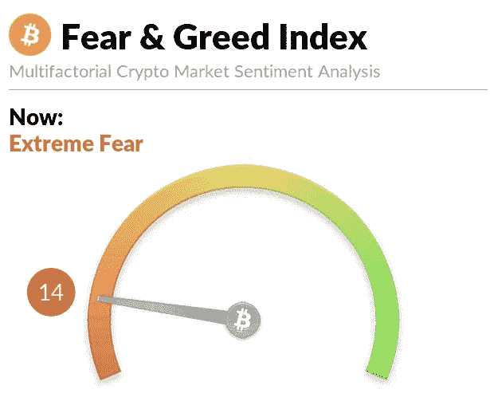

# “恐惧如此之多”:交易者遭遇秘密冬天

> 原文：<https://medium.com/coinmonks/theres-so-much-fear-crypto-winter-descends-on-traders-60958a4df3f6?source=collection_archive---------60----------------------->

Crypto winter and Trading

当加密崩溃开始时，交易者害怕错过买入的机会。但是随着这个隐秘的冬天的到来，对错过的恐惧变成了纯粹的恐惧。

加密货币今年的开局充满挑战，但有一段时间，似乎许多领先的数字资产正在从加密的冬天中崛起，直到一切都急转直下。

# 秘密的冬天:这是什么？

“加密冬天”这个词是由 HBO 的连续剧“权力的游戏”创造出来的。“冬天来了”在电视连续剧中充当了史塔克家的口号。这被解读为维斯特洛随时可能面临持久战的征兆。同样，密码市场可能会经历一段漫长的困难时期。在这个艰难的时期，你必须保持警惕，并为市场突然爆发混乱做好准备。从更直接的意义上来说，“隐性冬天”指的是价格下降并保持低位的时期。

# 是什么引发了隐秘的冬天？

在行业高管所谓的“加密冬天”中，随着价格持续暴跌，人们失去了财富和工作。结果，企业纷纷倒闭，怀疑情绪空前高涨。

仅仅几天后，“稳定币”Terra (UST)在 5 月份发生内爆，抹去了 400 亿美元的投资者资本。Stablecoins 在加密货币行业被宣传为一种安全投资，每枚硬币的价格通常与美元等传统金融资产挂钩。相反，Terra 使用一种算法来维持其价值在 1 美元左右，并用比特币来支撑其部分价值。

类似地，最大的加密货币交易所之一比特币基地在 6 月 14 日声明，该公司将裁员约 18%,并警告称，更大的衰退可能会使该行业的问题更加严重。

此外，一家名为 Celsius Network 的企业，作为加密货币所有者的银行，在 6 月 12 日冻结了其 170 万客户的账户。该公司用客户的资产进行投资、提供贷款和支付利息。更糟糕的是，与传统银行不同，没有联邦保险支持这些客户的存款。

市值最高的两种加密货币比特币(BTC)和以太网(ETH)在 3 月底达到了自 1 月初以来的最高水平。但现在，他们采取了一个急剧的逆转。因此，所有加密货币的市值再次跌破 2 万亿美元，比特币正在试图支撑 21000 美元上方。

> 交易新手？试试[加密交易机器人](/coinmonks/crypto-trading-bot-c2ffce8acb2a)或者[复制交易](/coinmonks/top-10-crypto-copy-trading-platforms-for-beginners-d0c37c7d698c)

结果，秘密情绪被抛到了垃圾堆里。在过去的几个月里，隐秘的恐惧和贪婪指数急剧下降，从三月底的 60 下降到本文写作时的 14。恐惧和贪婪指数已落入“极度恐惧”类别。

当加密崩溃开始时，交易者害怕错过买入的机会。但是随着这个隐秘的冬天的到来，对错过的恐惧变成了纯粹的恐惧。

加密货币今年的开局充满挑战，但有一段时间，似乎许多领先的数字资产正在从加密的冬天中崛起，直到一切都急转直下。

# 秘密的冬天:这是什么？

“加密冬天”这个词是由 HBO 的连续剧“权力的游戏”创造出来的。“冬天来了”在电视连续剧中充当了史塔克家的口号。这被解读为维斯特洛随时可能面临持久战的征兆。同样，密码市场可能会经历一段漫长的困难时期。在这个艰难的时期，你必须保持警惕，并为市场突然爆发混乱做好准备。从更直接的意义上来说，“隐性冬天”指的是价格下降并保持低位的时期。

# 是什么引发了隐秘的冬天？

在行业高管所谓的“加密冬天”中，随着价格持续暴跌，人们失去了财富和工作。结果，企业纷纷倒闭，怀疑情绪空前高涨。

仅仅几天后，“稳定币”Terra (UST)在 5 月份发生内爆，抹去了 400 亿美元的投资者资本。Stablecoins 在加密货币行业被宣传为一种安全投资，每枚硬币的价格通常与美元等传统金融资产相关联。相反，Terra 使用一种算法来维持其价值在 1 美元左右，并用比特币来支撑其部分价值。

类似地，最大的加密货币交易所之一比特币基地在 6 月 14 日声明，该公司将裁员约 18%,并警告称，更大的衰退可能会使该行业的问题更加严重。

此外，一家名为 Celsius Network 的企业，作为加密货币所有者的银行，在 6 月 12 日冻结了其 170 万客户的账户。该公司用客户的资产进行投资、提供贷款和支付利息。更糟糕的是，与传统银行不同，没有联邦保险支持这些客户的存款。

市值最高的两种加密货币比特币(BTC)和以太网(ETH)在 3 月底达到了自 1 月初以来的最高水平。但现在，他们采取了一个急剧的逆转。因此，所有加密货币的市值再次跌破 2 万亿美元，比特币正在试图支撑 21000 美元上方。

结果，隐藏的情绪消失了。过去几个月，秘密恐惧和贪婪指数大幅下降，从 3 月下旬的 60 降至本文撰写之时的 14。恐惧和贪婪指数属于“极度恐惧”类别。

该索引在密码世界中是众所周知的，它产生的读数在 1 到 100 之间。较低的读数显示投资者的紧张和卖家的涌入，而较高的读数反映贪婪已经占据了市场，买家正在大规模移动。

# 去哪里，从这里？

留给密码怀疑论者，他们会看着密码发烧友的脸，告诉他们，“我告诉过你。”但是真正的密码发烧友相信这个密码冬天将在密码春天结束。实心硬币会继续存在，而剩余的将无法存活。

> 加入 Coinmonks [电报频道](https://t.me/coincodecap)和 [Youtube 频道](https://www.youtube.com/c/coinmonks/videos)了解密码交易和投资

# 此外，请阅读

*   [币安 vs FTX](https://coincodecap.com/binance-vs-ftx) | [Best (SOL) Solana 钱包](https://coincodecap.com/solana-wallets)
*   [如何在 Uniswap 上交换密码？](https://coincodecap.com/swap-crypto-on-uniswap) | [A-Ads 审核](https://coincodecap.com/a-ads-review)
*   [密码货币储蓄账户](/coinmonks/cryptocurrency-savings-accounts-be3bc0feffbf) | [同比审查](/coinmonks/yobit-review-175464162c62)
*   [Botsfolio vs nabots vs mud rex](/coinmonks/botsfolio-vs-napbots-vs-mudrex-c81344970c02)|[gate . io Exchange Review](/coinmonks/gate-io-exchange-review-61bf87b7078f)
*   [CoinFLEX 点评](https://coincodecap.com/coinflex-review) | [AEX 交易所点评](https://coincodecap.com/aex-exchange-review) | [UPbit 点评](https://coincodecap.com/upbit-review)