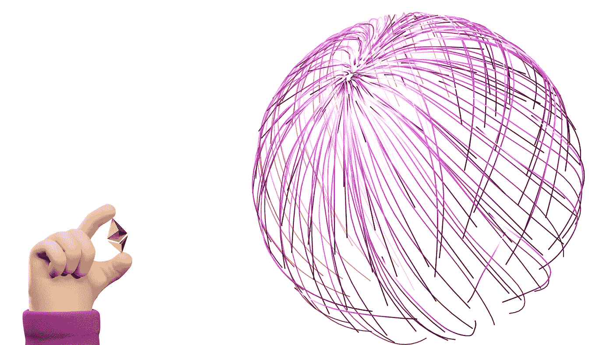
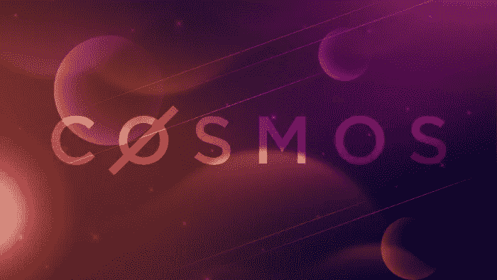

# 区块链不仅仅是以太坊

> 原文：<https://medium.com/coinmonks/theres-so-much-more-to-the-blockchain-than-ethereum-58a649a1ada9?source=collection_archive---------36----------------------->

区块链世界的每个人都明白，以太坊是构建和执行智能合同的最大网络，允许多个项目实现。在市场上第二大加密货币 ETH 的支持下，以太坊引领了区块链的生态系统，它非常受欢迎，甚至其他加密硬币也在它的网络上运行。

同样显而易见的是，引领市场需要成本。以太坊在社区中的流行使得它成为了一个封闭的盒子，因为它的智能合约只能在以太坊的主网上运行。

所有的可扩展性问题，其次是交易成本和碳足迹，导致区块链进入下一个阶段:以太坊 2.0。

令人惊讶的是:正如 DeFi 研究人员指出的那样，使用第 1 层解决方案时，天然气费用预计不会降低。

机会之窗仍然为其他受欢迎的区块链敞开，如 Solana 或 Cardano，这只是其他例子，表明你可以有一个成功的区块链项目，而不是在以太坊上运行。

但是再一次…还有更多…

# 探索宇宙生态系统

展望区块链的未来，重要的是要考虑**多链**和**互操作**。

互操作性一直是开发者面临的挑战。

宇宙生态系统用它自己的咒语解决了这个问题:

## 通过**区块链间通信(IBC)** 协议进行连接，该协议允许独立的区块链相互对话并传输数据和资产。

目标是打破以太坊(Ethereum)等区块链前辈的统治架构，从根本上改变分布式账本技术的孤立性质。

Cosmos 创建了一个模块化的开源 SDK(软件开发工具包)，允许在应用层创建区块链，然后与自己的网络无缝对接。

其他建立在 Cosmos 上的区块链有资格成为中心，并作为网络的独立支柱。

有了 Cosmos，开发者可以创建允许无许可全球贸易的交易所和市场。他们可以创建自治的特定于应用程序的区块链，而不是其他人链上的智能合约。这将用户从高昂的交易费用和网络拥塞中解放出来，并使 DeFi 对所有人开放。

重点:**区块链不仅仅是以太坊。**

将区块链项目带入生活比以往任何时候都更容易。

定义你的计划和路线图是成功的关键，同时记住:你正在解决的问题是什么？

你告诉我...🚀

> 交易新手？试试[加密交易机器人](/coinmonks/crypto-trading-bot-c2ffce8acb2a)或者[复制交易](/coinmonks/top-10-crypto-copy-trading-platforms-for-beginners-d0c37c7d698c)