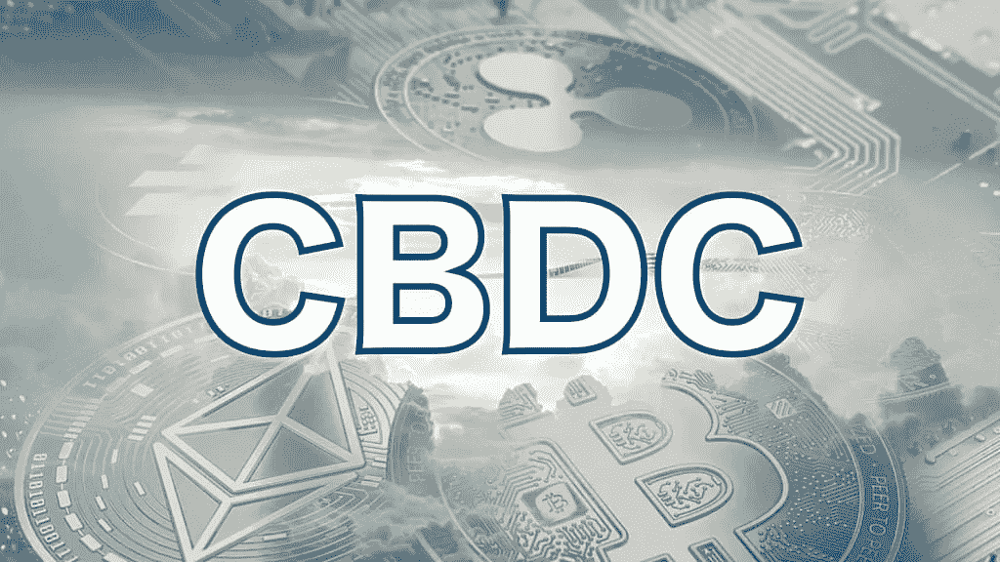
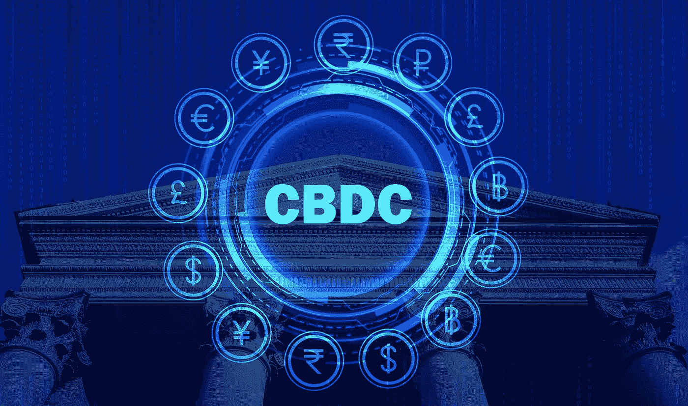
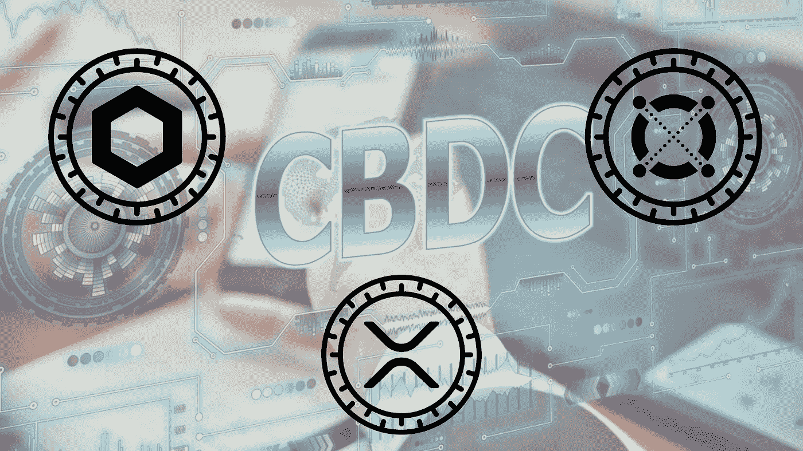

# 这 3 个密码可能会随着 CBDC 的采用而爆炸！

> 原文：<https://medium.com/coinmonks/these-3-cryptos-might-explode-with-cbdc-adoption-25d28839240?source=collection_archive---------3----------------------->

Cryptocurrencies are taking away dominance from central banks. Their response: CBDCs

随着近年来**加密货币**的受欢迎程度的迅速上升，**中央银行**和**政府**已经开始担心失去他们在经济中的份额。尽管央行失去了对货币供应的控制，但随着加密货币的大规模采用，政府也失去了收入。

加密货币无疑已经成为传统金融的巨大威胁——这就是为什么政府急切地试图找到一种方法来领先于加密！

他们的解决方案: **CBDCs**

# **什么是 CBDCs？**

Over 80% of central banks around the world are developing their own Central Bank Digital Currency

**CBDC** 是**央行数字货币**的简称。它基本上是一种数字法定货币，由一个国家的中央银行控制(就像美国的美联储或欧洲的欧洲央行)。CBDC 就像加密货币一样存在于区块链上。

> **区块链**是一个**共享数据库**，如果没有作为该数据库一部分的区块链参与者的一致同意，不能对其进行修改。

由于所有的银行都有自己的数据库，这通常会导致国家、银行和个人之间交易的低效率和高成本。一个 **CBDC** 旨在**通过将所有信息存储在一个公共数据库上来解决这些低效率**——这将是一个 **CBDC 区块链**。

> 全球超过 80%的中央银行正在发展中央银行

与**加密货币**的**区块链**由**人**/参与者**控制**不同， **CBDC 区块链**仅由一个代理人控制，即**中央银行**。这意味着尽管加密区块链不能被任何单一实体修改，但中央银行可以完全修改 CBDCs。

# **CBDCs 对 Crypto 的影响？**

The coexistence between CBDCs and Cryptocurrencies is a controversial topic with plenty of interest conflicts

**cbdc**对于**加密货币**来说**是好是坏**是个难题，只能通过假设来回答；

一方面，如上所述，中央银行必须为他们的中央银行选择区块链。由于加密货币行业已经有了运行良好的区块链，中央银行很可能**与加密项目**合作开发他们的 CBDC。这种采用可能会产生帮助中央银行的加密项目的基础加密货币。

另一方面， **CBDCs** 将**与去中心化的加密货币**直接竞争，比如比特币和许多其他 DeFi 项目。为了赢得与加密的竞争，**政府**很可能**禁止**或**限制**分散的加密货币。然而，由于 crypto 的**高**创新**以及 crypto 区块链需要托管政府的 cbdc，cbdc 不太可能**杀死 crypto** 。**

# **哪些加密货币将从 CBDC 发展中受益最大？**

3 cryptocurrencies are very likely to help governments and central banks with the creation of CBDCs

## 1.阿尔格兰德(ALGO)

美国最近匆忙采用数字美元，以保持与中国及其成功推出的数字元的竞争力。有一些证据表明美国将会与阿尔格兰德公司合作。Algorand 是由著名的计算机科学家和麻省理工学院教授**希尔维奥·米卡利**创建的，而**麻省理工学院**恰好是美联储合作开发其 CBDC 技术的大学。

此外，Algorand 发布了一份关于发行 CBDC 的 50 页报告，这进一步表明了他们致力于成为为美国中央银行开发 CBDC 的领先加密公司。

## 2.链环(link)

如果不同国家的中央银行采用 CBDC 作为他们的货币，他们需要以某种方式合作，以使交易顺利进行，成本低廉。这就是**链节**发挥作用的地方。

Chainlink 的目的是向**加密货币区块链**提供**真实世界的数据**，并且已经成为这个领域无可争议的领导者。凭借其在向区块链传输链外数据方面的领先地位，许多人猜测**跨境 CBDC 支付**(从一家央行向另一家央行的支付)将在 **Chainlink 的神谕**的帮助下发生。

## 3.涟漪(XRP)

**世界经济论坛**将 Ripple 的本币 **$XRP** 评为 CBDC 空间最相关的加密货币。Ripple Labs 认为 XRP 比其他任何数字资产都更快、更便宜、更具扩展性(每秒处理更多事务)。

2020 年 12 月， **SEC** (证券交易委员会)对 Ripple Labs(XRP 背后的公司)提起**诉讼，指控 Ripple 的创始人销售未注册证券。诉讼结果的日期还不太明朗，这给 XRP 带来了很大的下行压力。**

如果 Ripple Labs **赢得诉讼**，它可能会在开发 CBDCs 中发挥重要作用，因为它们具有**优越的区块链特性**(高度可扩展、廉价、快速)

👋业务请求: [**电报:联系@cryptohubtiktok**](https://t.me/cryptohubtiktok)

💰欢迎 [**关注我们**](/@officialcryptohub0) 获取更多此类分析

🐦也可以查看我们的 [**推特账号**](https://twitter.com/CryptoHub210?s=20&t=ts3bUBYtX7g0s5_ClYnL_A) 获取更简短的分析

🤑加入我们的 [**电报频道**](https://t.me/officialcryptohub) 与志同道合者互动

🤩成为 [**中型会员**](/@officialcryptohub0/membership) 并使用 [**此链接**](/@officialcryptohub0/membership) 阅读数千位作家的无限文章

> 交易新手？尝试[加密交易机器人](/coinmonks/crypto-trading-bot-c2ffce8acb2a)或[复制交易](/coinmonks/top-10-crypto-copy-trading-platforms-for-beginners-d0c37c7d698c)