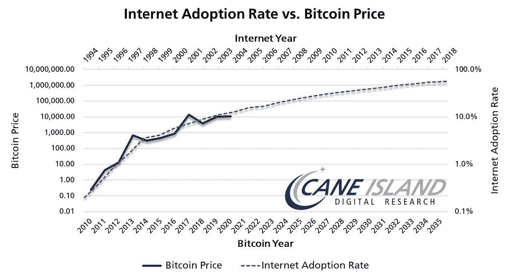
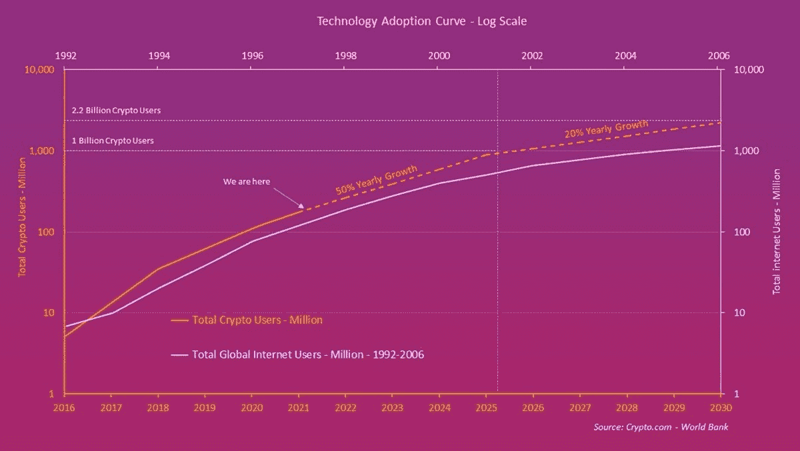
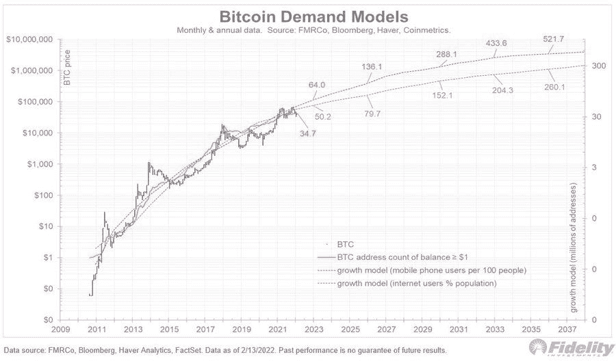
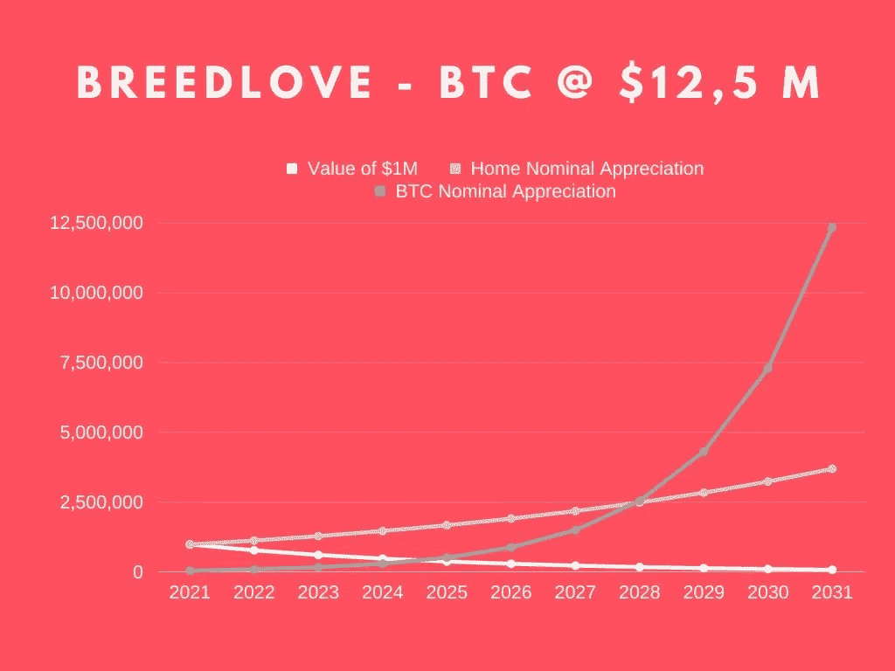
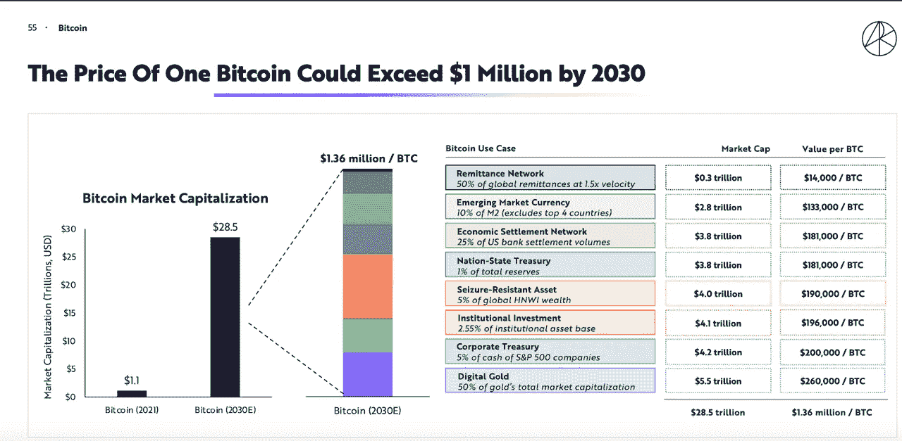
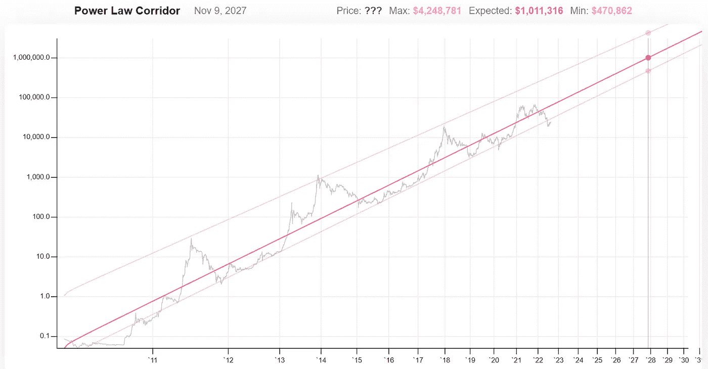

# 这 5 个模型认为，到 2030 年，比特币的价值将超过 100 万美元

> 原文：<https://medium.com/coinmonks/these-5-models-see-bitcoin-at-over-1-million-by-2030-8a94f029fe27?source=collection_archive---------1----------------------->

让我们做点梦吧。

在这篇文章中，我将向你介绍 5 种模型和理论，它们认为比特币在 2030 年将达到 100 万美元或更高。没有疯狂的理论，但坚实的，数学上合理的计算——到目前为止——还没有被反驳。

让我们直接跳进来吧！

## 1.互联网普及率与比特币

技术采用率遵循 S 曲线，这意味着最初的增长很快，直到达到饱和时才趋于平稳。凯恩岛比较了全球互联网普及率和比特币的价格，发现后者紧随前者。根据下面的图表，BTC 将在 2030 年左右达到 100 万美元。

为了更好地理解，我添加了另一个图表。它比较了互联网用户和比特币用户的增长曲线。事情似乎步入正轨了！

这是富达全球宏观总监尤丽恩·蒂莫尔的另一张图表。他根据手机订阅量在 S 曲线上绘制了持有超过 1 美元的比特币地址。它表明了比特币类似的整体长期增长路径，根据该路径，BTC 价格到 2030 年应达到 100 万美元。

## 2.罗伯特·布里德洛夫价值 1250 万美元的 BTC 模型

美国数字资产投资公司 Parallax Digital 的首席执行官罗伯特·布里德洛夫(Robert Breedlove)认为，到 2031 年，恶性通货膨胀将推动比特币的价值达到 1250 万美元。他的计算是基于 M2 货币供应的扩张和由此导致的美元购买力的损失。顺便说一下，他的模型预测比特币价格将在 2022 年达到 10 万美元。

Robert Breedlove’s case for $12,5 million BTC by 2031.

## 3.格雷格·福斯的 BTC 债券分配模型

前基金经理格雷格·福斯(Greg Foss)认为，比特币将取代一部分债券配置。他认为比特币在规模达 900 万亿美元的全球债券市场中占 5%。这意味着，比特币配置将达到 45 万亿美元，考虑到当今全球债券市场有 20-30 万亿美元的负收益率，这并非不可能。据 Greg Foss 称，这将使 BTC 的价格达到 200 万美元左右。

## 4.ARK Invest 的比特币价值 100 万美元理论

该公司认为，到 2030 年，许多原因将推动 BTC 价格超过 100 万美元，如下图所示。

除其他外，ARK invest 认为，未来几年很有可能会有更多国家将比特币作为法定货币，部分国际银行结算将使用 BTC 完成。

## 5.比特币的幂律走廊

比特币的幂律走廊(Power Law Corridor)是比特币自诞生以来价格不断上涨的通道，当时是以平方根时间尺度上的对数价格绘制的。如果该模型成立，比特币将在 2027 年末达到 100 万美元。

你知道我应该添加到这个列表中的其他模型吗？请在评论中告诉我！

*免责声明:本文无意作为投资建议。这只是为了教育和娱乐的目的。*

> 交易新手？试试[加密交易机器人](/coinmonks/crypto-trading-bot-c2ffce8acb2a)或者[复制交易](/coinmonks/top-10-crypto-copy-trading-platforms-for-beginners-d0c37c7d698c)