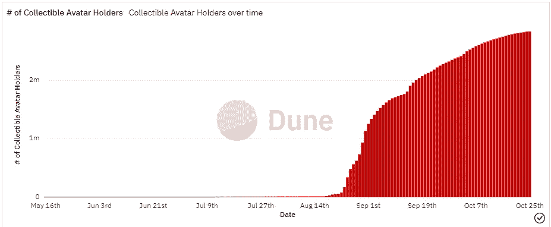
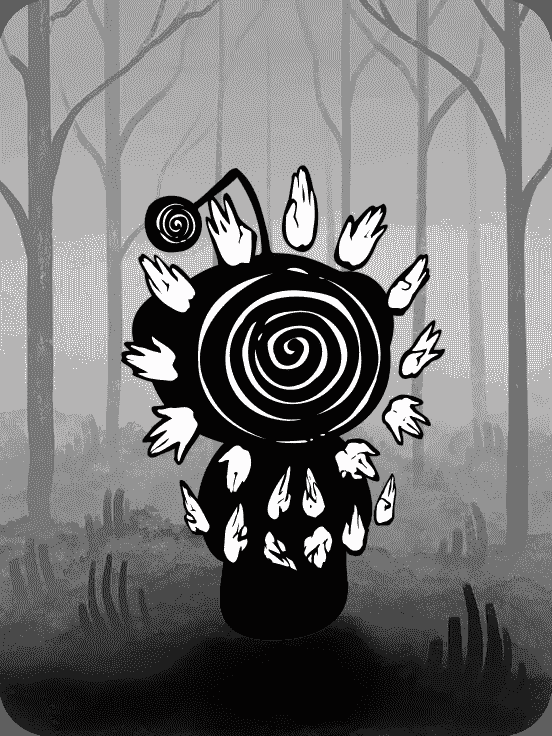
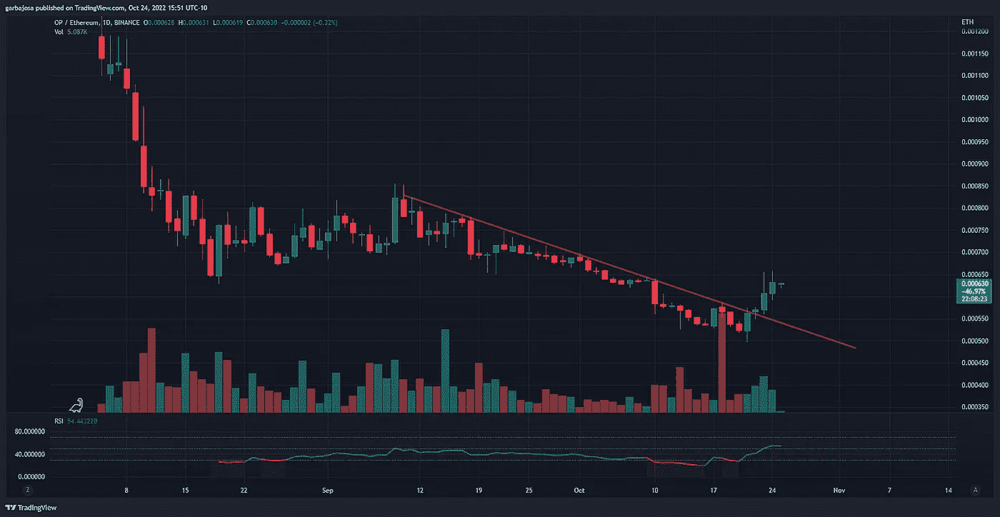
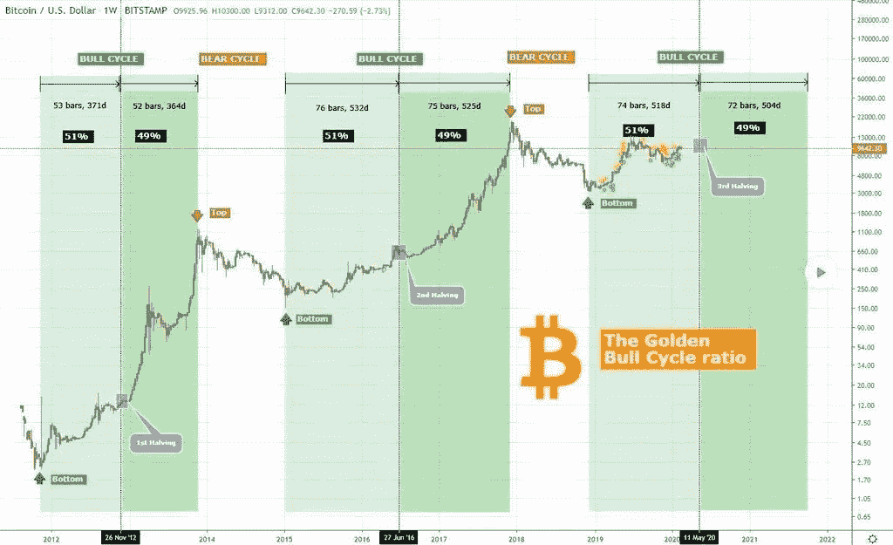

# 这些是有史以来最热的 NFT！

> 原文：<https://medium.com/coinmonks/these-are-the-hottest-nfts-ever-4e3da02106e5?source=collection_archive---------46----------------------->

## 每日征服#110

最好的每日新闻、见解和阿尔法信息来源。

**概述**

*   NFTs 冲击主流:Reddit 数字头像热。
*   这种 L2 代币的表现开始超过瑞士联邦理工学院。
*   FTX 将补偿被骗的 3 个手机用户。
*   苹果更新 NFT 应用条款。看涨还是看跌？
*   声称熊市接近尾声的比特币周期图。

早上好，家人，

**世界上最受欢迎的社交媒体应用之一 Reddit 上出现了 NFT 热**。

尽管如此，Reddit 还是偷偷摸摸地将这些资产命名为“数字化身”，自 8 月以来，已有 280 万用户在社交媒体网站上声称或购买了一个。化身是建立在多边形网络上的 NFT。

来源:[沙丘分析](https://dune.com/polygon_analytics/reddit-collectible-avatars)

Reddit 引入该项目是为了增强艺术家的能力，自引入以来，他们已经净赚了 60 多万美元，但一个很好的副作用是让 280 万人加入了加密钱包和 NFT。值得注意的是，许多 Reddit 用户仍然不知道头像涉及区块链技术。

Reddit 拥有 3.3 亿活跃用户。总销售额和销售额分别达到了 22，229 和 600 万美元。

*感官“* [*手#19*](https://opensea.io/assets/matic/0x8d0501d85becda92b89e56177ddfcea5fc1f0af2/18) *”出售给 11 ETH*

# 市场更新🌍

**BTC/USDT 4H**

BTC 努力保持周末的涨幅，并继续被打压到 19k 美元的支持。4 小时图显示价格拒绝了 8 月 14 日开始的本地趋势阻力(红色)。BTC 收盘下跌 1.23%，至 19，329 美元。

*高分辨率* [***图表***](https://www.tradingview.com/x/IGsohwn0/)

**OP/ETH 1D**

在 Arbitrum 和乐观主义的成功宣传之后，以太坊二层(L2s)很快成为加密领域最热门的故事，这对组合在本月的 TVL 排名中超过了 Solana。自乐观主义的象征性释放以来，乙醚(ETH)的表现超过了 OP，但潮流可能正在转向。OP/ETH 日线图显示了一个趋势反转，在过去的五天里，OP 在 ETH 上涨了+20%。观察持续上升趋势开始发展，以确认看涨倾向。

*高分辨率* [***图表***](https://www.tradingview.com/x/kJJvYP3x/)

# 新闻观察📰

**FTX 补偿 3 名手机网络钓鱼受害者。**FTX 加密交易所已经[同意](https://twitter.com/SBF_FTX/status/1584304078976614400?s=20&t=qsEsKZakXb3CanXrVqLF6A)向那些受到涉及假冒 3Commas 网站的网络钓鱼诈骗影响的人进行赔偿。3Commas 是一个通过 API 与 FTX 链接的机器人交易网站。此外，FTX 首席执行官 Sam Bankman-Fried 表示，网络钓鱼欺诈报销是一次性的事情。FTX 将向三名受影响的人支付约 600 万美元。

**新闻花絮:**

*   出于对元宇宙的担忧，美国银行将 Meta 评级下调至中性。
*   罗宾汉列出了 AAVE 和 XTZ 的代币。
*   比特币基地仍然对 ATOM 令牌升级保持警惕。
*   传言 Twitter 正在为用户创造加密钱包。
*   凯西·伍德[以 250 美元的价格购买了](https://twitter.com/Blockworks_/status/1584520935419191296?s=20&t=qsEsKZakXb3CanXrVqLF6A)10 万美元的比特币。

**NFT &元宇宙更新🐵**

*   **苹果澄清 NFT 应用商店规则。**苹果将[允许](https://appleinsider.com/articles/22/10/24/apple-has-new-app-store-rules-for-nfts-and-cryptocurrency)用户购买、制造和转让应用程序内的非功能性技术，但须支付 30%的应用程序商店费用。然而，该公司引起了争议，因为它在条款中指出“应用程序可能允许用户查看他们的 NFT，前提是 NFT 所有权不会解锁应用程序内的特性或功能”。
*   新加坡高等法院在第一份关于 NFT 案件的书面裁决中指出，非关税壁垒是财产。

# 我的五分钱…

**金牛周期比。**

你听说过比特币的 4 年周期。金牛周期怎么样？

金牛周期跟踪过去熊市底部和牛市顶部之间的时间，试图猜测熊市/牛市周期何时开始和结束。

在金牛周期比率中，比特币减半在一个牛市周期的中间下跌。

根据 James Bull 在 Twitter 上提供的图表，熊市平均持续 12.5 个月。有趣的是，我们目前已经进入熊市 11 个月了。你认为美联储会在未来 1.5 个月转向吗？

***来源:*** [***推特，詹姆斯公牛***](https://twitter.com/MariusCrypt0/status/1584047098185781248?s=20&t=CCHhCLqRKMeE1Rhp6ucSww)

***Gabi***

*关注我的* [*推特*](https://twitter.com/web3_gabri) *每日更新！*

> 交易新手？尝试[加密交易机器人](/coinmonks/crypto-trading-bot-c2ffce8acb2a)或[复制交易](/coinmonks/top-10-crypto-copy-trading-platforms-for-beginners-d0c37c7d698c)