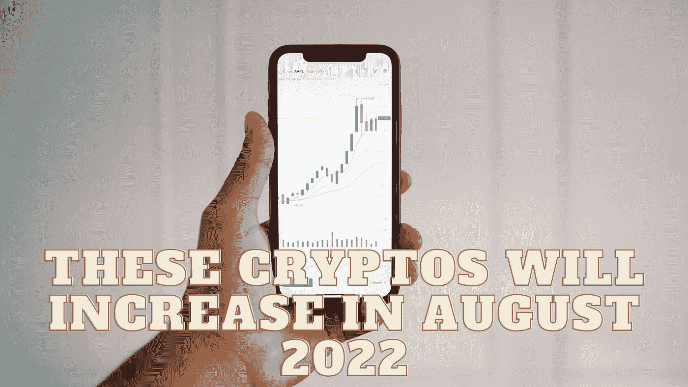

# 这些密码将在 2022 年 8 月增加

> 原文：<https://medium.com/coinmonks/these-cryptos-will-increase-in-august-2022-b385ad4c2e4?source=collection_archive---------20----------------------->

Source photo Unsplash.com

# 茄属植物

根据市场预测，在经历了一年的惊人价格上涨后，SOL 将在 2022 年迎来更大的上涨。Solana 使用一种新颖的历史证明(PoH)方法来加速区块链，同时仍然保持其安全性和分散性，这是对比特币 PoW 过程的一种改进。这种方法允许索拉纳与以太坊竞争，处理超过…