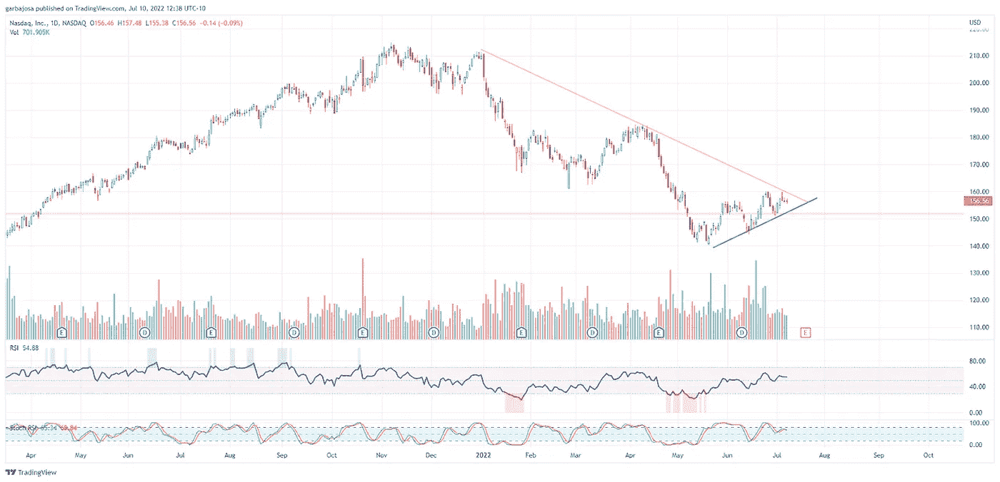

# 这些协议展示了熊市期间的疯狂增长。

> 原文：<https://medium.com/coinmonks/these-protocols-are-showcasing-insane-growth-during-the-bear-market-ac463e8a313e?source=collection_archive---------22----------------------->

## 加密每日混合器 7.10.22

问题#035

*快速发展的加密市场每日回顾*

Photo by [Ashkan Forouzani](https://unsplash.com/@ashkfor121?utm_source=medium&utm_medium=referral) on [Unsplash](https://unsplash.com?utm_source=medium&utm_medium=referral)

**概述**

*   熊市中疯狂的 L2 增长
*   这一次 BTC 能支撑住吗？
*   14.2 万 BTC 将在市场上倾销！
*   即将到来的黑天鹅事件？

# **熊市中疯狂的 L2 增长。**

早上好，家人，

我一直关注的一个加密领域是新兴的第二层(L2s)生态系统。L2s 允许以较低的气费使用 ETH，尽管整体市场状况不佳，l2s 仍是增长最快的行业之一。

以 ETH 衡量，主要由 Arbitrum (52%)、乐观(19%)和 dYdX (14.9%)主导的整体行业上月增长了 11%，目前包含 310 万 ETH 价值(约 38 亿美元)。

*来源:*[*L2Beat.com*](https://l2beat.com/)

令人惊讶的是，当月 L2 上的单个协议的 TVL 增长百分比很高。例如，在 Arbitrum 生态系统中，许多主要协议在过去 30 天内增长了 100–1000 个百分点。值得注意的是，Arbitrum 上的 Uniswap (UNI)的流入百分比为 10，000%，尽管它仅占 5，200 万美元。尽管如此，它显示出人们对 L2s 交易的兴趣越来越大，这可能会节省汽油费。此外，桥接协议是 L2 迁移的主要受益者之一，包括多链(+657%)、星门(272%)和突触(+638%)。

*来源:*[*DeFILlama.com*](https://defillama.com/chain/Arbitrum)

尽管与其母链以太坊(ETH)相比仍然微不足道，但毫无疑问，在 L2s 的早期阶段，人们的兴趣和活动有所增加，这提供了以太坊网络的安全性、更低的油费和更高的交易速度。

# 市场更新🌍

**BTC/美元**

比特币打破了上周末在 4H 图上形成的上升趋势，并试图测试之前在 20k 附近的支撑。最好的情况是 BTC 继续创造更低的高点，巩固从 6 月 18 日开始的上升趋势(绿线)。本周的几个重大经济事件可能会对 BTC 和整个加密技术的发展方向产生重大影响。周一，美国东部时间上午 11 点，将公布 3 年期通胀预期，周三，美国东部时间上午 830 点将公布核心 CPI。

*高分辨率* [*图表*](https://www.tradingview.com/x/b9wqYKp3/)

**NDAQ/美元**

我正在仔细研究的另一张图表是纳斯达克(Nasdaq)ETF。BTC 和 NDAQ 在过去几个月里一直密切相关，NDAQ 即将测试日线图上始于 2022 年 1 月(红色)的显著下降趋势。打破这一趋势有助于确认市场参与者略微转向风险资产，最终有利于 BTC 和 crypto。

*高清*[图表 ](https://www.tradingview.com/x/s4ef0l5a/)

如果你喜欢这份报告，并且认为它值 20 分(0.01 美分)，请点击下面的按钮来支持我的写作。(最多 50 次！)谢谢！

***免费成为*** [***订阅***](https://tradergabi.substack.com/subscribe) ***的第一个收到每日快讯的人！***

> 交易新手？尝试[加密交易机器人](/coinmonks/crypto-trading-bot-c2ffce8acb2a)或[复制交易](/coinmonks/top-10-crypto-copy-trading-platforms-for-beginners-d0c37c7d698c)

# 新闻观察📰

**比特币黑天鹅事件？Mt. Gox 交易所希望从 8 月份开始偿还其债权人，这可能会导致 14.2 万比特币进入市场。这场诉讼耗时 7 年，可能会威胁到比特币的价格，因为许多投资者可能急于退出他们的头寸。**

Celsius 雇佣新律师。四面楚歌的加密贷款平台 Celsius[增加了来自柯克兰&埃利斯 LLP](https://twitter.com/AndrewScurria/status/1546184168777961472?s=20&t=4EZqQfCUXAdl_i8AbDvE6A)的法律顾问，作为其重组重点的一部分。值得注意的是，这家律师事务所代表了最近宣布破产的加密交易所 Voyager。

**CoinFLEX 进入仲裁**。CoinFLEX 已在香港法院对 Roger Ver 提起仲裁，试图挽回 8400 万美元的损失，以应对其流动性危机。罗杰否认他欠公司任何东西。

**新闻花絮:**

*   vault exchange[丢失](https://cointelegraph.com/news/keys-lost-in-the-vauld-singapore-crypto-exchange-freezes-withdrawals)密钥，并停止提取密码。

**在协议层⛓**

**迁移成多边形**。在 Terra 生态系统崩溃后，超过 50 个项目已经[迁移](https://decrypt.co/104803/opening-our-arms-polygon-ceo-ryan-wyatt-on-rescuing-terra-projects)到 Polygon 作为他们的新家。

**协议级花絮:**

*   以太坊 2.0 合约中存放的总 ETH 现在[已经超过](https://twitter.com/glassnode/status/1545793611194896392?s=20&t=4EZqQfCUXAdl_i8AbDvE6A) 13m。
*   比特币[增加第六个核心开发者](https://twitter.com/WuBlockchain/status/1545458483088494593?s=20&t=4EZqQfCUXAdl_i8AbDvE6A)。
*   阿兹特克网络:网上隐私指南。
*   Bancor [更新](https://blog.bancor.network/bancor-update-week-of-july-4-2022-ced02556b104)

**NFT &元宇宙更新🐵**

*   来自古西 x 超稀有实验室的第二个 NFT [掉落](https://fadmagazine.com/2022/07/08/the-2nd-nft-drop-from-the-gucci-x-superrare-collab-is-live/)现场直播。
*   约翰尼·德普从 NFT 捐赠了 80 万美元给艾梅柏·希尔德。

**作家笔下的花**

8 月 14.2 万 BTC 入市会不会制造黑天鹅事件？

如果我不得不做出一个有根据的猜测，这是不太可能的。黑色事件的本质是没有人看到它们的到来。然而，意外事件可能会对市场产生影响。此外，比特币的日交易量约为 400 亿美元，多 30 亿美元不太可能大幅改变价格。谁知道呢，也许大多数 Mt. Gox 的债权人都想保住他们的 BTC。如果你问我的话，这只是另一个标题。

# ***加布里***

***免费通过*** [***订阅***](https://tradergabi.substack.com/subscribe) ***抢先获得每日快讯！***

出版商、作家和图表作者表达的所有观点都不应被理解为财务建议，也不一定反映秘密玩笑的观点。出版商、作家和图表制作者可能持有所讨论的代币和资产的头寸。鼓励读者自己做研究。