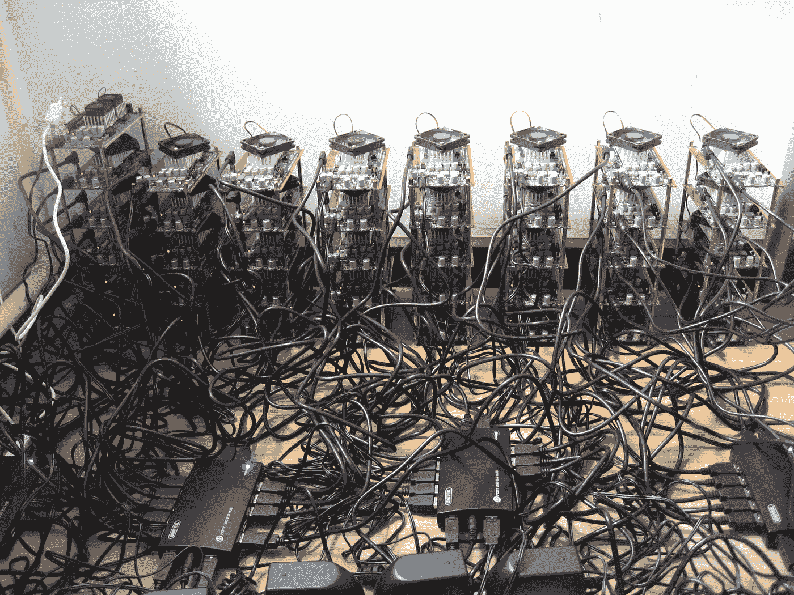
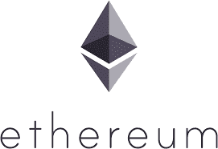
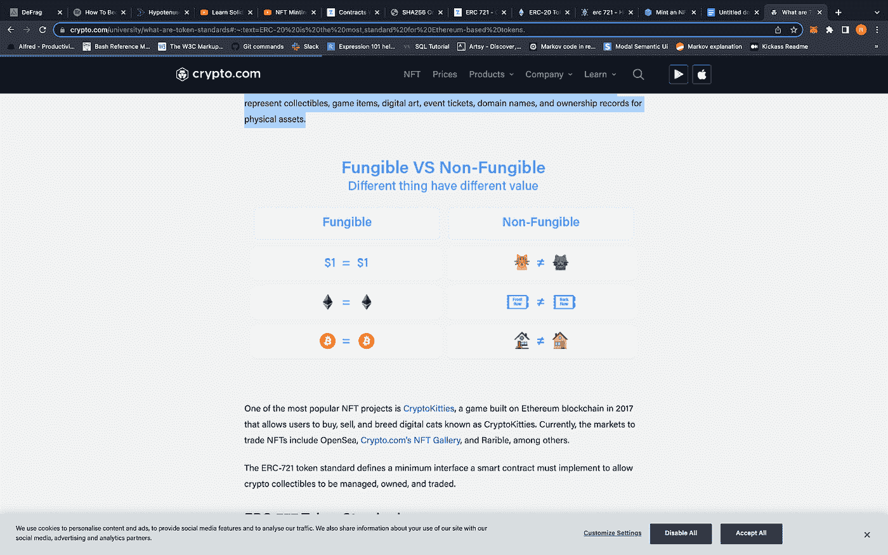
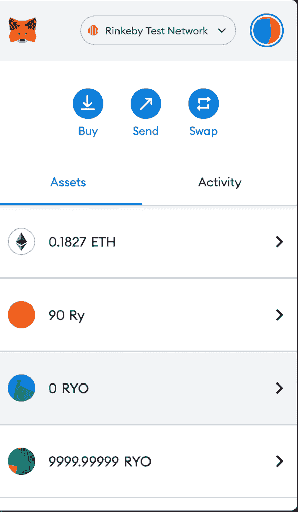
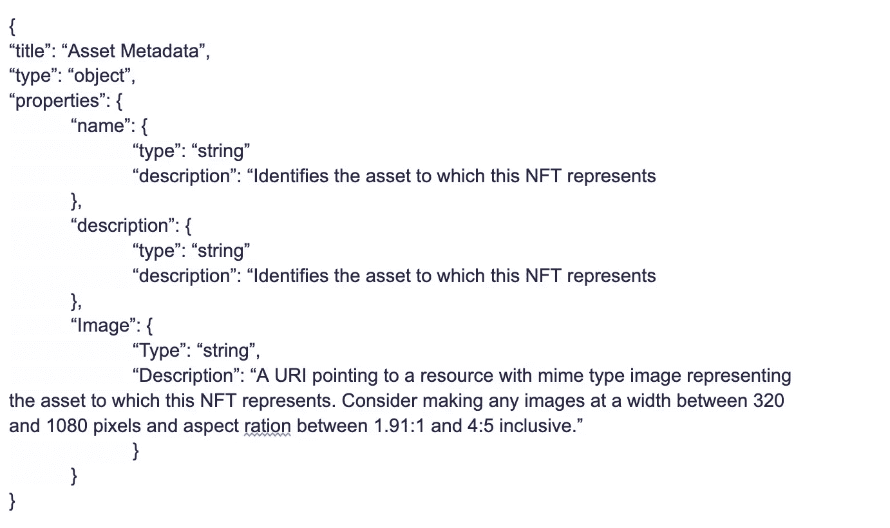

# 我希望 8 个月前就知道的事情…

> 原文：<https://medium.com/coinmonks/things-i-wish-i-knew-8-months-ago-7928cfa0fa9b?source=collection_archive---------24----------------------->

这是对区块链、web3、以太坊和 NFTs 世界的好奇者的基本指南。我将深入一些技术细节，但这主要是作为进入这个世界的门户，回答谷歌无法为你翻译的难以表述的问题。

什么是区块链？

当你听到区块链这个词的时候，想想公共分类账。它跟踪网络中的所有交易。比特币区块链由一个计算机(节点)网络保护，这些计算机(节点)受到经济激励(通过一个称为挖掘的过程)来验证网络上的交易。每个节点都有一份完整的区块链(公共账本)——记录了每一笔比特币交易——一直追溯到比特币诞生之初。截至今天，公共分类账包含超过 3000 万笔交易，需要 13 GB 的磁盘空间。一个完整的节点基本上是一个电子簿记员，世界上任何人都可以建立和运行一个(即任何运行节点的人都是矿工)。通过能源密集型流程(采矿)来确保网络的安全性，这些流程通过奖励矿工比特币来验证交易，从而在经济上激励矿工，从而确保网络运行和安全。由于采矿所需的能源密集型过程和良好行为产生的财务激励，区块链被破坏的可能性极小(需要超过 50%的节点是恶意的并协调攻击(在现实世界中进行协调极具挑战性)。

Bitcoin Mining rigs i.e. enormous energy consumption and expensive specialized hardware

但是比特币是什么？什么是比特币？它看起来像什么？用编码术语来说是对象吗？还是一串？还是一个数字？

比特币的价值是这样的:

1,02930291

*比特币是数字而非实体，即一个数字。它有 8 个小数位。当你拥有比特币时，这意味着你拥有访问分类账中特定比特币地址记录的权利，并从该地址向不同的地址发送资金。该值存储在联机或脱机钱包地址中，如下所示:3j 98 t1 wpez 73 nmqvlecrnylwrnqrhwnly

比特币只打算成为价值储存手段和交易媒介。重要的一点是，比特币可以被占有、转移，不可能被复制。

与比特币(BTC)不同，以太坊(ETH)不仅仅是一种交易媒介或价值储存手段。相反，以太坊是一个基于区块链技术的分散式计算网络。用加密者自己的话说，以太坊是“一个全球性的、分散的货币和新型应用平台”，在以太坊区块链上运行着数以千计的游戏和金融应用。这种加密货币(ETH)非常受欢迎，甚至其他加密硬币也在它的网络上运行。以太坊的原生货币是 ETHER (ETH)，可以用来支付区块奖励(挖矿)，支付交易费用(燃气)，可以在账户之间转账。天然气是一种计算单位，天然气价格决定了每单位天然气需要多少 ETH 才能使网络验证交易(交易会改变区块链的状态)。汽油价格取决于网络活动和拥堵情况，因此如果您的交易对时间不敏感，如果您愿意等待更长时间来验证交易，您可以支付更低的汽油费用。

好酷。很多但容易消化。但是 ERC20 和 ERC721 到底有什么区别呢？还有哪个是比特币？哪个是以太坊？

比特币和以太坊不是 ERC20 或 ERC721 代币。

ERC-20(以太坊评论请求 20)是一个令牌标准，它为智能合约中的令牌实现了一个 API。智能合约只是存储在区块链上的程序，在满足预定条件时运行。ERC-20 代币的示例功能包括:将代币从一个账户转移到另一个账户，获得账户的当前代币余额，获得网络上可用代币的总供应量，以及批准第三方账户是否可以花费账户的代币量。ERC-20 令牌标准由特定的函数和事件(https://ether eum . org/en/developers/docs/standards/tokens/ERC-20/)组成，允许开发人员构建与其他产品和服务互操作的令牌应用程序。

ERC-20 是一个可替换的令牌标准，这意味着每个单独的令牌(或分数)与下一个是等价的，无法区分。美元是可以互换的:1 美元= 1 美元，1 美元= 100 美分。这永远是真的。比特币和以太坊是可替代的加密货币，但它们不是 ERC-20 代币。

ERC-20 (fungible) vs. ERC-721 (non-fungible)

令牌没有固有值。当我说 0 的时候，我的意思是零，零，零，什么都没有。我可以凭空做一个信物。我上周做了这个，实际上我做了三个不同的令牌(见下图)。代币价值来源于它的效用。我能用它做什么？以太有价值，因为它允许我在 EVM 更新状态，即在网络上进行交易。以太是使网络运行的气体。例如，chain LINK([https://chain.link/](https://chain.link/))拥有一个 ERC-20 令牌链，截至 2022 年 7 月 28 日，其价值为 7.11 美元。LINK 之所以有价值，是因为它是运行 Chainlink 的 gas，chain LINK 是一个去中心化的 oracle 网络。

分散式 oracle 是一组向区块链提供数据的独立区块链 Oracle。分散式 oracle 网络中的每个独立节点或 oracle 独立地从链外源检索数据，并将其带到链上。数据被聚合，因此系统可以得出该数据点的确定值。如果该数据的准确性存在不确定性，那么人的因素就会发挥作用，并且该人在经济上不愿意提供不准确的数据。

展示 oracles 效用的一个简单例子是，如果我开发了一个下注 dapp(去中心化应用程序),你和我就一场棒球比赛的结果互相下注。我们都签了一份聪明的合同，当游戏结束时，谁赢谁就能得到钱，对吗？不对！如果没有 oracles，像这样的赌博应用程序将需要获得经过验证的数据(谁赢了？)从一个来源？或者可以汇总几个来源来更加确定？智能合约持有和分配大量资金，因此确保数据正确和正确的人获得报酬至关重要。通过金融激励和惩罚，甲骨文为智能合约和以太坊区块链提供了可验证的现实世界数据，因此，在体育比赛中下注的两个人可以确定，当比赛结束时，正确的人将获得报酬。链接气体，链接，这是一个 ERC-20 代币有价值，因为它是你用来支付神谕以验证数据是否准确的货币。我的 ERC-20 代币(Ry 和 RYO)没有价值，因为它们没有效用，也就是说，你不能用它们买任何东西，因为我没有为它们建立任何网络(我只是铸造了硬币)。另一方面，如果我构建了一个复杂的分散式 oracle 网络(技术上具有挑战性),并使用我制作的令牌作为运行该网络的气体，只要人们使用该网络并反过来为这些令牌付费，它们就具有价值。

My worthless ERC-20 tokens fun to create but worthless

ERC 队以 20 比 721 胜 ERC 队

与 ERC-20 可替换令牌标准相反，ERC-721 是一种令牌标准，它定义了以太坊区块链上的不可替换令牌(NFT)。不可替换令牌(NFT)是一种特殊类型的加密令牌:它们不能根据各自的规范相互互换。NFT 具有与众不同的特性，使它们成为代表收藏品、游戏项目、数字艺术、活动门票、域名和实物资产所有权记录的媒介(想想汽车的所有权)。

Six figure NFT from “Bored Ape Yacht Club” collection

**什么样的 NFT 由**构成

定义 NFT 有几个关键特性，与平台无关。

首先，每个令牌都有一个唯一的 id，以区别于所有其他令牌。这与 Ether ETH 之类的可替换令牌形成对比，Ether ETH 是作为附加到帐户或钱包的数量而存在的。没有办法区分两者。因为每个 NFT 都是独一无二的，它们被单独拥有和交易，智能合约跟踪谁拥有什么。

NFT 的另一个关键特性是能够链接到存储在智能合约之外的数据。在智能合约之外存储或处理数据被称为链外*。因为存储在*链上*的数据需要在整个区块链网络中进行处理、验证和复制，所以存储大量数据可能非常昂贵。对于许多 NFT 用例来说，这是一个问题，尤其是代表数字收藏品或艺术品的令牌，存储整个作品可能需要花费相当于数百万美元的成本。*

**

*NFT in code form*

*正如你从上面看到的，当你拥有一件艺术品的 NFT 时，你就拥有了一个标记，这个标记引用了该图像所在的 URI。这就带来了所有权的问题。如果我可以使用任何网络浏览器访问您的 URI，查看您的 NFT，那么您的 NFT 有什么意义？你拥有什么？如果 URI 号沉没了怎么办？你有什么东西吗？NFT 只证明了令牌的所有权，而不是图像的版权。您拥有对某些数据的唯一且不可更改的引用。艺术家可以给 NFT 购买者图像的版权，但这些权利并不与大多数非功能性森林公园一起提供。赛斯·格林最近有一个“无聊的猿”NFT 通过网络钓鱼诈骗被盗，最终不得不以超过 10 万美元的价格买回，因为 NFT 授予了所有者该图像的版权。由于格林计划在一个即将播出的电视节目中使用“无聊的猿”形象，他不得不从法律上买回这个形象。看看这篇关于它的文章:[https://news . Bloomberg law . com/IP-law/Seth-greens-stopped-bored-ape-muddles-NFT-legal-ownership](https://news.bloomberglaw.com/ip-law/seth-greens-stolen-bored-ape-muddles-nft-legal-ownership)*

*感谢大家阅读更多区块链的故事=)*

> *交易新手？试试[加密交易机器人](/coinmonks/crypto-trading-bot-c2ffce8acb2a)或者[复制交易](/coinmonks/top-10-crypto-copy-trading-platforms-for-beginners-d0c37c7d698c)*