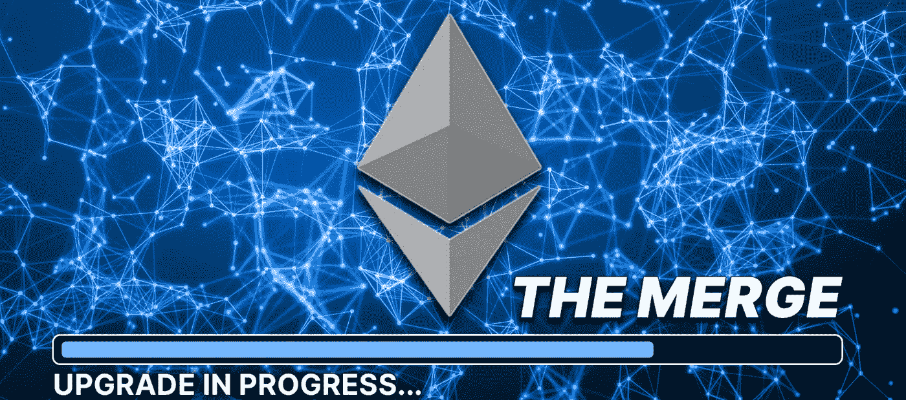

# 投资者必须知道的事情——以太坊合并后的几条潜在路径

> 原文：<https://medium.com/coinmonks/things-investors-must-know-several-potential-paths-following-the-ethereum-merger-286d2cac5446?source=collection_archive---------49----------------------->

**要点:**
以太坊的合并按计划进行，以太坊成为了一个完全经得起考验的区块链，速度、效率和吞吐量都有所提高。
·充其量以太坊继续升级更多计划。
在最糟糕的情况下，合并不会按计划进行，投资者开始在区块链的其他地方寻找机会。

如果你正在考虑购买以太，请考虑这三种场景，看看这种流行的加密货币在 2022 年可能会发生什么。

如今，以太坊(Ethereum)成为了定于 9 月 19 日合并的焦点。如果这项备受期待的技术升级按计划进行，这将是区块链以太坊的突破性发展，可能会让许多加密货币爱好者非常兴奋。投资者在合并前涌入以太坊，这是有道理的。

然而，我们已经听说以太坊合并这么久了，一路上有这么多的延迟，它不是不可能永远不会发生。考虑合并的一种方式是三种不同的场景:基线场景、最佳场景和最坏场景。每个场景都代表了一条合并以太坊的潜在路径。

**基线场景**
假设以太坊合并按计划在承诺日期 9 月 19 日发生。基于我们所听到的一切，这似乎很有可能。以太坊将是一个赌注的证明区块链。到那时，以太坊区块链将会更快、更易扩展、更高效。这就是投资者对合并如此热情的原因。这确实是一次技术之旅。

投资者可能在合并前购买乙醚，等待价格上涨，并在合并实际发生后开始获利。

**最佳情况场景**
在最佳情况场景中，合并如期进行，并且不存在迁移到完全利益相关区块链的问题。在这个过程中，技术升级可能会赢得密码怀疑论者的赞扬。

好消息是以太坊的 Vitalik Buterin 似乎正在为这一最佳情况做准备。在最近的巴黎以太坊开发者大会上，他宣布合并后将会有激增、边缘、清洗和挥霍。这听起来非常令人兴奋，如果激增，边缘，净化和挥霍得到投资者的青睐，它可能会推动乙醚的价格达到新一轮的历史新高。

最糟糕的情况
最糟糕的情况是没有人愿意去想的。在完成合并的时间压力下，合并被拖延了很久。如果这种情况发生，它可能会导致乙醚的价格立即暴跌。有警告称，失败的合并可能会影响整个加密货币市场，给其他所有基于以太坊的区块链项目蒙上阴影。在这种情况下，投资者可能会放弃乙醚，在竞争对手第一层区块链中寻找新的机会，如 Solana (CRYPTO: SOL)或 Avalanche (CRYPTO: AVAX)。

**哪种情况会占上风？**

商界有句老话:“做最好的打算，做最坏的打算”。合并也是如此。我们都希望最好的事情发生，但这并不意味着最坏的事情不会发生。如果你正在考虑在 2022 年购买乙醚，为了做出最佳投资决定，仔细考虑每一种情况都是值得的。

> 交易新手？尝试[加密交易机器人](/coinmonks/crypto-trading-bot-c2ffce8acb2a)或[复制交易](/coinmonks/top-10-crypto-copy-trading-platforms-for-beginners-d0c37c7d698c)