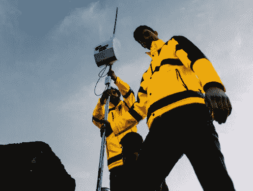
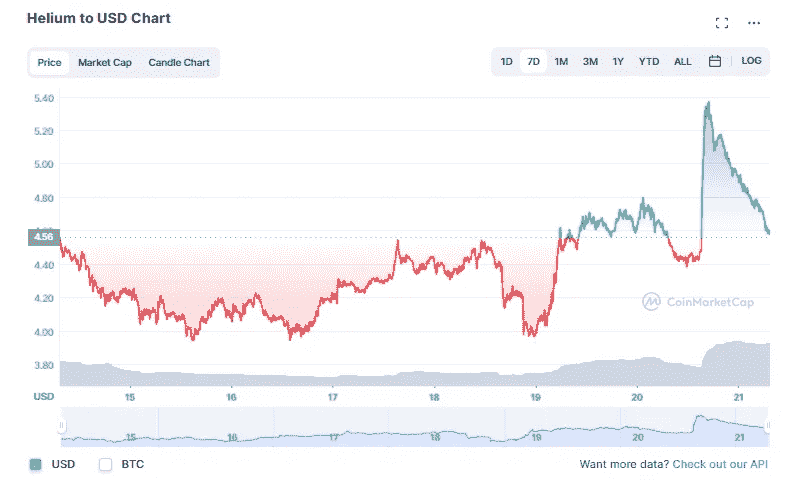
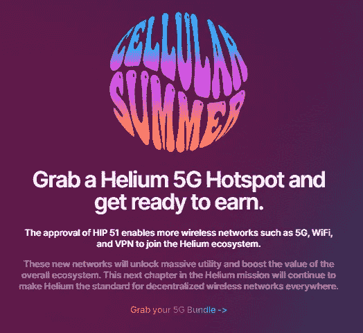
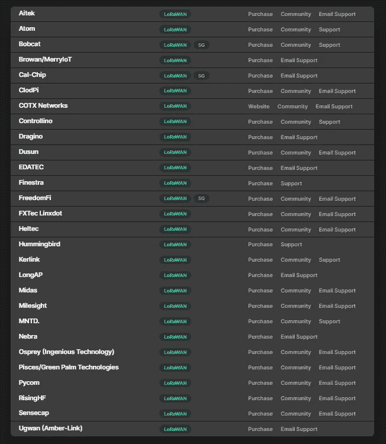
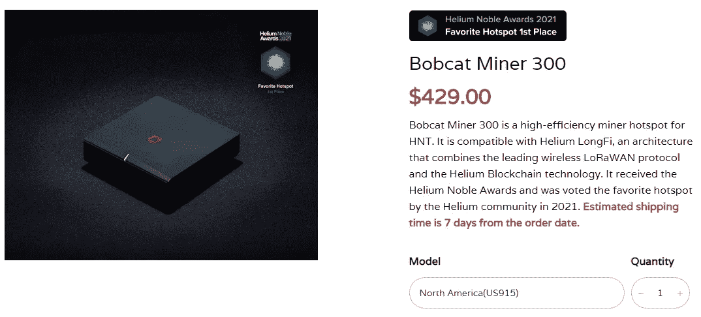
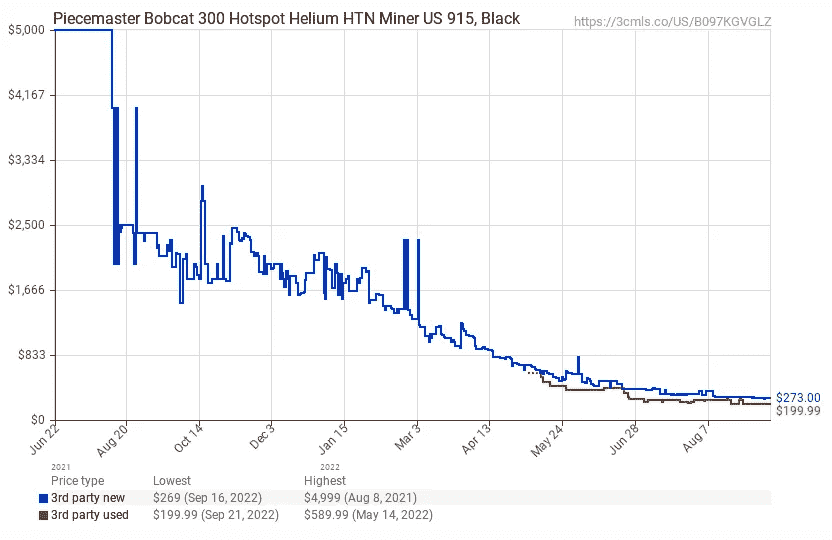
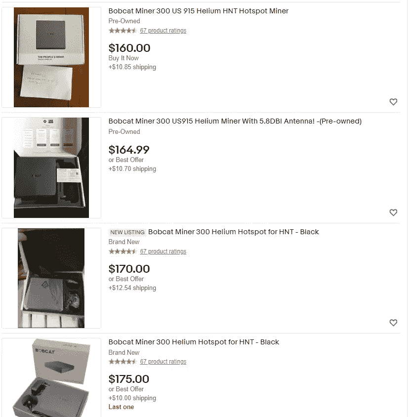
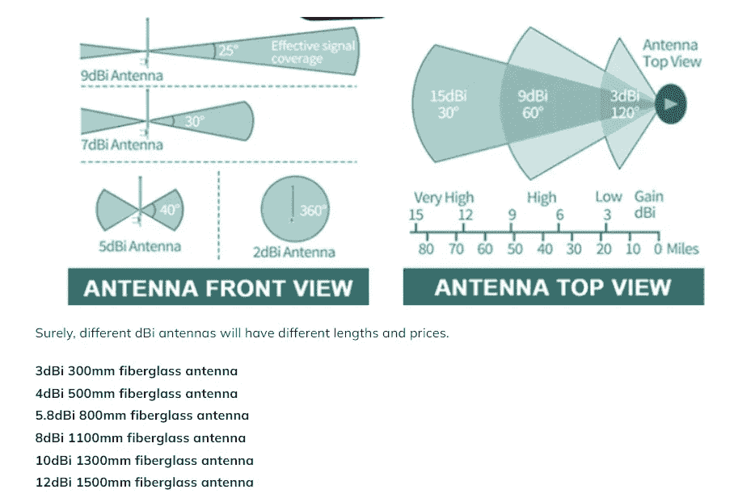
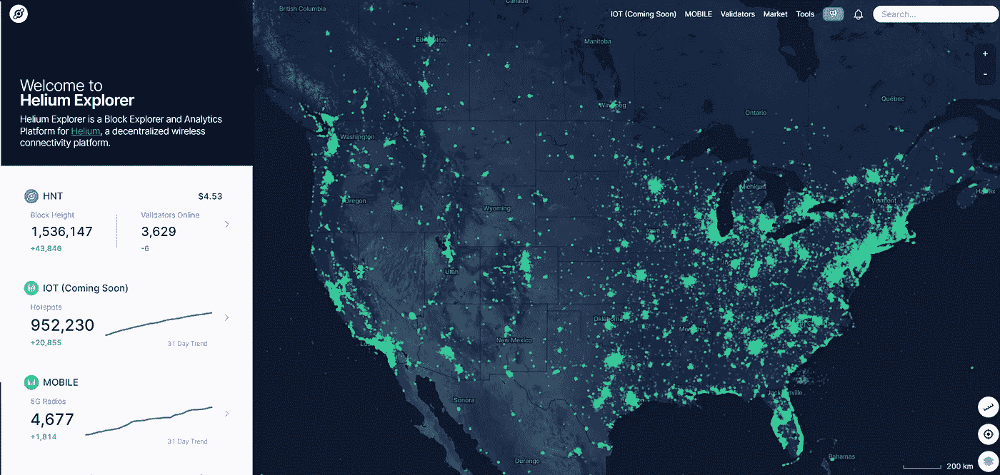
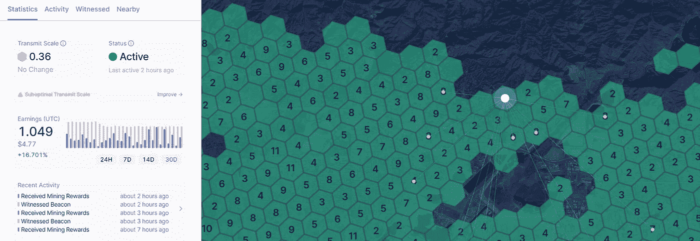

# 购买氦矿机之前需要考虑的事情(2022 年秋季)

> 原文：<https://medium.com/coinmonks/things-to-consider-before-getting-a-helium-miner-fall-2022-8dc46968fde6?source=collection_archive---------3----------------------->

去年牛市期间，我一度考虑购买一台氦矿机(HNT 矿机)，但最终决定放弃，原因很简单，因为矿机似乎到处都卖完了，我绝对不想冒被骗的风险以疯狂的价格从第三方购买。

从那以后，一些事情发生了变化——首先，我搬到了一个更偏远的地区，所以我认为我能够获得更多的回报(稍后会有更多的介绍)。第二，虽然就像加密市场的其他部分一样，$HNT 的价格自 2021 年以来一直在下降，但最近$HNT 的价格出现了积极的变化，所以我想知道现在是否会更有利可图:

接下来，我假设合并后，矿商的价格总体上会让东西变得更便宜一点。最后，随着 HIP51 的批准，氦网络本身也在向 5G 迈进，为氦生态系统提供了更多的选择和可能性。因此，我认为这是值得的，至少看一看$HNT 矿业已经变得多么有利可图(或无利可图)，以及现在是否是赶上$HNT 矿业潮流的正确时机。

# 氦生态系统的更新:

随着“Cellular Summer”的推出，氦生态系统现在已经纳入了 5G，希望为氦生态系统增加很多价值:

与蜂窝合作伙伴如 [GigSky](https://www.globenewswire.com/news-release/2021/09/23/2302261/0/en/GigSky-First-to-Launch-Cellular-Data-on-the-Helium-Blockchain.html) 和 FreedomFi 合作，氦网络将超越使用 LoRaWAN，开始使用 5G 兼容热点，开始“使用区块链快速部署小型蜂窝基础设施，允许主机从其供电的蜂窝网络中获得直接的经济利益。”从 cryptospace 过去的例子来看，很明显，假设更多的利用率=更多的价值，就效用而言，这似乎是朝着提高利用率迈出的非常积极的一步。

# 一个 HNT 矿工值多少钱？

说到向 5G 的转移，如果你在 Helium 的网站上列出不同矿工选项的列表，你会注意到其中只有少数选项具有 5G 兼容性:

比较不同的采矿选择，我个人在过去听说过的是山猫矿工和 MNTD 矿工。我敢肯定，还有其他几种类型的矿工工作非常出色，只是这两种人我听说过，也看过很多关于过去的评论，所以至少，可以说我是优秀营销的吸吮者，但我相信他们是有效的。进一步缩小山猫和 MNTD 之间的范围，但出于本文的目的，我决定只考虑山猫 300 矿工，即使他们不支持 5G(只有山猫 500 支持)。

正如我所料，目前市场上有大量的山猫矿工，包括新的和二手的。山猫 300 的平均新零售价格似乎也下降了，从大约 520 美元下降到现在的 429 美元:

当然，二手和第三方卖家的价格也大幅下降。去年，这些东西的二手价格达到了 1000 美元，我听说许多人通过转售它们大赚了一笔，但从那以后，价格急剧下降:

上图显示了亚马逊上山猫 300 矿工的平均价格，但你可以在 ebay 等网站上找到更便宜的价格:

就本文而言，我粗略估算了一下大约 175 美元，因为似乎有很多来自知名卖家的商品，你可以以这个价格+运费买到。

# 我能开采多少 HNT？

所以这个问题的答案会有点复杂，因为它取决于几个关键因素。据我所知，他们归结为:

1.  当地热点密度——如果你所在的区域被几十个不同的热点矿工包围，那么你很有可能会赚得少一点。
2.  天线尺寸——取决于您现有公寓的高度和/或您的天线尺寸会影响您的覆盖范围。这是我应该在 miner 价格中考虑的因素，但大约 50 美元左右就可以买到一套天线。我发现在 tvpao.com 的[有一个关于天线尺寸和覆盖范围的很好的解释，它显示:](https://tvpao.com/which-dbi-helium-hotspot-antenna-is-good-for-me/)

如果你正在寻找一个相当准确的$HNT 汇率，也许找到一个准确估计值的最简单的方法就是简单地在[氦的网站](https://explorer.helium.com/)上查找，并专门查找你附近的一个现有热点的位置:

单击您旁边的相邻区块后，您可以轻松找到有多少名氦矿工，包括每个矿工最近 24 小时、7 天、14 天或 30 天的$HNT 累积:

特别是对我自己而言，在我的单幅图块中没有矿工，但我可以从相邻的单幅图块中看到只有一个热点，这些热点在过去 7 天内一直处于活动状态，分别为:1.538 @ 8 dBi、0.406 @ 2.8 dBi、0.156 @ 5.8 dBi、6.209 @ 6 dBi 和 0.508 @ 3 dBi。如果我们取所有这些的平均值，它似乎是 7 天内的平均值约为 1.7634 美元 HNT**或 0.2516 美元 HNT 每日@ 5.12 dBi** 。按照目前每 HNT 4.64 美元的市场价格，这相当于每天 1.16 美元或每月 35 美元的 HNT。

鉴于这些案例的范围相当大，仅考虑较低的数字与较高的数字，保守估计约为 0.05092 美元 HNT/天(1.52 美元 HNT/月；7.05 美元/月)，乐观估计是 0.251914 美元 HNT/天(16.6 美元 HNT/月；75.69 美元/月)。

# 运行一个矿工的成本——电力

所以这是另一个变量，它完全取决于你通常每千瓦/小时得到多少电量。然而，从大的方面来看，我认为电力是一个非常微不足道的因素——氦采矿运行在覆盖范围的证明值上，所以它不需要像 GPU 工作证明采矿那样多的能量。从我收集的信息来看，[每个月运行一个山猫矿工大约需要 3-4k wh。举例来说，如果你住在加利福尼亚州的](https://www.reddit.com/r/BobcatMiner300/comments/rubwy9/bobcat_miner_300_power_consumption/)[，每度电的平均成本大约是 19.90 美分](https://www.electricchoice.com/electricity-prices-by-state/)，或者每月大约 60-70 美分。这并不多，即使在能源危机地区，如德国、[平均兆瓦时目前为 387.89 欧元/兆瓦时(或 0.38789 欧元/千瓦时)，这仅相当于每月约 1.16 至 1.55 欧元。](https://tradingeconomics.com/germany/electricity-price)

# 总的来说，我的投资回报率是多少？

因此，如果我今天以大约 175 美元+50 美元的价格购买一个山猫矿工的平均尺寸天线，然后在考虑电力成本后，我估计我可能每天可以开采大约 0.25 美元 HNT，或者如果说了和做了所有的事情，我可以获得大约 33 美元的月净收入，这意味着我可以在大约 7 个月内获得投资回报。

然而，根据我的研究，有相当多的其他变量需要考虑，这些变量将极大地改变你的投资回报时间表。例如，我们已经看到了人们的收入范围，所以保守的收入估计(1.52 美元 HNT/月；6.05 美元/月)将产生大约 37 个月的投资回报，乐观估计(16.6 美元 HNT/月；75.696 美元/月)可以让您在大约 3 个月内获得投资回报。

# TLDR:

这里有一个快速的清单，希望能指导你对$HNT 矿业的决定…

1.  不要为一个矿工支付超过 200 美元；现在市场上充斥着它们，所以你根本不需要支付 429 美元的零售价
2.  dBi 和天线很重要，所以如果你住在地下，没有屋顶通道，你可能赚不了多少。或者，如果你住在 10 楼的顶层公寓，你可能状态很好
3.  所有的$HNT 采矿数据都在氦的网站上公开，所以检查你的位置，看看你周围有多少热点，看看其他人在做什么

# 结论:

目前我住在公寓大楼的三楼，在 300-500 公里的“十六进制”范围内没有其他热点，所以我想这使我处于一个非常有利的区域，可以有一个热点。然而，我个人并不急于马上得到一个矿工，因为我想象矿工的价格会变得更低。因此，我会定期查看易趣上二手矿工的价格，看看我是否能以一个好价格买到一只山猫，最好是 100 美元左右。我能得到的矿工越便宜，我就能越快获得投资回报。

通过我的研究，我也很快认识到,(至少现在)没有办法让 HNT 矿工们快速致富。如果你在这个项目的鼎盛时期参与，你可能每月能赚 4-5 千美元左右，但现在很明显，这些收益是不可持续的，尤其是当网络增长如此之快时。

尽管 HNT 的价格比 ATH 的价格低，但即使保守估计，HNT 矿商的投资也不是那么糟糕——即使是在 37 个月的投资回报率时间框架内，这大约是 25%的 APY。这并没有改变生活，但也没那么糟糕。

你已经拥有一台氦矿机了吗？如果是这样，我很乐意在下面的评论中听到你的经历。或者还有什么我没提到的因素值得考虑？

一如既往，再次感谢你的阅读，如果你还没有，请在这里和推特上关注我，获取我所有的最新消息:[https://twitter.com/CryptosWith](https://twitter.com/CryptosWith)

免责声明:本文中的任何内容都不是财务建议。请自行研究和/或联系财务顾问，找出最适合你的投资。

> 交易新手？试试[密码交易机器人](/coinmonks/crypto-trading-bot-c2ffce8acb2a)或者[复制交易](/coinmonks/top-10-crypto-copy-trading-platforms-for-beginners-d0c37c7d698c)