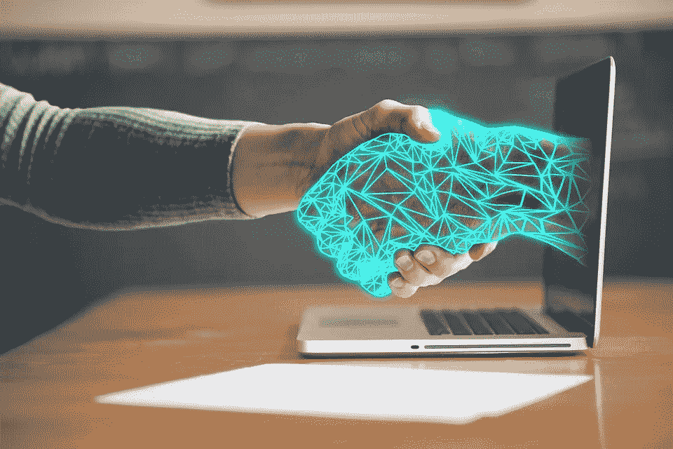
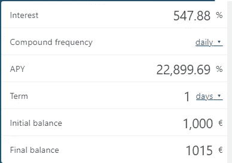
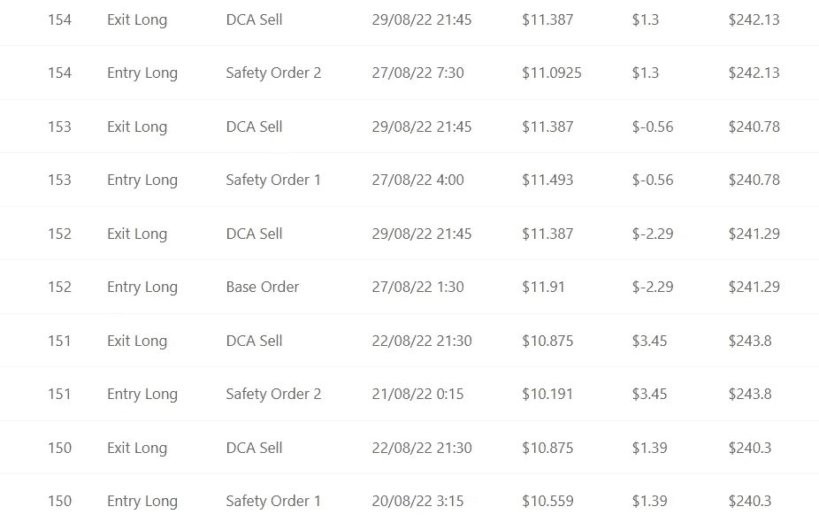
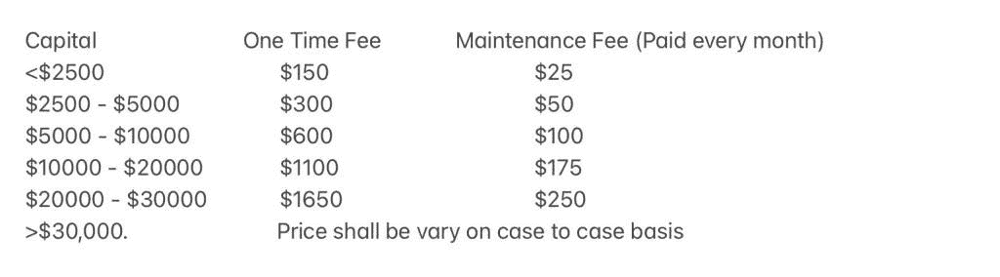

# 启动 Crypto-TBAAS(交易机器人即服务)之前需要考虑的事情

> 原文：<https://medium.com/coinmonks/things-to-consider-before-starting-a-crypto-tbaas-trading-bot-as-a-service-d7c59d81ee0f?source=collection_archive---------7----------------------->

嘿，伙计们，所以我必须在这篇文章的开头说，我不认为自己是一个交易者，我睁大眼睛试图理解像 Cryptoverse 的本杰明·考恩或 twitter 上的戴夫·波恩这样的人。然而，我所知道的是，加密交易机器人非常受欢迎，最近我在任何地方都能看到它们。我可能会在这一点上重复自己，但如果你正在考虑尝试一个加密机器人，请务必提前做好自己的研究，因为有很多骗局。重要的是保持怀疑，认为一切都可能是一个可能的骗局，所以再次，只是要警惕。

我进入加密交易机器人的旅程实际上是几个月前开始的，当时我正在 Kucoin 上尝试一些[交易机器人，从我的经验来看，虽然使用起来很有趣，但我不认为这是有利可图的，可以获得大量的被动收入。](https://www.publish0x.com/jaik83/things-to-consider-before-using-kucoins-trading-bots-xqmldem)

从那以后，密码交易机器人领域在过去的几个月里肯定有所发展，而且有几个产品正在兜售一些相当疯狂的回报。在我寻找真正有利可图的东西的过程中，我学到了一些关于加密交易机器人的东西，我希望每个人都考虑一下，*尤其是*如果你认为自己是像我这样的非交易者/非 TA 专家。

# 我的加密 TBA 清单

**确保你正在查看的任何机器人都允许你保留自己的资金:**这包括不要交出你的私钥或任何可能允许其他人访问你的加密货币的密码。我知道这听起来像是既定的，但如果有人告诉你他们需要控制你的帐户来设置机器人，这在一开始似乎是合理的。有很多平台/服务可以让你 100%控制你的资产，所以如果有人告诉你不是这样，这可能是一个骗局。

**问问自己回报是否现实:**我见过很多机器人在那里兜售一些相当疯狂的回报，比如一天内 7%的复利投资回报率，甚至更高。一个机器人能在一天内获得 7%的投资回报率吗？当然可以。他们能在一年中每天都这样做吗？不太可能。但是，让我们来看看这里的数学……如果你投资 1000 美元，一天的回报率只有 1.5%，这将是一个天文数字的 APY:

按照这个 APY 比率，这基本上意味着从最初的 1k 开始，一年结束时你可以赚 229，996.90 美元，两年结束时你基本上可以赚 52，898，574.01 美元。你觉得这听起来现实吗？如果不是，我可能会远离。

除了高得离谱的投资回报率，它们的收益率是固定的:就像我确信即使是最好的交易者也会说他们没有绝对完美的交易记录一样，你也不能指望一个密码交易机器人是完美的。因此，如果一个平台服务每天都保证这些天文数字般的高回报，我也会认为这是一个危险信号。事实上，如果数据确实显示了周期性的损失，我会更信任它。

**每一个好的密码交易机器人都需要维护:**市场不断变化，不同的东西一直在变冷变热——因此，如果有人只给你提供一个密码交易机器人，就这样，不要指望那个机器人永远保持它的性能。机器人应该不断微调和调整，以适应不同的市场条件。另一方面，如果你只是想短期试用一个密码交易机器人，那么关心维护就没什么意义了。

**问问自己是否可以使用杠杆:**这对很多人来说是一个交易破坏者，我个人并不责怪他们。俗话说，赚钱需要钱，所以如果你对使用杠杆感到不安，那么从相对较少的本金开始，任何交易者可能都会告诉你，在短时间内获得可观的利润要困难得多。同样，如果你不愿意承担这种风险，那么除了像 hodling 或 DCAing 这样的加密交易机器人之外，采用不同的策略可能更有意义。

# 我用什么机器人？

目前有几个我正在研究的机器人(我确信我会在未来发表文章)，但目前最让我兴奋的可能是我最近和 [tradingbots.me](https://tradingbots.me/) 的人一起启动的一个。这些人正好符合我的清单:

**我保留了对我的资金的完全控制权:**他们无法访问你的任何资金，而你可以完全访问机器人——他们只向你发送包含所有预设参数的链接，以启动并运行你的机器人。

**回报相对现实，没有固定的收益率:**他们的网站上有很多关于回报的统计数据，下面是他们的$ATOM Long bot 的一些交易历史的例子，这是我个人使用的一个例子:

注意条目 151–153？看到他们的交易历史中确实有一些不盈利的交易，我真的松了一口气。这向我表明，机器人并不完美，向我出售机器人的人并没有试图告诉我他们是完美的——事实上，他们告诉我，他们只能宣传他们的机器人在过去提供的回报——而不是他们在未来能够产生的回报。

你能期望制造什么？正如你从上面的快照中看到的，利率肯定会有所不同，但从我看过的评论来看，我认为他们平均每天的回报率约为 0.5%，这很棒，但不是不切实际的棒。

他们提供维护服务:一般来说，没有人喜欢收费，但就我个人而言，我希望运行机器人的时间远远超过一个月，我甚至可以说，如果这些家伙*不收取维护费，我会持怀疑态度:*

此外，如果我雇用任何人/任何东西作为服务，我想知道他们如何盈利，就像我想知道我如何盈利一样，如果他们的机器人未来的支出与他们过去的支出相符，那么这对我完全有意义。

# **与 tradingbots.me 有关的其他因素:**

**没有自动复利:**回报不会真正复利，因为机器人本来就是这样设置的——它们根据你的初始本金执行交易。例如，如果你的初始本金是 500 美元，你可能做 50 美元的交易，但是如果你的初始本金是 1000 美元，你可能做 100 美元的交易。我认为保持这个相对规模是很重要的，因为否则如果你的交易相对于你的本金规模来说太大，你的本金可能在一次糟糕的交易后就化为乌有。好消息是，如果你确实想增加你的资本基数，你所要做的就是向 tradingbots.me 的人询问新机器人的新参数。这就引出了我的下一个观点…

**和这些人一起工作很容易:**就像我之前提到的，我不认为自己是一个交易者或技术分析专家，这就是为什么我首先考虑 TBAAS。和我一起工作过的两个人——[@ sweet heater](https://twitter.com/sweetheater)和 [@ShinyJackal](https://twitter.com/ShinyJackal) 都非常有耐心，似乎 24/7 都有空。此外，最初在不小心给他们寄了太多钱来启动这个项目(就像一个完全的 noob)后，他们在几秒钟内退还我多付的金额后，立即赢得了我的信任。

为了完全透明，我只使用了 tradingbots.me 的机器人几天，所以他们的机器人到底有多棒还有待观察，但我可以报告说，到目前为止，我已经平均每天 0.4%左右，如果外推至一个月，这将有望达到每月 12%左右的投资回报率。如果你很好奇，一定要在下面的评论中告诉我，我可以稍后更新我对这些机器人的看法。

# 结论:

我们都知道加密是有风险的，我认为加密交易机器人只是增加了另一层风险。然而，鉴于市场的波动性，有大量的平台和服务显然能够找到能够利用市场的秘密酱料，无论是上涨还是下跌。考虑到这一点，让我最后提醒一下，这些都不是财务建议，只是出于教育和娱乐目的。请像往常一样，特别是考虑到有多少密码机器人骗局，做自己的研究，找到什么样的风险你愿意承担，什么样的投资可能是最适合你的。

感谢你花时间阅读这篇文章，一定要在推特([https://twitter.com/CryptosWith](https://twitter.com/CryptosWith))上关注我，获取我所有的最新消息。干杯大家！

> 交易新手？试试[密码交易机器人](/coinmonks/crypto-trading-bot-c2ffce8acb2a)或者[复制交易](/coinmonks/top-10-crypto-copy-trading-platforms-for-beginners-d0c37c7d698c)