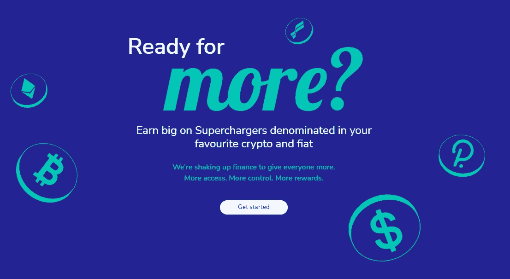
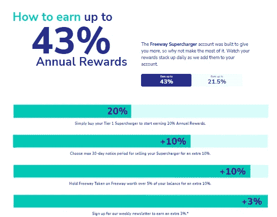
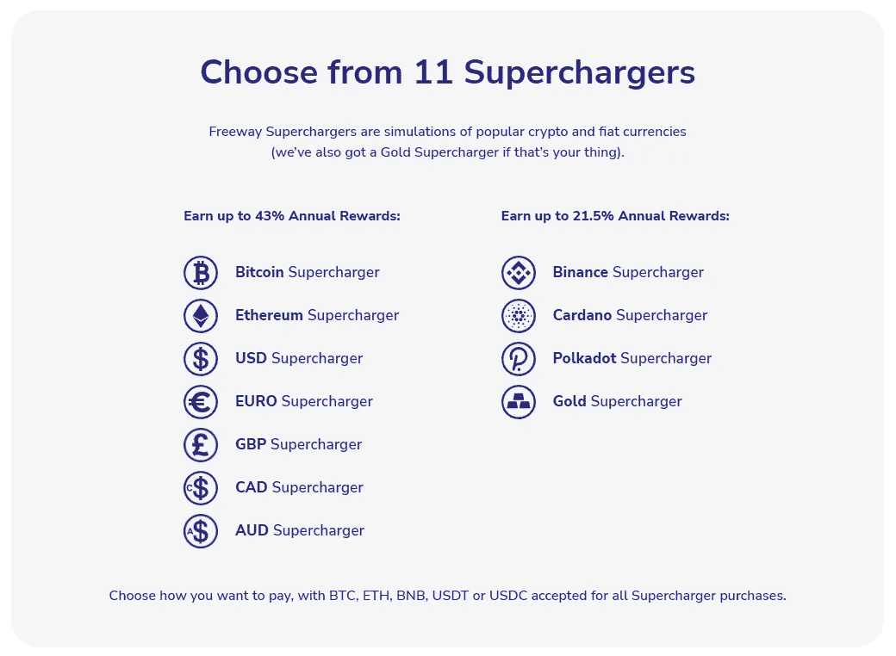
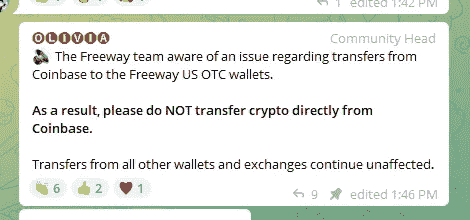
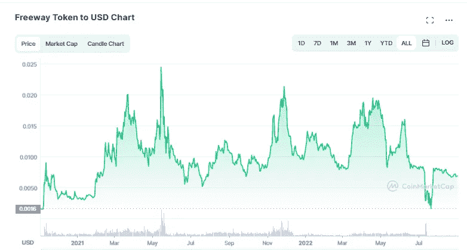

# 进入高速公路前需要考虑的事情

> 原文：<https://medium.com/coinmonks/things-to-consider-before-venturing-into-freeway-17fd41c9d432?source=collection_archive---------5----------------------->

大家好，在过去的几个月里，我已经阅读了许多关于 Freeway 的相互矛盾的评论/意见，所以我一直在推迟进行深入研究，因为我知道尝试整理所有内容会花费一些时间。幸运的是(也可能是不幸的是)随着我们继续穿越这个熊市，我有了更多的时间来最终完成这个分析。如果你没有听说过 Freeway，我将快速回顾一下它是什么，但我在这里的主要重点是回顾一下我听到的一些主要批评，并分析其中哪些有分量，和/或哪些似乎没有道理。

# 快速介绍 Freeway:

简而言之， [Freeway](https://app.freewaylite.us/ref/cryptoswith) 是 Aubit Prime 的更名，是一个集中的非托管平台，允许用户产生相对较高的收益:

Freeway 展示自己的方式有一些细微但重要的差异(我稍后会谈到)，但本质上你能够获得大约 20%的 APY 的基本利率，然后如果你通过其他障碍(这些障碍都可能承担一点额外的风险)，最终你能够获得高达 43%的 APY。

# 他们如何产生回报？

尽管可能存在争议，但答案很简单——杠杆。也许我应该把这作为一个直接的免责声明，但如果你对使用杠杆如此不舒服，以至于感到恶心，那么你可能应该现在就停止阅读，完全忘记你曾经听说过 Freeway。如果你不熟悉杠杆的概念，本质上是更多的流动性(或者他们从像你我这样的人那里得到更多的资金)，他们能够有更好的信用来借更多的钱。借了更多的钱，他们可以做更大规模的交易，这反过来创造了更多的收入。然而，随之而来的危险是，借的钱越多，如果交易不按你的方式进行(T2 ),你被炒鱿鱼的风险就越大。我们说的是多少杠杆？在[5 月的 AMA](/freewayfi/freeway-internal-ama-transcript-wednesday-17th-may-2022-97323a9b4127) 中，杠杆率据报道在 30 倍左右。如果你不知道这意味着什么，这实际上意味着如果他们为一个 1000 美元的账户开了最大杠杆，他们现在的头寸价值是 30000 美元，

对于您剩余的 degens reading，我怀疑 Freeway 有几个关键因素给了他们更大的优势，其中包括 AuBit Prime 的利用，AuBit Prime 是他们拥有的受监管的经纪交易所，是 Freeway 生态系统的一部分。就像普通银行一样，如果你很有名，并且和他们有良好的工作关系，你可能更容易获得贷款(也是条件更好的贷款)。第二，Freeway 使用 quant 交易，本质上是使用数学模型和算法进行交易。现在我肯定不是一个量化交易者(事实上我根本不认为自己是一个交易者)，但是从我对量化交易的了解来看，量化交易也有相当大的风险，但是理论上由于缺乏情绪波动，错误应该会更少。我知道算法交易和机器人交易越来越受欢迎(稍后会有一篇关于这方面的文章)，我也知道其他主要的高于平均收益率的平台，如[南波瑠投资](https://app.haruinvest.com/signup?r=CryptosWith)和[迈达斯](https://midas.investments?p=0191)至少在某种程度上利用了算法交易。

# 你不把钱存入高速公路，你买增压器…那么增压器到底是什么？

通过我在 Freeway 上阅读的所有信息，我发现自己越来越讨厌阅读增压器，因为它们不断被称为用户获得回报的渠道。他们特别将增压器定义为:

> “象征性的虚拟模拟……当你从平台上购买增压器时，你就拥有了它们。就是这样。
> 
> 你用来购买增压器的是 Freeway 的收入。然后，Freeway 将其收入存入 AuBit Prime。

[*——高速公路 AMA 成绩单，2022 年 5 月 17 日*](/freewayfi/freeway-internal-ama-transcript-wednesday-17th-may-2022-97323a9b4127)

现在，如果你从字里行间来看，我的假设是，通过一遍又一遍地明确声明用户没有将资金存入 Freeway，Freeway 正在绕过一些主要的监管障碍。这种区别显然是设计出来的，我假设当你说“存款”的时候，立刻就暗示你是作为一家银行或者其他一些必须遵守特定法规的金融机构。换句话说，货币很容易监管，而增压器却不容易。你还会注意到，他们的游戏规则与币安和 FTX 等主要交易所相同，他们为美国用户提供单独的美国账户(freeway-lite ),有自己单独的规则。最显著的区别是——美国用户将发现，通过开设一个美国的 Freeway 账户，你将无法访问所有的增压器，最明显的是$BNB、$ADA 和$DOT，并且没有场外交易。

目前有 11 款增压器可供选择，上个月刚刚增加了澳元:

你还会注意到，所有的增压器不一定都是基于密码的，那是因为这些家伙不一定只是做基于密码的交易。事实上，根据最近的推特空间，Freeway 报告说，他们实际上很少接触 stablecoins，无论是 USDT 还是 USDC，因为他们转而离开匝道去菲亚特，只有当用户出售他们的一台增压器时，他们才会回到 stablecoins。

# 主要批评(或 FUD)

因此，希望您对什么是 Freeway 以及他们想做什么有足够的了解。外面所有的负面指控呢？我们应该相信什么？

我花了大量时间剖析一些攻击，因为就像我正在考虑投资的任何其他平台一样，我认为在这样做之前权衡风险或回报只是最佳做法。让我们一个一个的分类，好吗？

## **菲威是庞氏骗局吗？**

首先，[联合首席执行官格雷厄姆·道加特](https://mt.linkedin.com/in/grahamdoggart)在他的[五月 AMA](/freewayfi/freeway-internal-ama-transcript-wednesday-17th-may-2022-97323a9b4127) 中说道:

> “Freeway 不依赖新资金的流入来保持可持续发展。这意味着我们不仅不是庞氏骗局，而且我们甚至不属于传统的创业或商业风险领域。我们完全有能力盈利，我们甚至不需要高速公路用户来盈利。这就是生态系统的力量，网络效应将帮助我们指数级增长，并随着时间的推移变得越来越强大。”

假设这是真的，这是一个非常明确的声明，说他们不是。我认为很多庞氏指控来自于他们有锁定期的事实，但重要的是要注意这些锁定期不是强制性的。如果你选择锁定你的资金至少 30 天，我认为这有利于平台，因为它保证了持续时间内的流动性，这反过来也允许他们获得更高的交易杠杆。如果我们缩小一点，有很多平台和对冲基金(甚至美国政府国债)有不同的锁定期，可能会根据锁定期的长度提供更高的收益率，所以我不认为锁定期本质上意味着平台是庞氏骗局。

庞氏骗局的定义是，平台用投资者 A 的资金偿付投资者 B。是 Freeway 做的吗？好吧，如果他们说他们从交易中赚钱，这将很容易通过访问他们的交易数据来验证。Freeway 尚未公开这些信息，但已经发布了一些片段:

**结论**:这是一份全面的综合报告吗？没有。但是，老实说，如果这真的是 3-4 个资产类别之间大约一天的交易的样本，我想一份完整的报告会…长得可笑，而且出版起来也很多余。也就是说，他们 2021 年的交易数据由 [ACA Global](https://www.acaglobal.com/) 审核，他们确认他们取得了相当荒谬的 112%的回报。我没有看到这份报告，因为他们要求你事先签署一份 NDA，但如果你有兴趣自己看，[任何人都可以要求做](https://t.co/IyjxKdVg9a)。

## **高速公路是骗局吗？**

这肯定是一个受欢迎的批评，认为 Freeway 只是想拿走你的钱，他们正在使用欺诈行为，试图用他们有吸引力的费率来欺骗你。有一种风气是[数字资产新闻](https://www.youtube.com/c/DigitalAssetNewsDAN)使用的，我很喜欢，基本上就是把一切都当成骗局。因此，我完全能够理解为什么当人们对一个平台缺乏信任时，会有大量的怀疑，这个平台给你的回报几乎是任何竞争对手的两倍。当然，我们无法知道与高速公路有关的人们的想法，但是有大量的信息指向相反的方向:

1.  我还没有发现一个人在提取资金时遇到麻烦。事实上，被比特币基地发现试图向 Freeway 转移资金的人还有更多问题:

2.我在很多地方读到过，许多高速公路交易者是被高速公路的精神诱惑而退休的。通过#AccessForAll，该公司“设想了一个世界，在这个世界中，每个人都可以平等地获得世界顶级投资产品……无论他们来自哪里，收入如何，居住在哪里”:

3.同样，如果你是一个怀疑论者，你可能会认为这是一堆公关绒毛，但他们是我见过的唯一一个通过他们的“慈善增压器”开辟慈善通道的平台，他们问用户他们希望看到公司捐赠给哪些慈善机构:

**裁决**:我还没有发现任何有确凿证据证明他们是个骗局的东西，但显然我认为他们不会公开任何不法行为。

# 高速公路风险

无论你如何破解，使用 Freeway 都有风险，我发现最大的风险是:

**如果不是你的钥匙，那就不是你的密码:**这和许多其他平台一样，可能是最大的平台，这就是为什么确保你做自己的研究以了解你个人是否信任这个平台并拥有你的资产是非常重要的。我们已经看到这是许多其他平台的问题，如 Celsius 和 Voyager，但就像任何 CeFi 工具一样，如果你绝对不愿意让别人接管你的资产，那么你就不应该使用 Freeway 或任何其他 CeFi 平台(BlockFi，比特币基地等)。)一点都不。

**Freeway 没有义务回购你的增压器:**同样的，Freeway 的设置也有可能成为你的钥匙。换句话说，让我们说，在世界末日的情况下，高速公路下或在更有可能的情况下，如果他们不得不大幅降低其利率，你可能不会失去你的增压器，但你不会无法恢复最初的原则，你支付，以购买增压器。

锁定风险更大:风险越大，回报越大，如果你决定将资金锁定 30 天，收益就会增加 10%。在 Terra 死亡螺旋中，我们看到无数人无法从验证器中提取他们的$LUNA(包括我自己),因为价格在一夜之间重新上涨，所以如果你计划在任何时间内将你的资金锁定很长时间，这是另一个考虑因素。

**$FWT:** $FWT 是 Freeway 的原生代币，如果你在我的第一张图中看到了，如果你在投资组合中持有 5%的$FWT 余额，你可以获得额外的 10%奖励。我知道由于这个原因，在 Freeway 周围有很多 FUD，但这种做法并不罕见，正如我们在许多 CeFi 和 DeFi 平台上看到的那样，包括 Nexo 和 Midas。像许多这些原生平台代币一样，让更多的人在 Freeway 上拥有$FWT 有助于平台保持流动性，从而增加整个生态系统的价值。但是，需要注意的是，由于美元 FWT 的波动性，它本身也是一种风险:

像任何小市值硬币一样，FWT 受到价格大幅波动的影响，买家应该注意。这种风险在 7 月份的最近一次崩溃中被放大了，当时咖啡桥被黑客攻击，大量 FWT 代币被抛售:

此后，FWT 美元的价格有所回升，但我认为这仍然值得注意。如果你对代币的一些统计数据感到好奇，根据 freewaystats.com[的数据，总共有 100 亿代币的供应量，其中近 70 亿在流通，近 90%的流通供应量都在高速公路上。](https://freewaystats.com/#stats)

# 结论

总的来说，我发现大多数投机者分为四个阵营:1)高速公路憎恨者，他们认为这是一个完全的骗局，人们进入高速公路是完全荒谬和愚蠢的。2)不参与的旁观者，因为他们持怀疑态度，但胆怯地希望秘密世界的美好，即 Freeway 能够成功，而不是一个骗局。3)人们希望相信高速公路是可行的，因此他们正在尝试投入和撤出资金。最后 4)完全相信高速公路并全力以赴的人。

我完全相信，Freeway 确实受到了很多批评，因为这些利率，因为人们将这些回报归类为“好得令人难以置信”，因此这肯定是一个庞氏骗局或骗局，但老实说，我很难找到任何具体的证据来支持这些断言。

如果你热衷于亲自尝试 Freeway，请考虑支持我和我的博客，并使用我的推荐链接:【https://app.freewaylite.us/ref/cryptoswith。根据他们的联盟计划，如果你通过一个推荐链接，推荐人会得到额外的 2%的奖励。

我自己可能是一个旁观者，但在做了大量的功课后，我慢慢相信 Freeway 可能值得一试。如果您自己对 Freeway 有任何不良体验，或者有任何信息可以澄清许多许多关于 Freeway 及其疯狂收益率的流行批评，如果您在下面留下评论，我将非常感谢。否则，感谢你花时间阅读这篇文章，并确保在推特([https://twitter.com/CryptosWith](https://twitter.com/CryptosWith))上关注我，获取我所有的最新更新。

免责声明:最后提醒一下，这不是财务建议，仅用于教育和娱乐目的。请一如既往地做自己的研究，找到最适合你的投资。干杯大家！

> 交易新手？试试[密码交易机器人](/coinmonks/crypto-trading-bot-c2ffce8acb2a)或者[复制交易](/coinmonks/top-10-crypto-copy-trading-platforms-for-beginners-d0c37c7d698c)