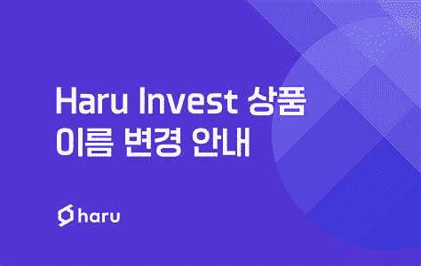
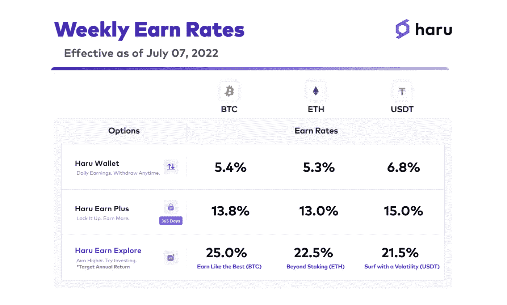
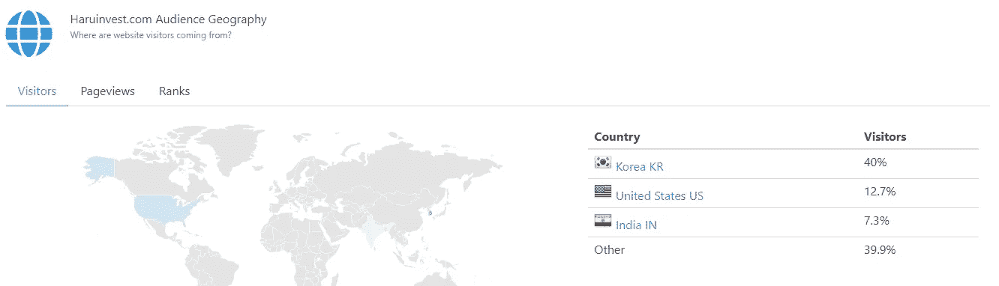
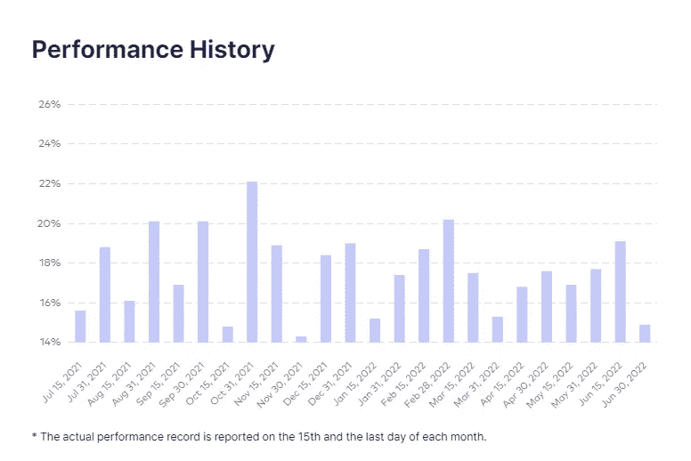
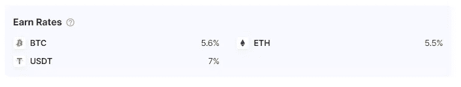
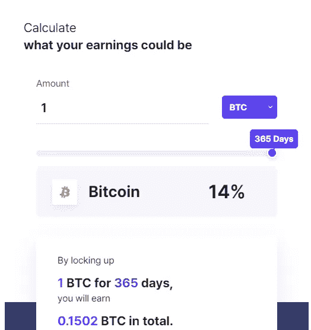
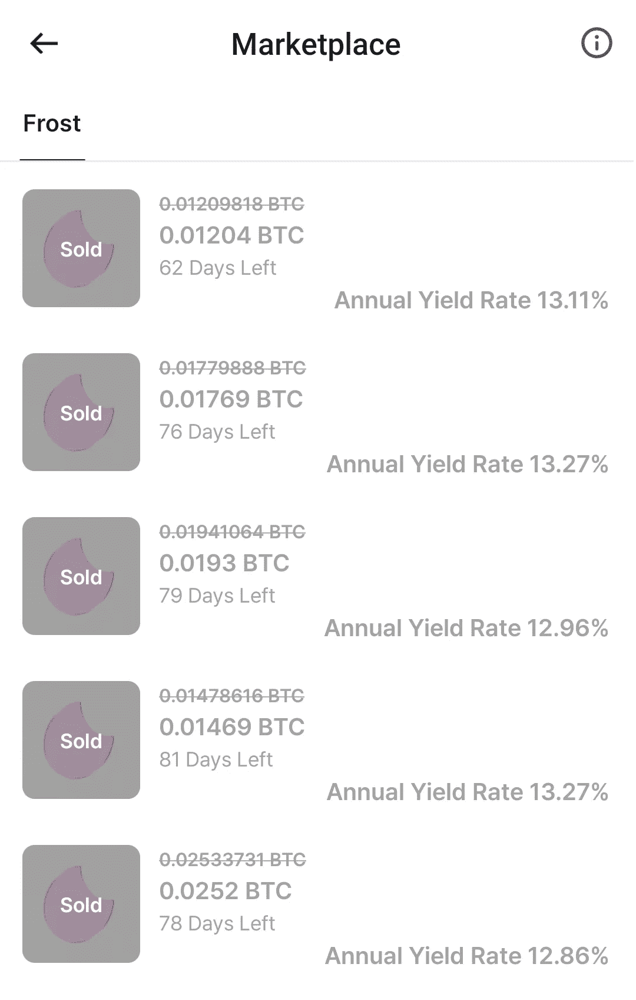
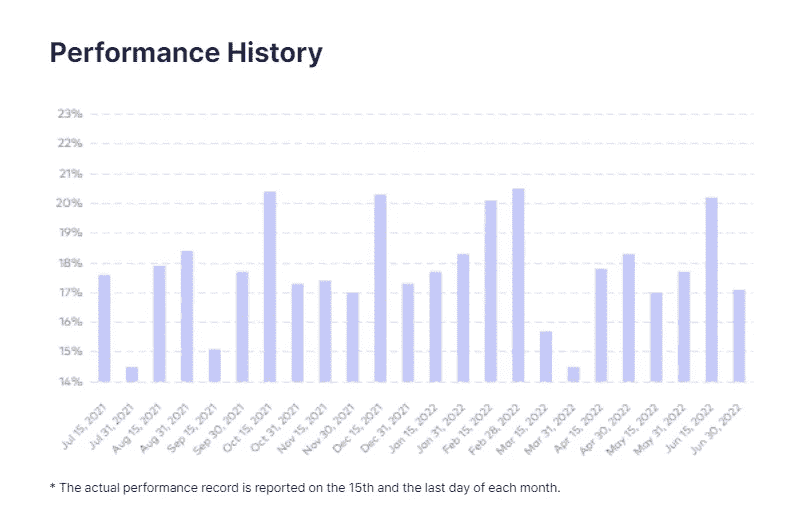
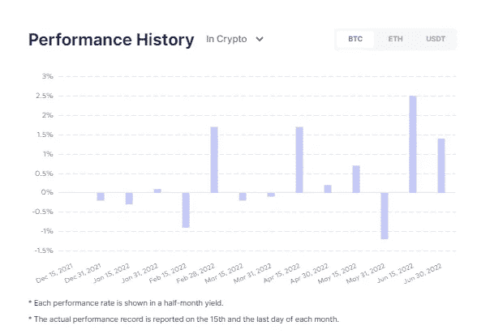

# 进入南波瑠投资公司之前需要考虑的事情——一篇深度评论

> 原文：<https://medium.com/coinmonks/things-to-consider-before-venturing-into-haru-invest-an-in-depth-review-2f7a5a03e0c4?source=collection_archive---------0----------------------->

如果你关注了我的其他一些帖子，你就会知道我在努力利用熊市深入研究那些我只是简单听说过，但从未真正花时间去研究的项目/平台。南波瑠投资公司就是这样一个平台——在$BTC 上宣传持续的令人瞠目结舌的收益率，在$ETH 上为 21.5%，在$USDT 上高达 22.5%；

正如你从他们的分级收益率中看到的，他们基本上可以从标准收益率到类似德根的回报。最终，这种独特的风险与收益的划分让我觉得至少值得仔细观察一下。

现在，如果你和我一样，来自 3AC、Celsius、Voyager 等等的传染已经让我极度怀疑，坦率地说，已经完全丧失了风险承受能力。希望熊市让每个人都更努力、更明智地考虑把他们的资产放在哪里，所以我将分享一些关于我对南波瑠的发现的信息，以及我是否决定选择它作为放置我的一些马厩和蓝筹股的选项。

# 你为什么没听说过南波瑠投资公司？

大概是因为你不住在亚洲。长寿可以作为密码领域合法性的例证，所以我问自己的第一个问题是，为什么我现在才听说南波瑠投资公司。虽然南波瑠投资公司(在韩语中也被称为“南波瑠”或“一天”)自 2019 年以来一直存在，但需要额外的挖掘才能找到他们是谁或他们是什么的信息。原因很快就清楚了——它的[主要用户群](https://rankchart.org/site/haruinvest.com/)在南韩和亚洲:

这也反映在他们的员工身上，因为他们的整个领导团队(他们是 [doxxed](https://haruinvest.com/about-us) )也大多在韩国，公司本身的总部在新加坡。尽管他们能够在去年年底达到 10 亿美元的总交易额，然后在上个月达到 20 亿美元，但他们在亚洲以外的市场营销和业务相对较少，至少在几个月前是这样。

随着他们交易量的抛物线增长，我发现有趣的是，尽管他们取得了成功，他们的社交媒体影响力却非常小。例如，尽管他们自 2019 年以来一直在[Medium.com](/@haruofficial)上，但他们只有不到 200 名粉丝。此外，尽管在过去几年中，他们可能至少每隔几天就发一次推特，但他们在[推特](https://mobile.twitter.com/haruinvest/)上几乎没有 2000 名粉丝，这与 [Celsius (259k)](https://mobile.twitter.com/CelsiusNetwork) 、 [Nexo (223k](https://mobile.twitter.com/Nexo) )或 [BlockFi (158k)](https://mobile.twitter.com/BlockFi) 等相比相形见绌。然而，尽管他们在 twitter 上存在不足，但他们的历史和时间线相对容易追踪。简要介绍公司的发展历程:

**2019 年 9 月** — HaruBank 由他们的母公司 [Block Crafters](https://blockcrafters.com/) 推出

**2020 年 6 月** — Harubank [与 BitGo](/haruinvest/harubank-collaborates-with-bitgo-to-ensure-the-security-of-crypto-asset-d5c22374a78) 合作，用作他们的加密保管人

**2020 年 9 月** — Harubank 更名为南波瑠投资

**2020 年 12 月** — [南波瑠交易总额达到 1 亿美元](https://www.crowdfundinsider.com/2020/12/170582-south-korean-digital-asset-management-platform-haru-hits-100m-total-transaction-volume-milestone/)

**2021 年 11 月** —交易总额超过 10 亿美元

**2021 年 12 月**——南波瑠投资公司与[基斯·哈林合作在 NFT 销售](https://ambcrypto.com/keith-harings-original-artwork-goes-on-sale-as-nft-on-haru-invest/)

**2022 年 6 月** —在[共识 2022](https://www.globenewswire.com/news-release/2022/06/10/2460714/0/en/Haru-Invest-Talks-Bitcoin-Investment-Strategies-During-Consensus-2022-Workshop.html) 召开研讨会

**2022 年 7 月** — [南波瑠投资交易额达到 20 亿美元](https://www.prnewswire.com/news-releases/haru-invest-introduces-freeze-marketplace-for-liquidating-lockups-301582170.html)

除了这个时间表之外，我印象深刻的是南波瑠至少每两个月发布一次关于其整体平台性能以及调整后收益率的报告。把他们去年的收入加在一起，你会发现他们相当可观。以他们在 BTC 的收入比率为例:

或者，如果你足够勤奋，你可以追踪更早以前(或至少更接近几年前他们刚开始时)他们的收益率，所有收益都公布在[medium.com/haruinvest](https://medium.com/haruinvest)上。

# 透明度和风险:

尽管我认为他们定期更新收益和业绩很好，但在这个熊市时期，很难相信任何平台能够在不承担很大风险的情况下在稳定股和蓝筹股上产生 20%以上的回报。因此，毫不奇怪，他们最近在[6 月](https://www.reddit.com/r/HaruInvest/comments/v8j9ty/ask_hugo_anything_haru_invest_ama/)进行的 AMA 的主题可能是被要求更多透明度的问题淹没，特别是风险缓解。我邀请你自己去看看，但简单地说，虽然它们没有揭示它们如何产生产量的确切过程，但它们确实突出了一些让我更放心的事情，但也有一些让我想问更多问题的事情:

**南波瑠与其他 DeFi 或 CeFi 平台没有互动**——这意味着没有向 3AC 这样的人放贷，没有暴露于任何 stETH 控股公司或 staked ETH，也没有与 Anchor 这样的协议互动。然而，如果你确实查看了他们每周发布的[收益率](https://medium.com/haruinvest)他们确实在 terra 生态系统上暴露于 KRT，然而这在 2021 年 8 月停止了。退市背后的原因是，他们“在调查时发现了严重的风险。(他们)觉得 UST 相对于 USDT 缺乏可靠性，所以(他们)把注意力放在了 USDT。”(我必须说这是一个好的举动)

> 交易新手？尝试[加密交易机器人](/coinmonks/crypto-trading-bot-c2ffce8acb2a)或[复制交易](/coinmonks/top-10-crypto-copy-trading-platforms-for-beginners-d0c37c7d698c)

**南波瑠尚未接受独立审计，但他们确实有一些合规和控制措施** —据报道，南波瑠投资公司没有一个人(甚至包括首席执行官)对资金转移和资产分配有完全的控制权。此外作为[与英属维尔京群岛](https://e-cryptonews.com/hugo-lee-of-haru-invest-talks-to-us-about-their-crypto-trading-platform/)的“批准基金”，他们至少要遵守[的一些规定](https://www.bvifsc.vg/sites/default/files/securities_and_investment_business_incubator_and_approved_funds_regulations.pdf)。看起来他们已经根据他们的交易方/法定方业务进行了公开审计，但没有加密方；然而，Hugo Lee 指出，虽然与审计人员进行了对话，但是为他们的商业模式找到一个特定的审计是“极其困难的”

南波瑠是如何赚钱的？— 这个挺透明的，是通过收费的。澄清一下，他们的赚钱机器并没有取消提现费(0.0001 BTC，005 ETH 或 1 USDT)，而是从他们的“赚取探索”期权中扣除利息收入，如果你赚取的 APR 回报率超过 15%，则从你的总利润中扣除 15%的费用。相反，如果你赚了少于 15%的年利率，那么没有费用。

**南波瑠从算法套利交易中获取用户资金并创造收益—** 这可能是透明度最低的地方，但最终南波瑠通过在多个不同的衍生品交易所进行算法套利交易来实现交易，并打击了市场的效率。这也是他们在牛市和熊市中最有可能持续盈利的根本原因。换句话说，BTC 美元是 4 万还是 2 万并不重要，重要的是不同交易所之间继续存在市场无效率，他们可以利用这一点。假设这是真的，这就是为什么当首席执行官说“南波瑠投资公司最大的风险是比特币和以太坊的彻底崩溃”时，这实际上是有道理的——换句话说，如果他们没有价格走向零，到那时南波瑠将无法利用任何市场无效率。

不是你的钥匙，不是你的密码，这当然是最大的风险。如果你像我一样，目前有资金被锁定在 CeFi 平台，如 Celsius 或 Voyager，你已经知道无法控制自己的资产有多大的风险，相信我，我知道这很糟糕。随着这些教训的学习，这就是为什么你可能知道(如果你在本文中已经做到了)为什么我在我考虑进入的每个平台/加密货币上做了这么多研究。话虽如此，做作业就否定了所有风险吗？当然不是，所以我知道这对一些人来说是一个交易破坏者。然而，正如我将在下一节更详细地介绍的那样，我将阐述为什么南波瑠我个人决定为什么值得冒这个险。

# 南波瑠有 5 种不同的赚钱方式

南波瑠有 5 套不同的利率，你可以赚取收益率:南波瑠钱包，赚取加，冻结，赚取探索，最后切换。在我详细介绍每个计划时，每个计划都有自己在过去 12 个月中发布的业绩历史。正如你将看到的，他们确实会在亏损的时候公布利率，对我来说，这给了数据更多的可信度。

**南波瑠钱包—** 是无提现罚款、无锁定的最低计划。这些是撰写本文时的当前汇率，每两个月会有变动(尽管是微小的变动):

这些绝对是风险最低的，因为没有锁定期，但我个人不认为仅凭这些利率就能让我投资南波瑠——有太多风险相同或更低的其他选择提供了更好的回报。

南波瑠挣得 **加**——是德根谱上的下一级。南波瑠 Earn Plus 允许用户赚取与他们愿意锁定其 BTC 的指定时间量(15-365 天)相对应的利率。通过使用他们的收入计算器，你可以确定确切的日期和确切的利率，你想自然增长。例如，将 1 美元 BTC 锁定一年，你可以获得 14%的年利率，或者累积大约 0.1502 美元 BTC:

据我所知，虽然你的本金被锁定，但你的收益*是可以提取的，或者你可以选择复利。此外，关于 Earn Plus 计划的最后一个考虑是，它们实际上为您的初始本金提供了担保。现在我不确定这个“保证”一定是由什么支持的，但是这个保证不是给 Earn Explore 计划的。*

**冻结**——南波瑠挣加计划与南波瑠的最新(也是我最喜欢的)功能相联系，那就是冻结市场。基本上，如果你的资金处于 15-365 天的锁定期，你可以将你的清算价格放在“冻结”市场上，希望有人愿意以你设定的价格收购你。因此，你不仅可以以较低的价格购买密码，还可以从中赚取利息！以下是一些最近被收购的公司的例子:

有一点需要注意的是，出于某种原因，冻结功能只在南波瑠手机应用程序上可用，而不是实际的南波瑠网站。此外，如果你决定为你想要清算的股份定价，要格外小心，不要像这个家伙一样[结束交易，他不小心把一个 2457 美元的 USDT 股份标价 49 美元的 USDT。#fatfingerssuck](https://www.reddit.com/r/HaruInvest/comments/vucmc2/i_know_i_will_get_hate_for_this_but_i_have_to_say/)

**挣探索—** 是看起来最简单(也是最赚钱)的计划，因为它的费率是我见过的任何大型 CeFi 平台中最高的。有三种不同的策略，一种针对$BTC，$瑞士联邦理工学院和$ USDT——所有这些在过去的一年里都有不同的利率。$USDT 的“从波动性开始冲浪”策略产生了大约 14%到 21%的波动幅度，如下图所示:

Earn Explore 与 Earn Plus 的其他不同之处在于，禁售期没有资格通过冻结市场进行清算，而且它们有不同的期限限制——BTC 和 ETH 都是最少 3 个月，USDT 是最少 1 个月。他们解释锁定期的理由是，当资金持续大规模存入或取出时，南波瑠很难盈利。这种推理让我想起了 Yield Nodes 最初的 6 个月锁定期，因为如果人们不断意外提取资金，他们就不得不不断减少节点，那么他们就不可能有可持续的商业模式。

**Switch —** 我的理解是南波瑠版的交换，用户可以从流动性池中获利。像大多数 LP 一样，他们最有可能遭受非永久性损失，这解释了为什么有些月份会出现负利率:

# 关于南波瑠需要注意的其他事情

**KYC**——所有投资者都需要通过一个 KYC 程序。我自己，我的 KYC 有一些问题，但在清理了一些事情后，我能够在几分钟内完成我的工作。

客户服务——他们有一个应用内的实时客户聊天服务(这帮助我度过了 KYC)。不幸的是，聊天在周末不工作，但除此之外，我发现他们非常有帮助和响应。

**韩国已经受到了一些加密法规的威胁**——最近在韩国有很多关于加密的争议，我可以想象这是他们为什么做 100% KYC 的原因之一。随着更多法规的通过，我可以想象，由于南波瑠在朝鲜的员工/业务，可能会有一些意想不到的后果。也就是说，[韩国的新总统](https://techcrunch.com/2022/05/15/south-koreas-new-pro-crypto-president-gets-pushback/?guccounter=1&guce_referrer=aHR0cHM6Ly9wcmVzZWFyY2guY29tLw&guce_referrer_sig=AQAAAGNMEc7QwHpLAf7R9rSON_-ZtWAslsmG0tY8OktoBtiwbPwo-qOLRXA88k4oXdkPlFcSE8x5Ug6q8o4RE2D-NKgpPr2I5PLL7KPq2SPB9wp9aVYJFm0syqLBU2NtpX4a9QHkayvZ4TNSk4I32KHr4CxfZDGwATYCpOFyAjS3GD8M)据说对密码非常友好，所以我认为至少在最近的将来不会有任何重大变化。

**联盟计划**——对于我提到的所有比率，如果你通过推荐链接注册([这是我的](https://app.haruinvest.com/signup?r=CryptoWith))，你实际上可以获得 0.2%的提升收益率。据我所知，这仍在测试中，所以我不知道这种提升会持续多久或有多好。但这也让我想到了我的下一个项目…

**这些利率不会永远持续下去** —在与雨果·李的 AMA，这种可能的利率下调在不止一个场合被明确提出，尤其是如果南波瑠继续其快速增长。基本上，他们必须管理的资金越多，就需要更多的资源来维持安全和相关运营的标准，从而导致利润不会像今天这样高。

**用户投诉**——在我看来，唯一的投诉与用户错误有关(比如一个家伙以低价卖掉了他的 USDT ),也与获得 KYC 奖的问题有关。此外，他们的 [TrustPilot 记录](https://www.trustpilot.com/review/haruinvest.com)可能是我见过的最好的记录之一，在数百条评论中获得 4.9 分。

# 结论，TLDR

南波瑠投资公司表现出了一些干预，它能够挺过 2020 年的熊市，也能够继续挺过当前的熊市。他们使用一种算法交易策略，宣称自己能够抵御牛市或熊市，从他们有记录的收益记录来看，这似乎是正确的。

他们的确切方法是透明的吗？不，但对我来说有意义的是，算法交易不仅很难做到，而且我认为这也会使他们处于竞争对手的劣势——他们都没有提供可比的利率。

你参与过南波瑠投资公司吗？如果是这样的话，我很乐意在下面的评论中听到它以及你可能遇到的任何问题/成功。如果你还没有注册，请考虑使用我的推荐链接:[https://app.haruinvest.com/signup?r=CryptoWith](https://app.haruinvest.com/signup?r=CryptoWith)，这样你就可以在支持我的博客的同时提高收益率。

一如既往，再次感谢您的阅读，如果您还没有阅读，请务必在 twitter 上关注我，获取我所有的最新更新:【https://twitter.com/CryptosWith

免责声明:本文中的任何内容都不是财务建议。请自行研究和/或联系财务顾问，找出最适合你的投资。