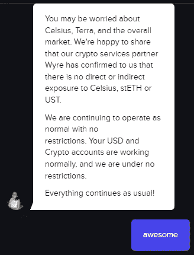
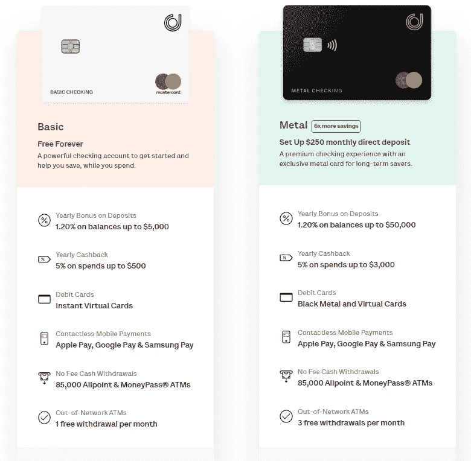
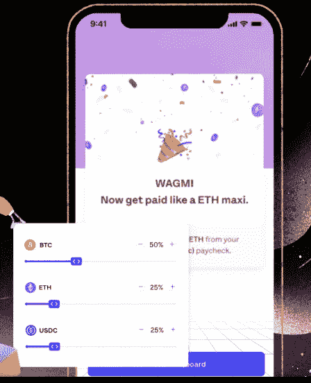
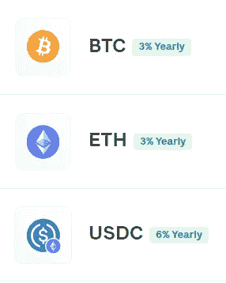
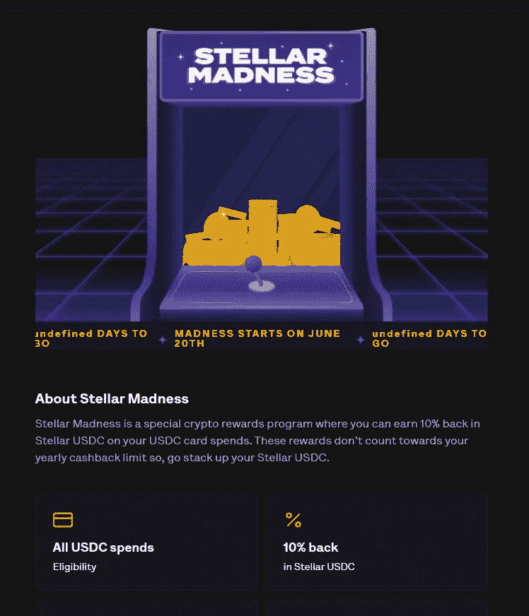

# 进入 Juno 之前需要考虑的事情——这是加密银行的未来吗？

> 原文：<https://medium.com/coinmonks/things-to-consider-before-venturing-into-juno-is-this-the-future-of-cryptobanking-2456f0b3b636?source=collection_archive---------8----------------------->

如果你读了我之前在 [GMX](/coinmonks/is-gmx-a-option-for-the-bear-market-an-in-depth-review-2c2eff249b7b) 上的帖子，你就会知道，现在我们正处于熊市，我终于找到时间去挖掘并研究一些我听说过但还没有真正玩过的平台。随着 Juno 目前的“[恒星疯狂](https://help.onjuno.com/en/articles/6321238-stellar-madness-terms)”促销活动(稍后我会详细介绍)，我终于做了功课，我认为分享一些我发现的关于 [Juno](https://onjuno.onelink.me/TkoI/referral?code=JAME4XIL) 的信息以及我最终决定注册的原因会很有用。

# 朱诺是什么？

Juno 上的[于 2020 年推出(或在](https://onjuno.onelink.me/TkoI/referral?code=JAME4XIL) [2022](https://juno.finance/blog/the-journey-from-OnJuno-to-Juno) 年正式重新推出为 Juno)，许多人认为它是一家新银行，但事实上，它实际上并不是一家银行。也许最容易想到的是 Juno 分成两个不同的部门——TradFi 和 Crypto。TradFi 部门充当银行的角色，因为他们的银行服务是由 FDIC 成员[Evolve Bank and Trust](https://www.getevolved.com/)提供的。换句话说，就像任何其他官方银行一样，你的资金由联邦保险公司(FDIC)承保，最高可达 25 万美元。

另一方面，加密部门没有得到联邦存款保险公司的保险(据我所知，没有一个加密部门能够得到保险)，但是“在信托和特许保管人的监管下，他们将大部分加密数据保存在冷库中，并购买了必要的保险。”从我[读到的](https://www.thewaystowealth.com/reviews/onjuno-review/)来看，这个冷藏库来自 BitGo，如果你之前没听说过，他是一个主要的行业加密货币托管人，参与了 [2016 年 BitFinex 黑客攻击](https://www.ccn.com/bitgo-claims-software-not-fault-bitfinex-hack/)。

# 朱诺是怎么赚钱的？

因此，对于 TradFi 部分，Juno 的赚钱方式非常简单——他们与选定的品牌合作，削减了卡用户的部分销售额，这反过来又产生了收入流；我假设像一个附属链接。其次，就像任何店主会告诉你的那样，每次用户刷借记卡本身都会产生费用。

鉴于我们已经看到的所有传染事件，我认为更深层次的问题是 Juno 如何产生其加密相关收益，不幸的是，我找不到那么多具体的相关信息。我收集到的有限答案是，他们使用他们的[“受监管的交易所合作伙伴 Wyre，主要与机构贷款台和一些次要的链上协议打交道，以产生加密资产的收益。”](https://help.onjuno.com/en/articles/6165672-how-does-juno-generate-the-bonus)

> 交易新手？试试[密码交易机器人](/coinmonks/crypto-trading-bot-c2ffce8acb2a)或者[复制交易](/coinmonks/top-10-crypto-copy-trading-platforms-for-beginners-d0c37c7d698c)

此外，通过直接与客户服务部门交谈，我得知:

虽然我们知道传染病的传播比地球或摄氏温度要远得多，但听到这个消息还是让人松了一口气。

# 会员计划

简而言之，有两种不同的选择:基本与金属

解剖其中的一些特征，有一些东西值得注意。

1.  对于基本型 5000 美元和金属型 50000 美元以上的资金余额，年度存款红利从 1.20%降至 0.25%。(但老实说，如果你在上面放了那么多钱，我强烈建议你去找一个理财顾问)。
2.  5%的返现仅限于一定数量的品牌，上次我数了一下 [43](https://help.onjuno.com/en/articles/3825432-what-are-the-brands-available-for-cashback) 。这些大牌包括亚马逊、塔吉特、网飞、Spotify、苹果和星巴克。如果你通常不会在这些供应商身上花任何钱，那么…这张卡可能就没什么意义了。此外，品牌可能会发生变化。
3.  返现也只能用于符合条件的目的，他们明确指出，预付卡充值或预付礼品卡的购买是不符合条件的。(抱歉女士们)
4.  利率可以(过去也曾经)改变。例如，当他们在 2020 年秋季首次推出时，他们提供的利率为 2.15%，但他们在 2021 年 5 月将利率降至 1.20%。
5.  这两个计划基本上都是免费的，金属卡的唯一限定条件是持续直接存款 250 美元。说到“免费”，这就引出了我的下一部分…

# 有费用吗？

每当我看到“免费”或“永远”这些词，我自然会有点怀疑，因为我总是认为免费是有代价的，对于借记卡来说，这通常意味着隐性费用。Juno 确实在条款和条件中引用了一个关于费用的常见问题，但应该将人们引向费用明细的链接是这样的:

进一步挖掘后，他们似乎真的没有收费结构，甚至对[透支](https://help.onjuno.com/en/articles/5167877-are-there-any-overdraft-fees)也是如此。事实上，如果你看一下他们的[免责声明](https://juno.finance/legal/disclaimers)页面，他们声明没有维护费，没有透支费，无论是金属卡还是基本卡都没有最低余额要求。即使有了升级版的金属卡，如果你停止直接存款，他们也会把你降级回基本卡。

基本上，我找不到任何提及 TradFi arm 的费用，但对于 Juno 的 crypto arm，我发现了一些费用，我将在下一节中讨论。

# 朱诺的加密部门

因此，使 Juno 成为“新银行”的是其平台中集成的 Crypto 有多好。有多种与加密相关的功能，例如:

1.**你可以将一部分薪水分配给多种加密货币:**

这是一个非常棒的功能，可以让菲亚特进入加密领域。如上图所示，这 3 个选项分别用于 ETH/BTC/USDC，并且它们还可以自动将你的密码放入你的冷钱包或热钱包。

2.**您可以从您的加密存款中赚取收益:**

即使没有杠杆，这些利率相对于你在 DeFi 中所能赚到的也是相当低的。尽管如此，它仍然是一个很酷的特性。

**3。存款没有 ACH 结算期。**

与其他正在发展的 CeFI 平台相比，这是一个很大的区别，因为大多数(如果不是全部)平台至少有一些最短的锁定期，在 ACH 结算之前，您不能提取您的存款。尽管我使用并尊重 OkCoin 等平台，但 10 天的 ACH 存款冻结可能会令人非常恼火。

**4。您可以选择以加密或法定方式付款**

这可能是最具革命性的——每当你想用加密货币或法定货币支付时，你就有了一个开关。如果你在菲亚特付款，你通常会得到 5%的返现，但至少在 7 月 31 日之前，如果你决定在 USDC 付款，你可以得到 10%的返现，每年最高 300 美元。目前，在他们的 [Stellar Madness](https://help.onjuno.com/en/articles/6321238-stellar-madness-terms) 促销活动中，如果您决定用$USDC 付款，您可以在 Stellar USDC 获得高达 100 美元的购物返现的 10%:

澄清一下，stellar madness 促销活动适用于在 USDC 完成的所有消费(不仅仅是您选择的品牌)，这不计入您正常的 300 美元返现限额。

**5。** **购买/出售费用:**因此，围绕 Juno 加密部门的费用可能是我最难理解的事情，因为费用结构似乎一直在向后推。然而，我发现所有低于 250，000 美元总交易量的密码买卖在 7 月 31 日之前都是免费的(这是从 6 月 30 日推迟的)，超过这个数量的所有交易每笔买卖订单都有 0.50%的费用。7 月 31 日之后，一切都会有 0.50%的手续费。

# **其他需要考虑的因素**

**财务** : Juno 和许多 DeFi 平台一样，都是风投资助的，早在 2019 年，他们就从红杉资本、Consensus 和蜻蜓资本管理等公司筹集了 300 万美元的种子资金。你可以在这里找到更多关于这个[的信息](https://www.crunchbase.com/organization/neo-bank-juno/company_financials)。

**总部在印度之外** : Juno 的总部在印度之外，看起来他们的团队[与他们关联的 linkedin 个人资料](https://juno.finance/about)混淆了。

**用户评论:**我在 [Trustpilot](https://www.trustpilot.com/review/onjuno.com) 和 Youtube 上看了无数的用户评论，虽然大多数评论都是正面的，但我认为最常见的抱怨是人们要么没有获得建立直接存款的 100 美元奖金，要么是其他技术问题，比如根本无法建立他们的直接存款。我看到的另一个主题是，一些用户无法获得客户支持，但根据我的经验，我可以通过他们的聊天功能轻松快速地获得客户支持——这也是我如何找到这篇文章的许多细节的原因。

# TLDR；结论

据我所知，Juno(或 OnJuno)是一个非常出色的金融科技平台，有助于在 TradFi 和 Defi 之间架起桥梁。他们的财务状况能更透明吗？是的，但我想知道，如果他们的加密产出实际上是由 Wyre 产生的，而不是通过他们自己的团队，他们的透明能力会有多有限。再看看收益率本身，我不会把 USDC 的 6%或 BTC 联邦理工学院的 3%归入“好得令人难以置信”的类别，而是相对保守。这是否排除了他们像 Celsius 一样发放德根贷款的可能性？不，但是任何有经验的 DeFi 的人都可以非常理性地假设这些回报。

根据我的发现，我肯定会开始向我新开设的 Juno 帐户中存入至少 250 美元，以获得 100 美元奖金的资格，然后看看情况会如何发展。我的直接存款在接下来的几周内不会达到，但我确实认为这是一个好方法，可以帮助我在等待熊市结束时 DCA 进入 ETH/BTC。

如果你正在阅读这篇文章，并且也有兴趣试用 Juno，请考虑支持这个博客，并使用我的推荐链接:[https://onjuno.onelink.me/TkoI/referral?code=JAME4XIL](https://onjuno.onelink.me/TkoI/referral?code=JAME4XIL)。如果你直接存入 250 美元或更多，我们都将得到 100 美元。

感谢阅读，请一如既往地在 twitter 上关注我，阅读我的所有最新发现和更新:【https://twitter.com/CryptosWith

声明:这些信息都不是财务建议，只是我在网上随便找的一个人的推测。请考虑这纯粹是教育和娱乐的目的。像往常一样，请做你自己的研究或联系财务顾问，找到什么投资可能最适合你。