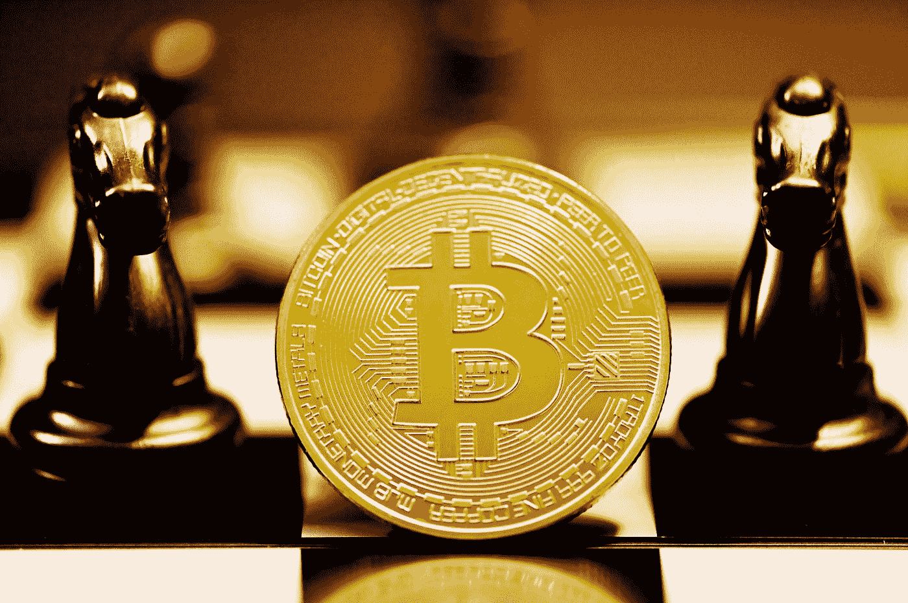

# 探索 GameFi 之前需要注意的事项(包括可以帮助您避免诈骗的提示)。

> 原文：<https://medium.com/coinmonks/things-to-note-before-exploring-gamefi-including-tips-that-can-help-you-avoid-scams-23057df7485f?source=collection_archive---------49----------------------->

Photo by [Kanchanara](https://unsplash.com/@kanchanara?utm_source=medium&utm_medium=referral) on [Unsplash](https://unsplash.com?utm_source=medium&utm_medium=referral)

> 传统上，我们玩游戏只是为了好玩，有时我们甚至付费玩这些游戏。区块链技术正在改变我们人类社会的方方面面，并没有将游戏行业甩在后面。现在随着 GameFi 的出现，可以玩赚。自从比特币和区块链技术出现以来，这项发明正在迅速接管游戏行业。它通过给玩家提供娱乐的同时赚钱的机会来吸引玩家。

## **什么是 GameFi(游戏与金融)**

GameFi 指的是建立在区块链之上的玩赚游戏。它允许玩家在完成一些任务时获得加密货币和 NFTs 等经济奖励。GameFi 生态系统使用加密货币、不可替代代币(NFT)和区块链技术来创建虚拟游戏环境。

截至 2022 年 3 月，DappRadar 中已有超过 1400 款区块链游戏上市。流行的游戏存在于多个区块链，如以太坊，BNB 智能链(BSC)，多边形，和谐，索拉纳，等等。

受欢迎的 P2E 游戏包括:被解放的神，Axie Infinity，StepN，DeFi 王国，Aavegotchi，Splinterlands，Genopets，Benji Bananas，Illuvium，Mirandus，Step App 等。

## **GameFi 中的常用功能。**

**先玩后赚模式(P2E):**GameFi 项目的核心是先玩后赚模式(P2E)。与传统电子游戏采用的付费玩模式大相径庭。付费游戏要求玩家在开始游戏前进行投资。但 GameFi 通过将娱乐与经济激励结合起来吸引游戏玩家。

**数字资产所有权:**类似于视频游戏，玩家可以拥有宠物、房屋、武器、工具、头像等等。但是在 GameFi 中，这些资产可以在区块链中作为 NFT 发行或创建(也称为 NFT 铸币)。这使得玩家可以完全控制他们的资产，具有真实性和可验证的所有权。

**DeFi 和 GameFi:** 一些 GameFi 项目也提供 DeFi 产品和功能，如打桩、流动性开采和产量耕作。通常，玩家可以下注游戏内代币来赢取奖励、解锁专属物品或进入新的游戏级别。

## **GameFi 是如何工作的？**

每个 GameFi 项目都将采用独特的模式和游戏经济。虽然一些 P2E(play-to-earn)游戏可以免费玩，仍然可以为玩家带来经济回报，但一些 GameFi 项目要求您在玩之前购买 NFT 或加密资产。GameFi 的其他特性包括:

*   玩家可以通过完成游戏指定的不同任务来获得奖励。
*   一些 GameFi 游戏还允许玩家通过下注或将其游戏资产借给其他玩家来产生被动收入。
*   GameFi 奖励以经济激励的形式出现，如加密货币或虚拟土地、头像、武器、服装等游戏内资产。
*   虽然其中一些游戏内资产是在区块链上运行的 NFT，这意味着它们可以在 NFT 市场上交易。其他的需要在玩家交易或出售前转换成 NFT。

## **要求玩**

*   不同于需要你设置用户名和密码的传统在线游戏，大多数区块链游戏使用你的加密钱包作为游戏账户。
*   大多数 GameFi 项目将要求你购买他们的加密货币令牌或游戏内的 NFT 来开始。
*   你需要一个兼容的加密货币钱包，比如 Trust Wallet 或者 MetaMask。去游戏官网查查他们支持的。确保你连接到他们的官方网站，而不是一个虚假的网站。

**GameFi 中规避风险的小技巧？**

市场上有成千上万的区块链游戏，它们的工作方式各不相同。因此，对 DYOR 来说(自己做研究)和分析风险总是很重要的。小心骗局项目和假网站。

*   连接钱包或从随机网站下载游戏可能会有危险。始终创建一个专门用于游戏目的的新加密钱包。
*   总是使用你能承受损失的资金。
*   始终考虑收入潜力和整体风险。一定要估计收回初始投资并开始盈利可能需要多长时间。
*   确保你连接到他们的官方网站，而不是一个虚假的网站。

# **谢谢你看完。我希望你得到了价值。**

> 交易新手？尝试[加密交易机器人](/coinmonks/crypto-trading-bot-c2ffce8acb2a)或[复制交易](/coinmonks/top-10-crypto-copy-trading-platforms-for-beginners-d0c37c7d698c)