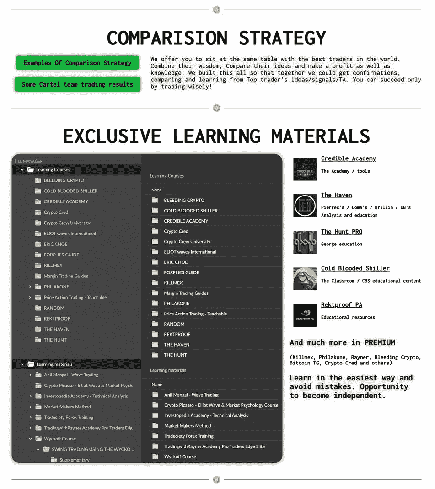

# 交易前必须知道的事情！

> 原文：<https://medium.com/coinmonks/things-you-must-know-before-trading-af416d99d35?source=collection_archive---------11----------------------->

大多数人在学习加密时犯的最大错误是认为他们需要在开始投资或交易加密货币之前阅读所有内容。
这不是真的！
你不需要知道所有的事情，但你需要很好地理解事情是如何运作的，这样你才能对你的钱做出更好的决定。
你的秘密教育和财富之旅不会一蹴而就。有时候你只需要每天做 1%。想象一下，如果你每天进步 1 %, 6 个月后你会在哪里！
我从基本面开始，过了一段时间，我有足够的信心进入交易、非金融交易和长期投资。今天，我每天都能从我的投资组合中赚到数千美元！

为了帮助其他人跳过一些错误，比我更快地开始交易，我们建立了 Crypto Cartel Original——这个地方甚至是为那些对交易一无所知的人准备的。
我们收集了顶级交易者的学习资料，包括你必须知道的主要内容，并提供将你的交易想法与世界顶级交易者的交易想法进行比较或进行复制交易(但我们从不建议盲目跟随任何信号或想法，这就是为什么我们收集了大量资料，所以你可以比较并获得确认，以进行良好的交易)。

第一课:开始吧！
[https://linktr.ee/cryptocarteloriginal](https://linktr.ee/cryptocarteloriginal)

> 交易新手？尝试[加密交易机器人](/coinmonks/crypto-trading-bot-c2ffce8acb2a)或[复制交易](/coinmonks/top-10-crypto-copy-trading-platforms-for-beginners-d0c37c7d698c)