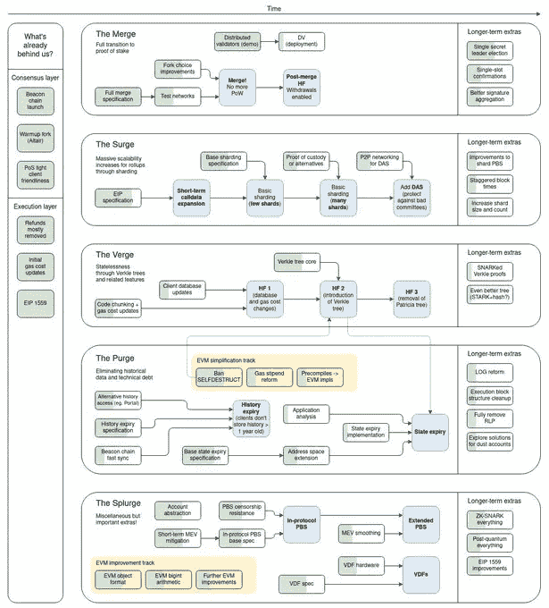

# 在以太坊合并中获利你需要知道的事情

> 原文：<https://medium.com/coinmonks/things-you-need-to-know-to-profit-on-ethereum-merge-f0c77ee1562f?source=collection_archive---------12----------------------->

以太坊开发者宣布了向利益相关证明过渡的日期——9 月 15 日。
让我们快速看一下什么是 POS，什么是 power。

# 利害关系证明与工作证明

使用工作验证(PoW)是因为采矿者的技术设备可以解决复杂的数学问题。对于向区块链添加验证块，矿工以加密货币的形式获得奖励。

+防御 DoS 攻击。当然，这是可能的，但成本会很高

+免受先前证据的保护。每个区块链都需要一组新任务的解，算法无法提前计算，所有部分都是顺序处理的。

—“攻击 51%”的威胁

-昂贵的设备

-不环保-高能耗。以太坊目前的年耗电量大约相当于芬兰

Proof-Of-stage
POS(Proof-Of-stage)——与 Proof-of-Work 不同，在 Proof-Of-stage 中，新区块的创建者是由系统根据其在股份中的状态(即在加密货币总量中的份额)预先选择的。

利害关系验证的思想是解决与高能耗相关的工作验证问题。重要的不是参与者的计算能力，而是他们账户中的加密货币数量。

+环保
+限制，硬币膨胀会继续，但会大大减少
+比战俘更好的防御“攻击 51%”

-对于没有中介的全面赌博，你需要 32 Eth
-你不能从赌博中退出半年
- 5% APR .这样的百分比可能会令人惊讶，也许除了银行的客户，在加密中这样的数字听起来很荒谬

然而，这不会一蹴而就，只会有 5 个阶段:合并，激增，濒临，清洗，挥霍。

# 攻击 51%

51%攻击是对区块链的攻击，其中一个实体或组织捕获了最大部分的 hashrate，这可能导致网络中断。

Vitalik Buterin 建议降低 51%针对 ETH 2.0(一个利害关系证明(PoS)网络)的攻击的相关风险，他说:

> “攻击者将能够执行它，但会很快被踢出网络，或者由于硬分叉，更改将被回滚，后者将失去对支持攻击所需的硬币的控制。”

Vitalik 还比较了 PoS 和 PoW，他强调了 51%的攻击对工作证明网络(如当前实施的比特币和以太坊)造成的风险增加:

> “因为 PoW 算法没有硬币可以“拿”，而且没有办法在不关闭其他所有人的设备的情况下关闭攻击者的设备，所以这种网络更容易受到 51%的攻击，这表明 PoS 相对于 PoW 的关键基本优势被低估了。”

当然，在 POS 中“51%攻击”是可能的，但要做到这一点，难度要大得多，也无利可图。

# 路标

*参考:*[vitalik . eth](https://twitter.com/vitalikbuterin/status/1466411377107558402)

# 在合并阶段等待协议的是什么

“合并只是第一阶段，但完成后，以太将有 55%准备好了”——Vitalik buter in 说。

合并更新是期待已久的以太坊从工作证明(PoW)到利益证明共识协议的转变。支持者认为，这次更新是迄今为止对以太坊代码最复杂、最彻底的改变。
开发者认为激活 Merge 后以太坊的功耗将下降 99.9%以上。

# 《议定书》在激增阶段等待着什么

在第一阶段，预计将引入分片技术。它会将整个以太坊网络分割成更小的碎片。这对于提高网络的可扩展性是必要的。

该协议的当前版本每秒可以处理 100 笔交易，至少在理论上，以太坊每秒可以处理数十万笔交易。

自 2013 年以太坊推出以来，切分的想法就一直存在。分片计划于 2023 年进行。

# 处于边缘阶段的协议等待着什么

下一阶段的变化将是 Merkle Trees，它也解决了可伸缩性的问题。

Merkle 树是一种散列大量数据元素(块)的数据结构。为此，几个元素被组合成块(桶)，这些块被散列，得到的散列被组合成新的块，等等。，直到我们最终得到一个根哈希。
所谓的边缘将优化存储和减少节点大小。最终，这将使以太坊更具可扩展性。这种方法首先在比特币区块链上被探索，然后被应用于以太坊。

因此，浪涌阶段将处理分片和卷起。边缘阶段将决定网络如何处理以太坊网络上的可扩展性和验证。接下来是一个“清洗+挥霍”的新时代。

# 清洗+挥霍的新时代

清除是为了减少备份的历史数据。

该协议试图随着时间的推移减少空间需求并简化协议。得益于此，该系统将变得更加强大、可靠和安全，甚至更加分散。一旦前面的所有阶段都完成了，那就是挥霍的时候了。

简而言之，挥霍是对所有过去协议的打磨，这样网络可以快速工作，没有中断，没有任何问题。

# 结论

到目前为止，以太坊目前正在开发中。这种转变需要一段时间才会出现。所有这些结果都是一个巨大的挑战，将向加密货币的未来迈出一步。总体而言，这一过渡预计将是无缝的。您不需要做任何事情来切换。

你可以在我的 [Twitter](https://twitter.com/trill2scope) 账户上找到更多文章和信息。

> 交易新手？试试[密码交易机器人](/coinmonks/crypto-trading-bot-c2ffce8acb2a)或者[复制交易](/coinmonks/top-10-crypto-copy-trading-platforms-for-beginners-d0c37c7d698c)