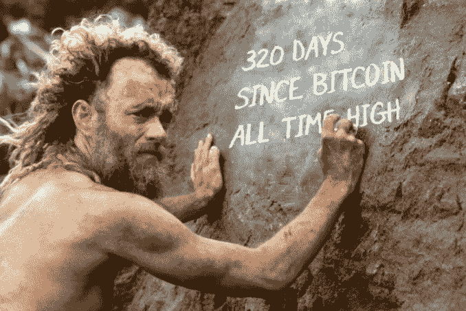

# 在 Twitter 上遵循任何人的秘密建议之前，要深思熟虑

> 原文：<https://medium.com/coinmonks/think-long-and-hard-before-following-anyones-crypto-advice-on-twitter-788d7642a4ca?source=collection_archive---------10----------------------->

如今，加密 Twitter 充满了机器人、骗子和邪教般的社区，他们盲目地相信他们的硬币会“飞向月球”。

可悲的是，与股票和债券不同，目前很难监管加密和解密领域。即使是有影响力的人也可以“兜售”一个 memecoin。

只要他们包括一个免责声明，告诉你“DYOR”(也称为“做你自己的研究”)，因为它“不是财务建议”。

## 避免诱惑

不管听起来有多诱人，投资这些迷因项目是为了一夜暴富。

试着保持冷静，避免落入陷阱。很有可能，你是被陷害的。

如今，每个人都可以推出一个加密令牌或 DeFi 协议，并推广它，预算为 15，000 美元。

这包括社交媒体页面、新闻稿、reddit 帖子和每天推广该项目的 Twitter 机器人大军。经常卖“买入信号”。

根据 Twitter 消息行事不会让你成为精明的投资者。充其量，你只是上当了。

## 影响者不是财务顾问

大多数影响者的服务只需几千美元就能买到。

因此，如果你是一个加密项目的所有者，你可以简单地花 50，000 美元让各种一级影响者向他们的社区推广你的加密项目。

天真的人最终会加入进来，因为“约翰·保罗支持新硬币”。

不需要常春藤联盟的学位就能明白这只是一个精心策划的阴谋，目的是利用寻求一夜暴富的绝望投资者。

## 加密货币空间有潜力。不要误解我。

我真诚地相信，许多加密货币，如 BNB、以太坊和 Avax，都是伟大的长期投资，将成为未来金融体系不可或缺的一部分。

然而，重点在于长期。大多数真正拥有加密货币的人并不是一夜之间购买的。他们投入到他们相信的项目中，并坚持了几年。

许多散户投资者被骗了，认为他们应该期待自己的投资组合在一周内上涨 50%。因此，只要他们的持有量下降 20%，他们中的大多数就会卖出，重复同样的循环，直到他们的投资组合变得无足轻重。

作为散户投资者，如果你真的想通过投资加密货币赚钱，你需要开始做自己的研究，就像人们做股票和债券一样。

其次，你需要有耐心，根据你所处的情况，持有和获利的能力。

投资加密货币不应该是一场赌博。即使你每年投资不到 10，000 美元，随着时间的推移，这些钱会越积越多，你的机会成本会变得很大。

根据 Twitter 的建议，你最好将这笔钱投资于获取新技能、提供服务，甚至只是投资于指数基金，而不是在加密上赌博，而没有勇气长期持有或获利。

## 在加密领域有很多市场操纵行为。

散户投资者在面对加密巨鲸或大多数欺诈时，没有 SEC 的杠杆或保护。所以不要让你的自负或贪婪误导你。

## 即使是以太坊和比特币这样的大市值项目，也不要接受 Twitter 的建议

我们都见过 bictoin Moon boys 鼓励人们在 69K 买入，并把他们的个人资料图片改为激光眼。

我曾亲眼目睹邪教般的 discord group，人们被告知卖掉所有财产，获得贷款，在比特币价格仍高于 5 万时购买比特币。

一年后，将近 5000 亿美元的市值化为乌有；激光眼个人资料图片已被删除，他们的推文也被删除。

以太坊的合并也发生了同样的事情，每个人都在大肆宣传合并后以太坊的价值至少会翻倍。它没有，它在一周内损失了超过 30%的价值。

> 买谣言，卖新闻。

在加密领域致富还是很有可能的。但是避免炒作，根据基本面分析投资你相信的项目，并长期持有。如果您能够每年投资 10，000 美元，在加密资产不断增值的同时，获得 10%到 30%的平均 IRR，那么十年内，您的投资组合价值将增长 5 到 20 倍。

## 不要贷款，避免不必要的杠杆，你永远不知道，交易所本身可能会对你不利。

如果当价格与你的预测相反时，你认为你没有勇气持有，就把密码锁在定期存款里，直到到期日你都不能动它。

我的个人策略是在高息储蓄账户上持有 50，000 美元/USDC，每月产生约 500 美元/USDC，我用这些资金投资 AVAX、比特币和以太坊等项目，同时防止我的资本被清算。我有时也用被动收入来买书，学习更多的加密知识，并投资于我的其他业务，以增加存款额。

随着时间的推移，我的目标是将 10，000，000 美元/USDC 投资到高息储蓄账户中，然后我可以将超过 1，000，000 美元/USDC 投资到我相信的加密项目中。无限风险资本。

## 不要让任何人侮辱你的智慧

你的硬币的价格不会暴涨，因为你在它上市的加密交易所的广告上看到了马特·达蒙，或者因为中非某个不知名的共和国决定让它成为法定货币。

比特币社区喜欢发布“突发新闻”这样的无关紧要的事件，而事实上它们对比特币的整体价格没有影响。

我家附近的咖啡店也接受比特币和以太币……我不是要把它作为头条新闻。

## 我绝不会仅仅因为一个不负责任的月球男孩的推文，就拿我所有的积蓄在一个项目上冒险。

我希望这篇观点文章对你有所帮助。留给我一个掌声和分享。这对我帮助很大。

> 交易新手？试试[加密交易机器人](/coinmonks/crypto-trading-bot-c2ffce8acb2a)或者[复制交易](/coinmonks/top-10-crypto-copy-trading-platforms-for-beginners-d0c37c7d698c)