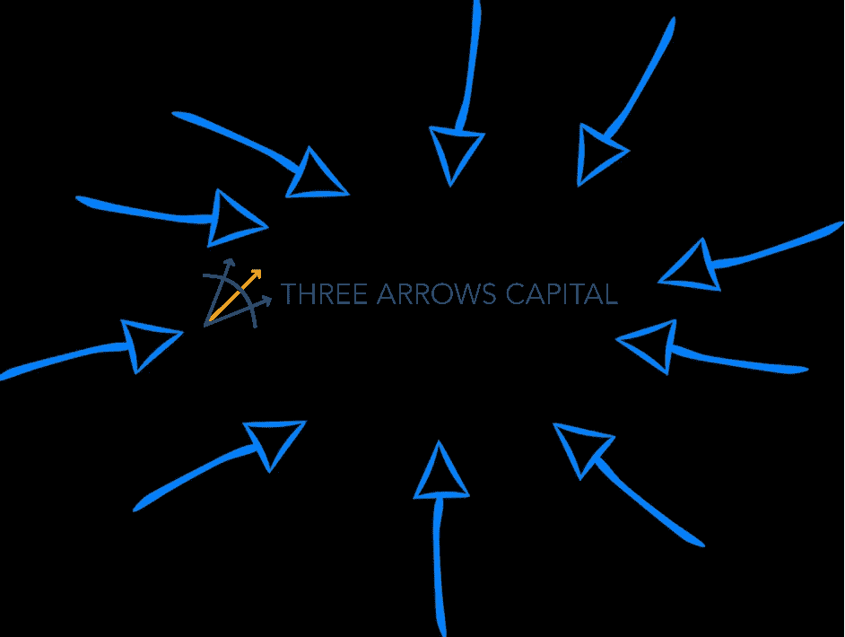
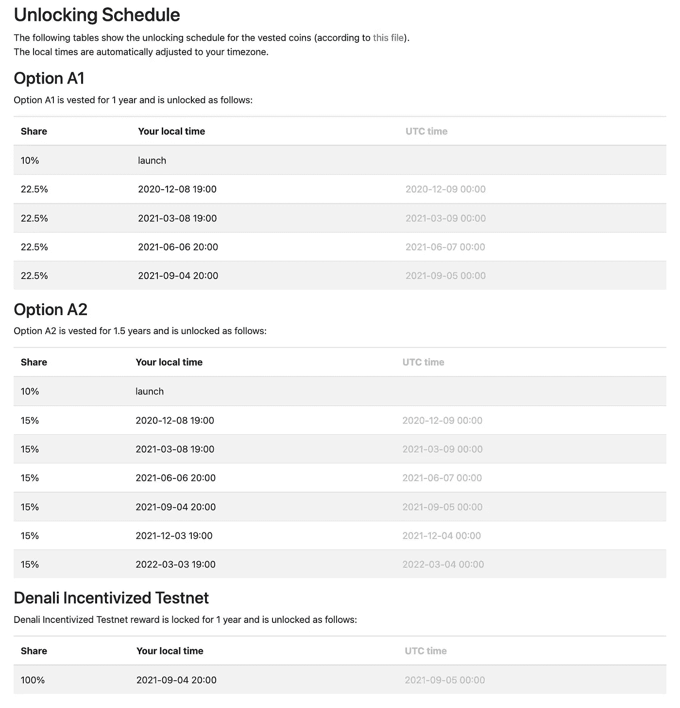
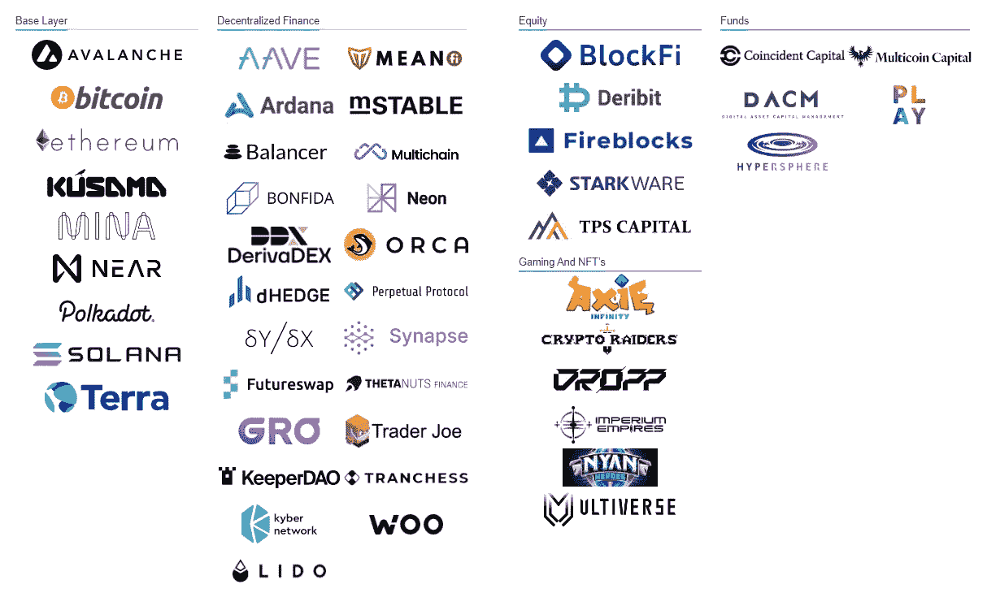
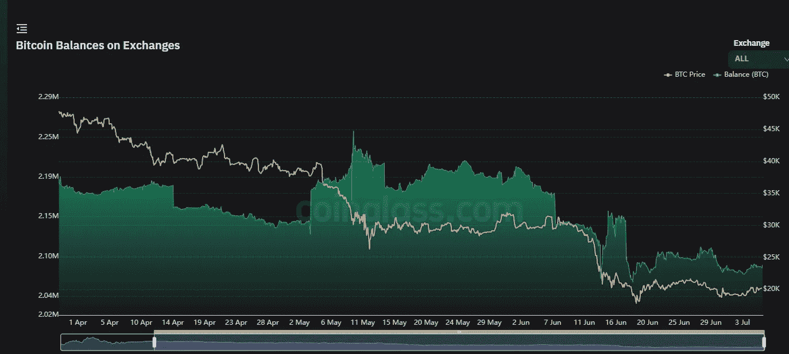
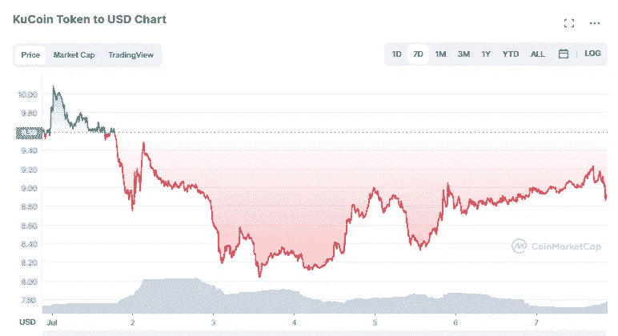

# 认为你没有受到 3AC 垮台的影响？重新考虑

> 原文：<https://medium.com/coinmonks/think-you-werent-affected-by-the-downfall-of-3ac-think-again-d2b797c0d986?source=collection_archive---------4----------------------->

No VC is an Island

尽管 Terra 的死亡螺旋可能是催化剂，但蔓延的主要原因是 3 Arrows Capital 的垮台。如果你是这个领域的新手，直到几个月前，3 Arrows Capital 是最著名的加密对冲基金之一，管理着数十亿美元的资本；然而，7 月 2 日，3AC 申请了第 15 章破产，可能会被认为是当前加密冬天的最大受害者。与 3AC 相关的一切都在蔓延，这是真的，而且发生得很快。正如我将在这篇文章中强调的，即使你认为你是安全的，因为你从未参与 Voyager(或 Celsius，Vauld，Coinflex 等。)或者，即使你从交易所撤出了所有资产，你可能仍未脱离险境。

# 3AC 授权计划

作为金融巨头，3AC 大概已经进入了底层，或者至少足够接近(没有双关语的意思)他们将通过其授权计划获得许多象征性解锁。在接下来的几周或几个月里，我会努力关注 3AC 的授权令牌锁的未来，但**我的假设是，当这些解锁发生时，它们可能会被立即出售，以试图弥补 3AC 的破产。**

如果你没有听说过授权时间表或代币解锁，本质上这是许多平台/代币采取的措施，试图防止在最初的代币发布日期倾倒代币。相反，通过解锁/授予计划，只有部分代币将在不同的时间间隔向初始投资者发行。

举个简单的例子，让我们看看$AVAX 令牌。 [3AC 是此次私人拍卖](https://www.theblock.co/post/117895/polychain-three-arrows-capital-lead-230-million-avalanche)的成员之一，此次拍卖共筹集了 2.3 亿美元。根据 Messari.io 的消息，以$AVAX 的价格进行的私人种子销售包括以下参与者的详细信息:

> “3.5%的代币是给私人销售的参与者的。每枚代币的价格为 0.5 美元，一年的授权期。分配的 10%在 mainnet launch 上发布，其余的在一年中每三个月发布一次。

发行时总共铸造了 3.6 亿美元的 AVAX，这意味着当代币首次发行时，私人投资者能够在发行时获得 1，260，000 美元的 AVAX，然后每 3 个月获得剩余的 90%，这相当于每 3 个月大约 2，835，000 美元的 AVAX。我想在这里提出的主要观点是，如果今天突然抛售 2，835，000 美元的 AVAX 代币，以 18.86 美元的当前现货价格计算，则$AVAX 市值可能会受到价值 53，468，100 美元的冲击。这无疑会导致$AVAX 的价格下跌，伤害所有$AVAX 的持有者。

现在这些数字可能看起来有点夸张，当然，可能不是所有的私人投资者都会一次性抛售他们的股票(事后来看，考虑到$AVAX 的 ATH 是 144.96 美元，这是愚蠢的)，但这些数字只针对*私人投资者。发行时的代币发行不仅面向私人投资者，还面向包括种子投资者在内的其他参与者，以及多次公开销售，总计约占 AVAX 最初发行的 3.6 亿美元的 15.97%，其中大多数在接下来的 12-18 个月内有不同的授权和解锁时间表。第二个考虑是，我找不到关于这 230，000，000 美元的私人销售收入中有多少属于 3AC 的数据，但我的假设是，在其他私人销售中，3AC 获得了最大的份额。*

现在，如果你担心 3AC 的未来解锁$AVAX，不要担心。$AVAX 的 ICO 日期是[2020 年 7 月 15 日](https://coinjournal.net/icos/avalanche/)，这意味着作为一个私人销售投资者，3AC 将在 2021 年 7 月 15 日获得他们最后的令牌解锁。事实上，对于能够提前进入$AVAX 的任何人来说，最后一次令牌解锁是在 2022 年 3 月 3 日，针对期权 A2 投资者:

我想在这里重申的主要观点是，随着未来解锁的发生，3AC 垮台的后果可能会导致不同令牌的未来抛售。不确定你的代币什么时候解锁？您可以在许多地方进行检查，包括:

 [## 解锁令牌日期

### 解锁令牌日期和日历、令牌组学、交易策略，以便在大众面前销售

unlocktokendate.com](https://unlocktokendate.com/)  [## 解锁日历|子堆栈

### 接收即将到来的令牌解锁的更新。

substack.com](https://substack.com/profile/33972922-unlocks-calendar) 

或者，如果没有列出，我会直接查看令牌的白皮书，因为通常可以在那里找到时间表。

# 没有人(或风投)是一座孤岛

我想指出的第二点是，正如你在下面看到的，3AC 是多个不同项目的主要投资者/利益相关者，所有这些你都可以在他们的[网站](https://www.threearrowscap.com/select-investments/)上找到:

Where’s Voyager?

如你所见，这是…很多。虽然有一些关于这些投资的公开信息，但我认为我们在这一点上可以假设的是，有数十亿美元的支持，3AC 已经触及了加密空间的许多不同部分，而不仅仅是像 Voyager 或 BlockFi 这样的德根贷款人。想要一些例子吗？

Fireblocks——数字保管人[“1300 家最大的机构利用 Fireblocks”](https://www.fireblocks.com/)

近协议——不仅有 3AC 的支持，还有许多其他公司，包括[老虎环球](https://www.tigerglobal.com/)、[共和资本](https://www.republiccapital.co/)、 [FTX 风险投资](https://ventures.ftx.com/)、[哈希](https://www.hashed.com/)、[蜻蜓资本](https://www.dcp.capital/)、[帕拉菲资本](https://www.parafi.capital/)、 [Blockchange 风险投资](https://blockchange.vc/)和 [MetaWeb 风险投资](https://www.metaweb.vc/)、[阿拉米达](https://www.alameda-research.com/)、[跳跃资本](https://jumpcap.com/)、[潘迪拉资本](https://panteracapita.com/)

> 交易新手？尝试[加密交易机器人](/coinmonks/crypto-trading-bot-c2ffce8acb2a)或[复制交易](/coinmonks/top-10-crypto-copy-trading-platforms-for-beginners-d0c37c7d698c)

3AC 的垮台本身并不迅速，也不具有灾难性，但它在多个不同平台上产生的直接和间接的连锁反应加剧了这一问题。直接原因是它拖欠了 Voyager (15，250 美元 BTC)和 BlockFi(10 亿美元)等公司的贷款，这些公司现在已经破产和/或陷入财务困境，但间接原因是它导致许多人因害怕冻结提款而将他们的股票从交易所撤出。只要看看过去两个月交易所的比特币总余额就知道了:

这种恐惧和蔓延已经使许多平台/协议面临流动性短缺的风险，或者至少是一吨 FUD，从而导致更多的 FUD 和可能的价格波动。这种不幸的组合会影响你的代币价格，不管它是否被冻结提款。如果你读了我在[上一篇关于围绕](/coinmonks/celsius-blockfi-coinflex-now-voyager-how-safe-is-kucoin-4a7bede052ad)[库币的 FUD 的文章](https://www.kucoin.com/ucenter/signup?rcode=r3GKBZX)，你会记得，由于一些大规模的从冷到热的钱包转移，出现了误传的恐慌。尽管谣言似乎没有得到证实，但库币的原生代币 KCS 仍然出现了一些重大的价格波动:

这种类型的价格行为可能会强烈刺激不良行为者轻易地操纵市场，以获得巨大收益或给其他人造成重大损失。这就引出了我的下一个也是最后一个观点:

# 连续的二阶、三阶和四阶连锁效应

由于 3AC 的确切流动性问题尚未公开，问题将会继续增加，在这些问题公开之前，我们不知道需要向谁偿还多少钱，也不知道这些投资项目中的一些会因 3AC 的资金撤出/清算而受到什么影响。

我敢打赌，在那之前，我们将继续看到不同项目的多米诺骨牌效应，这些项目甚至没有直接关系，将继续受到 FUD 或流动性短缺的影响，从而将更多的平台/交易所或代币置于风险之中。我目前正在撰写另一篇文章，我将对此进行更深入的研究，但这方面的一个简单例子是目前围绕$USDC 的 FUD。如果你把这些点连接起来…

1.  3AC 破产了
2.  创世纪因 3AC 曝光损失[“上亿”](https://www.coindesk.com/business/2022/06/29/genesis-faces-hundreds-of-millions-in-losses-as-3ac-exposure-swamps-crypto-lenders-sources/)
3.  Genesis 与$USDC 背后的公司 [Circle](https://www.circle.com/en/solutions-for-banks) 合作
4.  FUD 包围了$USDC

我个人不认为$USDC 有什么问题，但我也认为 FUD 会让人做出非常不理智的事情，所以我们只是还没有想象多米诺骨牌会倒下，或者在非常基本的层面上，接下来会有什么谣言传播。这可能是一个非常悲观的前景，但我相信只要熊市持续，我们就会继续看到这些不幸的事件。尽管我在 terra 生态系统中遭受了损失，这也是为什么我更担心 3AC 的垮台，而不是 LFG——3AC 在更多的底池中有更多的手牌。

其中一些项目的乱伦性质导致这种蔓延更像是一场野火——一场几乎燃烧了所有加密内容的野火。

# 结论；余波中的光

抛开所有对 3AC 垮台的悲观预测，我相信现在和未来几个月经历的痛苦将有助于加密市场作为一个整体变得更加强大，从长远来看更有弹性。希望能够幸存下来的项目能够建立应急计划和智能合同，以确保它们能够在未来发生的任何末日场景中幸存下来。这是在牛市的高潮，每个人似乎都在赚钱的车轮上睡着了，但这是在熊市的深处，当我们弄清楚到底需要什么，我们到底在做什么。

再次感谢您的阅读，如果您有任何相反的观点/事实，我将非常有兴趣在下面的评论中听到。另外，如果你想收到我所有的最新消息，请务必在推特上关注我:[https://twitter.com/CryptosWith](https://twitter.com/CryptosWith)

声明:这些都不是财务建议，只适合娱乐和教育目的。请像往常一样，做自己的研究，找到最适合你的投资。