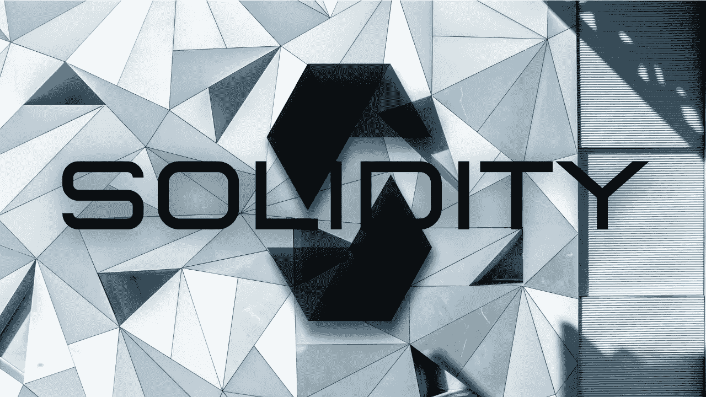

# 想着学扎实，从看这篇文章开始！

> 原文：<https://medium.com/coinmonks/thinking-of-learning-solidity-start-by-reading-this-article-45968c53fe65?source=collection_archive---------14----------------------->

Web3 是业内最新的技术爆炸，每个人都试图从中获利。要么开始 NFT，要么接受工作邀请。因此，在深入研究这个问题之前，需要遵循一定的程序。在这篇文章中，我将向你展示如何成为一名可靠性专家，并作为一名智能合同工程师或 web3 开发人员获得你的第一份工作。首先，学习稳健很简单，但掌握它需要大量的工作。但是别担心，我会告诉你所有你需要知道的。

1.  首先学习基本的编码概念

对于那些没有任何关于编码或如何编码的知识的人，请参考一些 youtube 视频并学习任何语言编码的基本概念，我将推荐 javascript，因为它已经在 web2 和 web3 中使用。主题包括变量、数据类型、函数等。

您可以参考这些播放列表中的任何一个:

2.学习重要的可靠性概念

youtube 上有数不清的频道，你可以在上面选择学习扎实。我将在这里提到我最喜欢的一个。

在 youtube 频道中，提供了正确的学习扎实度流程的非常少，下面提到了其中的一些。

另一个知识性很强并提供准确信息的播放列表是由 Smart Contract 程序员提供的。

3.看教程练习！

参考这个列表后，你会被认为是初级智能合同工程师。但是要成为可靠的专家，你必须知道如何独立地为不同的问题写合同。为此，你必须扎实地练习编码。试着做一些稳定的项目，比如

1.  待办事项应用程序
2.  [隐型僵尸](https://cryptozombies.io/en/course/)初学稳固之道
3.  由 [buildspace](https://buildspace.so/p/build-solidity-web3-app) 开发的 Waver 应用
4.  分布式交换
5.  ERC721 游戏
6.  在线赌场
7.  KYC 链
8.  众筹

一旦你完成了这些项目，你就会对自己的技能有信心。

4.练习运用你的技能

一旦你学会了如何创建一个智能合同，是时候学习如何创建一个准确的智能合同了。尝试在 solidity 中实现一些自己的想法。我知道独自思考一个问题并从头开始解决它是非常困难的。但这只是一个开始的游戏。一旦你开始建造，你会在几周内完成它。例如，使用 solidity 制作一个教室考勤系统，或者制作一种可以在大学或朋友之间使用的加密货币。

5.最后阶段

现在，你已经基本掌握了这些概念，所以你可以贡献一些开源库或者尝试在[以太坊栈交换](https://ethereum.stackexchange.com/)上解决问题，这肯定会给你一个专业的氛围。如果你在这个阶段遇到困难，你需要更多的练习，并尝试建立更多的项目。

6.万岁！

最后，你已经成为一个可靠的专业人士，现在你可以雇用自己的团队，从加密市场赚一些钱，或者你可以申请工作/实习。

提示:

还有一点，你可以在一周内完成学习巩固，但要掌握它，需要付出很多努力。所以，给 solidity 最大的时间，直到你确定你擅长它。

#稳固#网络 3 #学习稳固#实践

> 交易新手？试试[密码交易机器人](/coinmonks/crypto-trading-bot-c2ffce8acb2a)或者[复制交易](/coinmonks/top-10-crypto-copy-trading-platforms-for-beginners-d0c37c7d698c)