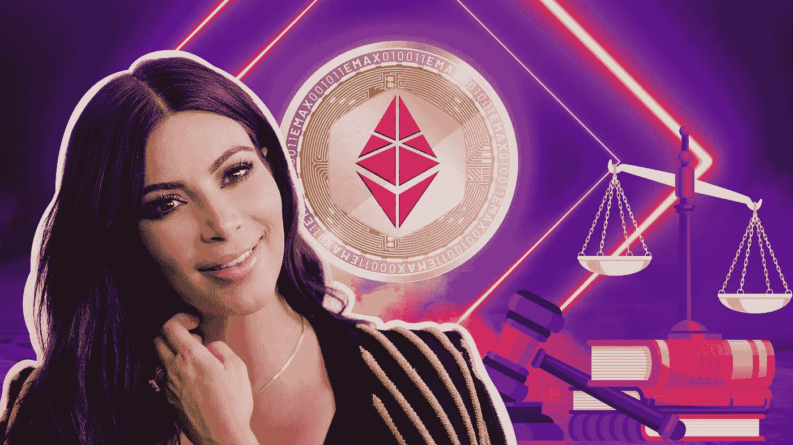
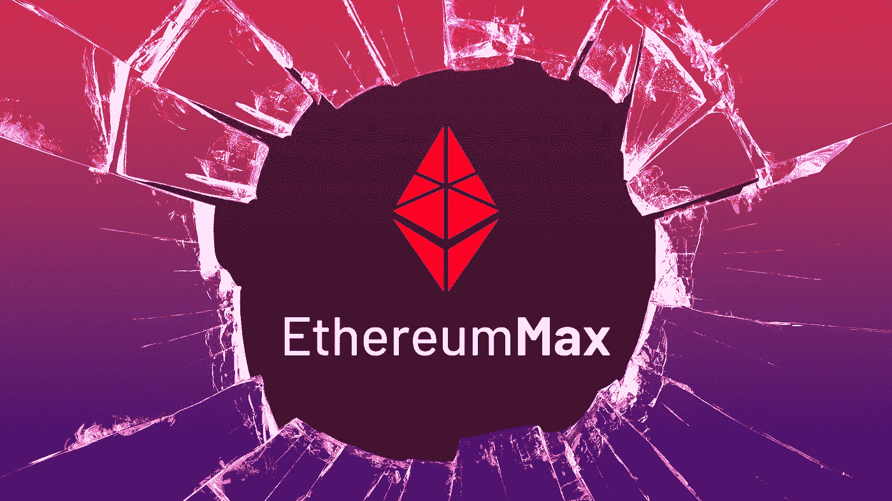

# 这项 126 万美元的法庭和解是对推广 crypto 的名人的最后警告

> 原文：<https://medium.com/coinmonks/this-1-26-million-court-settlement-is-the-final-warning-to-celebrities-promoting-crypto-9d1b605ed07d?source=collection_archive---------22----------------------->

密码骗局并不新鲜。它们几乎和密码本身一样古老。每一轮牛市都有自己的叫卖者，他们推销任何被炒得沸沸扬扬的硬币、NFT、社区或支付他们报酬的初创企业。2020 年刺激计划和全球经济反弹的最后一波牛市带来了一种新的叫卖者，即名人加密推动者。这是第一次。它带来了加密货币和区块链解决方案的主流意识和接受，但也带来了同样的老问题。很难区分哪些项目是合法的，哪些是建立在脆弱的商业模式上的。从出现在 crypto.com 广告中的马特·达蒙到杰克·保罗在 NFTs 中的冒险，几乎每个名人的名字都与 web3 空间中发生的事情相关联。每当一个项目失败，粉丝的投资遭受损失时，名人就会假装不知情。他们会声称，他们只是由一个赞助商支付，并不知道该项目是漂浮在热空气。

# 以太坊 Max 是什么？

这就把我们带到了名人金字塔的顶端，金·卡戴珊。金涉足了她自己的加密事业，似乎美国证券交易委员会正试图将她作为一个例子。我们在上一篇关于名人推广加密项目的文章中简要提到了 EthereumMax。作为一点背景，以太坊 Max 与第二大加密货币无关，这应该被视为第一个危险信号。这个名字旨在引起你的注意，并提供一种合法性的氛围，让投资者相信它是一个潜在的分支或由同一批开发商建造。令牌本身只不过是以太坊区块链上的一个 ERC-20 令牌，但与最初的以太坊项目无关。这在 crypto 中并不罕见，许多项目采用其他项目的名称，如比特币或 Doge，甚至借用 Musk 和 Squid Game 等著名名称。这几乎总是一个迹象，表明你正在处理一个骗局。

EthereumMax 令牌承诺建立一个强大且可扩展的生态系统，充分发挥去中心化金融(DeFi)的力量。白皮书概述的其他承诺包括交易所网络和 NFT 市场，以及进入最热门的餐馆和俱乐部。虽然这些承诺都没有实现，但这种象征遵循了 Fyre Festival 的方法，将其名称与名人世界的上层联系起来。这就是金·卡戴珊的用武之地。

# 金 K 做了什么？

Kim Kardashian promoted EthereumMax via an Instagram story.

虽然卡戴珊不是唯一一个兜售 EMAX 代币的名人，但她很可能是最大的一个。她是 Instagram 上最大的粉丝之一，毫无疑问她会拥有最大的影响力。当其他推广者更多地参与到他们的 t 恤、视频和推文中时，卡戴珊的推广只不过是一个简单的 Instagram 故事。这是 6 月份 2021 年牛市的高潮，现在臭名昭著的故事促进了这样一个事实，即开发者正在燃烧超过 400 万亿代币，以提升代币的价值并“回馈社区”。虽然帖子强调这“不是财务建议”(密码社区中常见的 meme 免责声明)，但很明显，围绕令牌、团队以及这是否是一项合理投资的研究很少。这对任何自己做过研究的人来说都是显而易见的。但真正让美国证交会恼火的是，卡戴珊没有透露向她当时的 2.1 亿粉丝宣传这一场景的报酬是多少。

# 从泵中掉出并倾倒

EMAX 代币没有在任何知名交易所上市，而是通过他们的网站直接投资。在一系列帖子之后，代币的价值暴跌了 97%。这导致许多愤怒的投资者将矛头指向名人金·卡戴珊、拳击手弗洛伊德·梅威瑟和篮球运动员保罗·皮尔思。投资者联合起来组成了一个针对开发商和名人代言人的[集体诉讼](https://www.cnbc.com/2022/01/12/kim-kardashian-and-floyd-mayweather-sued-over-alleged-crypto-scam.html)，指控他们在一个抽水-倾倒计划中串通一气。虽然集体诉讼的结果尚未决定，但美国证券交易委员会(SEC)迈出了一步，起诉了金·卡戴珊(Kim Kardashian)，并以 100 万美元的罚款加上她为推广该计划而获得的 26 万美元达成和解。她还被禁止在接下来的三年内推销加密资产。

这可能看起来像是金·K 巨大财富的九牛一毛，但对于加密社区来说，这是一个转折点。它发出了一个明确的信息，即这些盲目的促销是不会被容忍的，而像金·K 被指控的那样“非法兜售”一种加密货币，现在将引起 SEC 的愤怒。毫无疑问，在未来，我们将看到名人对他们将参与的加密计划更加小心，希望更少的泵和转储计划将达到 EMAX 所达到的程度。

如果你喜欢这篇文章，并想留在了解所有事情的网站 3，请确保你关注 BAXE 博客并注册我们的邮件列表。

你也可以在 [Twitter](https://twitter.com/BaxeApp) 上关注我们，并加入我们的[电报小组](https://t.me/BaxeCommunity)。

我们承诺让您了解最新信息，尽情娱乐😏

> 交易新手？试试[密码交易机器人](/coinmonks/crypto-trading-bot-c2ffce8acb2a)或[复制交易](/coinmonks/top-10-crypto-copy-trading-platforms-for-beginners-d0c37c7d698c)