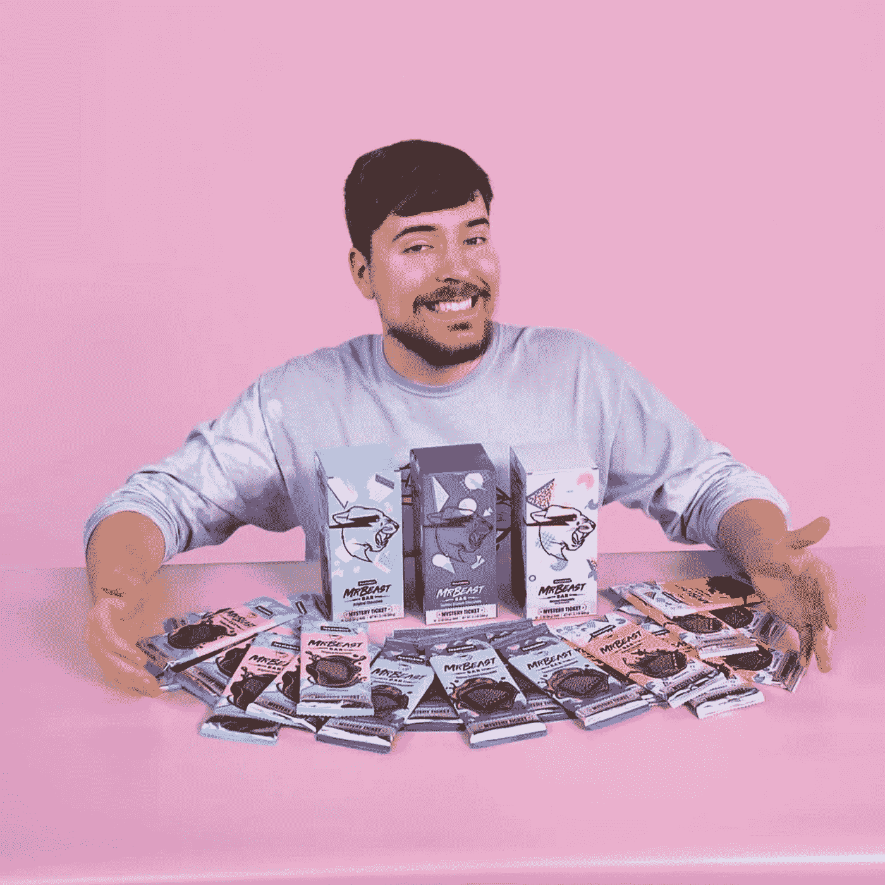
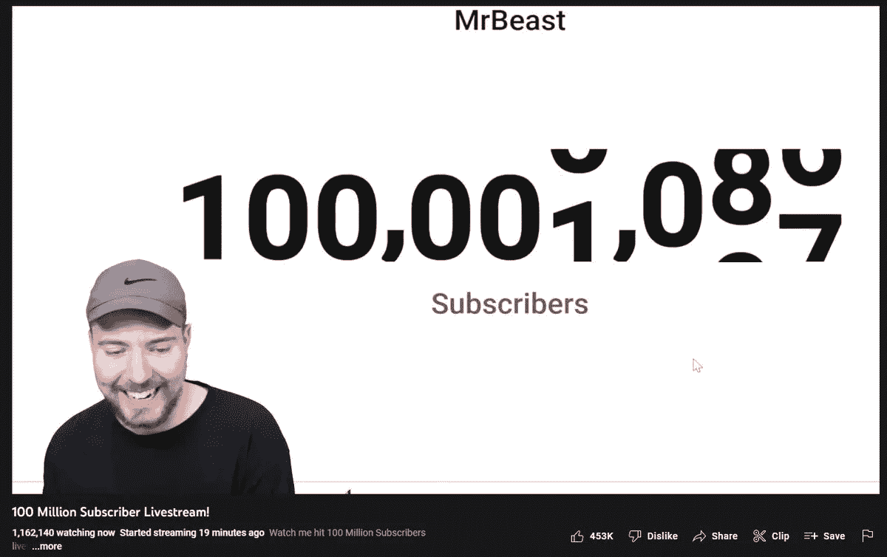

# 这位 24 岁的年轻人去年在 YouTube 上赚了 5400 万美元。

> 原文：<https://medium.com/coinmonks/this-24-year-old-made-54m-on-youtube-last-year-d89c1b95dc10?source=collection_archive---------22----------------------->

Mr Beast has his own chocolate line and makes millions every year from his YouTube videos.

生活中有些事情你真的不会期望有人在现实生活中去做。

比如重新创造我们都知道和喜爱的虚构事物。

原因很简单，因为它们不切实际，成本极高，而且非常费力。

这正是 YouTuber 的野兽先生所做的。

他建造了一个实物大小的威利·旺卡巧克力工厂，配有巧克力河、巧克力门、棉花糖室和巨型曼妥思。

他最近在 YouTube 上点击了 1 亿用户！

好吧，即使你不看他的视频或不太了解 YouTube 指标，不管怎样，1 亿仍然是一个令人印象深刻的数字。

"**近年来，Jimmy 'MrBeast' Donaldson 已经成为互联网上最知名的人物之一，他能够创作出前所未有的 YouTube 视频，许多其他创作者都希望模仿他的作品并取得成功。现在，他已经加入了一个真正的精英俱乐部，在这个平台上拥有 1 亿用户。**

He had a livestream to literally countdown to the 1 millionth subscriber.

我看了他的威利·旺卡巧克力工厂的视频，这是他全力以赴打造的。

他以这种滑稽动作闻名，为他的 YouTube 视频走了极端。

我猜他明白“用更多的钱赚更多的钱”的原则。

他花了多少钱？

可能是一笔财富。

计划这整件事所花的时间真是惊人。

完成这项工作需要各种团队和承包商的努力和协调。

他不得不增加赞助商的趣味。

从头开始规划和创造这一切所需的知识、关系、才能和资源。

随着比赛的进行，看到他在叙述中引入赞助商和广告的方式令人耳目一新。

How much did it take to recreate every detail of the Willy Wonka Chocolate Factory?

我要说的是，这一切的发生需要努力和精心的计划。

他也为乌贼游戏视频做了同样的事情！

有趣的是，每个令人惊讶的复杂的道具和舞台花了这么长时间来建造，而他只花了几秒钟。

我猜是出于对内容创作的热爱。

戈登·拉姆齐甚至来评判最后的甜点制作挑战！

这是一个痛苦的判断，我敢打赌，他讨厌每一个甜点，但它的观赏性。

他是如何说服戈丹这样做的？

我想当你有无限的预算，社交媒体上最大的受众之一和伟大的个性时，你几乎可以得到任何你想要的人。

Still can’t believe Gordon joined the video.

野兽先生甚至为一些中途被淘汰的参与者捐赠了 1 万美元。

他把整个工厂给了最终的赢家，让他以 50 万美元的价格把工厂卖回给他，但这个视频在 YouTube 上仍有 8700 万的浏览量。

天才。

根据《福布斯》发布的 YouTubers 收入最高的年度榜单，2021 年，吉米·唐纳森(MrBeast)在该平台上的视频收入约为 5400 万美元。据 YouTuber Nate Woodbury 估计，MrBeast 每年能赚 5000 万到 1 亿美元。"

这些钱来之不易。

他必须努力工作。

野兽先生 11 岁开始他的旅程，拥有 17 个 YouTube 频道，在 Twitch 上非常活跃。

他还是一名企业家和慷慨的慈善家。

我迫不及待地想看到他更多令人发指的滑稽动作和视频。

-

你看过野兽先生的 youTube 视频吗？

-

#初创公司#业务# startupx #员工#成功#社交媒体#文化#远程工作#战略# willy wonka # Mr beast # gordanramsay # YouTube #赢家#内容#坚持不懈

> 交易新手？试试[加密交易机器人](/coinmonks/crypto-trading-bot-c2ffce8acb2a)或者[复制交易](/coinmonks/top-10-crypto-copy-trading-platforms-for-beginners-d0c37c7d698c)