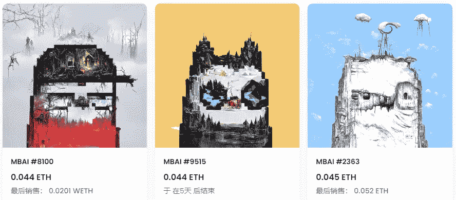

# 这个 AI 智能语言系统 chatGPT 可以流利的回答

> 原文：<https://medium.com/coinmonks/this-ai-intelligent-language-system-chatgpt-can-answer-fluently-9540c3ef13c0?source=collection_archive---------13----------------------->

昨天，人工智能语言智能系统 chatGPT 有点脱离圈子。它能处理一些交互问题，但不能预测未来。

它不知道 BTC 未来的价格，也不知道新冠肺炎病毒的影响何时会结束。

对于各种问题，如加密市场观点，历史故事，写代码和诗歌等。，他们都有自己的一套回复逻辑，甚至可以写一篇 500 字的作文。

它是知识百科，是 AI 聊天工具，它可以告诉你一切。

chatGPT interactive information

ChatGPT 的回复是符合逻辑的。系统已经学习并记录了 2021 年的所有事件和热点。它能像流一样回答各种问题，和人类无缝聊天。

马斯克表示，chatGPT 是一个非常强大的智能系统，人类正处于危险之中。当然，据说他是 chatGPT 背后的投资人，所以难免有带货的嫌疑。

但确实有很多玩家在和 chatGPT 开始对话后就进入了无限循环模式。不一定真的在寻找答案，只是最初的乐趣。

ChatGPT writes smart contract code

至于智能 AI 能不能取代人类，现在谁也说不准，但是拥有智能语音交互系统的机器人确实越来越多。

中国的智能设备，比如萧艾、小度、天猫精灵都在做这些事情，无聊的时候陪你聊天；告诉你每天的天气；提醒你时间到了；甚至玩语音游戏。

这个 chatGPT 知识库丰富，但只是一个 AI 工具，期待未来更多的应用场景。

现在很难说这个 chatGPT 是 web2 还是 web3 项目，需要邮箱注册，手机验证码确认才能开始互动之旅。如果在报名过程中遇到问题，也可以私信获取报名方法。

不过很快就在加密圈传开了，有可能是马斯克带的货；同时，项目协理 Sam Altman 本身就有 100 万粉丝，chatGPT 上线第二天就突破 100 万用户，2 天用户突破 400 万。

chatGPT can continue to interact

ChatGPT 是 OpenAI 的一个项目，其使命是确保通用人工智能造福全人类。

它的平台还包括 DALL E 项目，这是一个智能图像创建平台。创作者可以使用 DALL E 来扩展创造力和加快工作流程，该平台目前每天生成超过 400 万张图像。

未来的艺术创作都可以通过智能 AI 批量生成。普通人很难区分艺术大师的作品和 AI 创作。

利用智能技术，人类的创意画布可以无限延伸。

Artwork created by DALL·E

在加密世界中，智能合约是应用程序的基础。合同在链条上展开，自动执行，避免人工干预，保证公平原则。

随着技术的进步，AI 的使用方式越来越多，AI 创作的图片 NFT 也越来越多。

比如曾经异常火爆的 AI 月鸟，已经通过 AI 技术把像素月鸟变成了 AI 月鸟。虽然现在楼面价也跌回了谷底，但在推出初期确实获得了不少关注。

创作和设计只是 NFT 的环节，项目的营销和叙事方式才是可持续发展的根本。

AI Creation Moonbird

在加密的世界里，那些拥有理解代码技术的人拥有能够理解智能合约的优势。

结合 AI 技术，可以大大提高工作效率，也是一个很好的创作方向。

比如 chatGPT 可以用来衍生其他玩法吗？只要能提出有趣的问题，就能得到意想不到的回复，也可以作为一种很好的内容输出方式。

以上只是我个人观点，没有投资建议。我是楚小莲，我正在关注元宇宙和 web3。

> 交易新手？试试[加密交易机器人](/coinmonks/crypto-trading-bot-c2ffce8acb2a)或者[复制交易](/coinmonks/top-10-crypto-copy-trading-platforms-for-beginners-d0c37c7d698c)