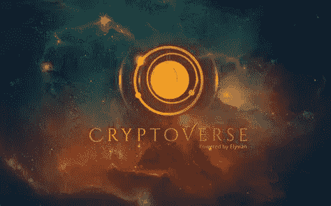

# 这定义了密码诗

> 原文：<https://medium.com/coinmonks/this-defines-the-cryptoverse-422b06751147?source=collection_archive---------54----------------------->

Yahoo photos

“我们的祖先离开了欧洲君主政体、强大的精英阶层和国家宗教，去建立一个个人自由和平等的体系。ESG[环境、社会和治理——评级系统]是我们这辈子对美国宪政共和制和经济自由的最大威胁。我们并不反对 ESG 议程；我们反对的是一个利用经济胁迫来实现其目标的体系…