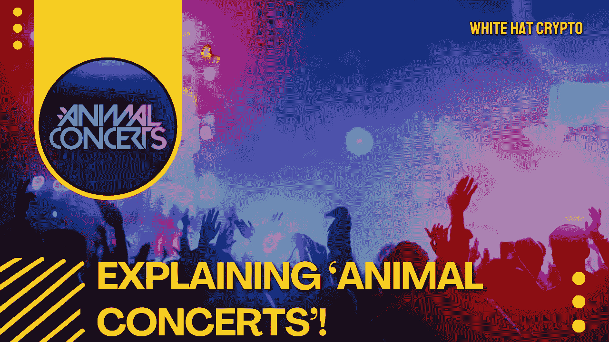

# 这就是“动物音乐会”如何改变娱乐业！🤯

> 原文：<https://medium.com/coinmonks/this-is-how-animal-concerts-is-changing-entertainment-industry-f45170a4f2f6?source=collection_archive---------51----------------------->

动物音乐会不是典型的加密货币创业公司，它有很多！

随着新企业在元宇宙-区块链领域寻求新的可能性，加密环境已经蓬勃发展。许多倡议试图通过开发新的平台来扰乱现场活动和音乐会的世界，粉丝可以通过这些平台观看现场表演。

据该公司称，新加入的公司之一 [Animal Concerts](https://animalconcerts.com/) 正在播放元宇宙演唱会，实现了“奇妙的下一代粉丝体验”。

在今天的博客中，我将向你全面介绍什么是动物音乐会，以及它是否值得注意。

# 什么是动物音乐会？

根据动物音乐会团队的说法，该倡议的目标是“通过让一线和新兴艺术家直接与粉丝互动和赚钱，改变粉丝体验，使音乐产业民主化。”

该倡议将网络直播 2D 和 3D 音乐会，使用 NFT 购买门票。此外，NFTs 将用于“个性化体验”，如跟踪投票权和发布后台凭据。

动物音乐会看起来已经获得了一些牵引力，艾丽西亚·凯斯，未来和布斯塔·莱姆斯等艺术家现在参与了这个项目。

ANML 代币可用于购买门票、NFT 和其他物品。令牌的所有者有权享受折扣以及参与协议治理的机会。持有人除了通过跑马圈地获得回报外，还可以通过重新分配动物音乐会的一部分收入来获得价值。

# 创始人是谁？

动物音乐会成立于 2021 年，总部在美国。

该协议由同时担任首席执行官的**科林·菲茨帕特里克**开发。科林是一个聪明、精通技术的专业人士，拥有 20 多年的经验。他有一份很好的简历，曾在 Hubspot、甲骨文和戴尔等公司工作过。

**Jeff Lombardi** ，动物音乐会平台的联合创始人，精通投资以及财富管理和资产管理。他为许多大公司协助和维护了大量的数字资产。

# 动物音乐会代币(ANML):

ANML 是一个公用事业和治理令牌，最大供应量为 12，500，000，000 枚硬币，支持动物音乐会生态系统。

ANML 代币是购买音乐会门票、NFT 和其他生态系统项目的主要货币。音乐会门票和收藏品是不可转让的资产，有各种各样的好处和机会。ANML 可以用来获得平台上的任何 NFT。

当代币持有者使用 ANML 购物时，他们可以在合作伙伴网站上获得折扣。ANML 的所有者参与平台治理、投票和其他活动。ANML 持有者还可以优先购买限量商品、独一无二的 NFTs、免费或不常见的门票以及收藏品。

所有平台用户，包括艺术家和粉丝，都可以获得 ANML 代币奖励。用户的积极参与度越大，折扣和优惠就越大。

动物音乐会今天的价格是 0.000924 美元，24 小时交易量是 2，434，902 美元。动物音乐会在过去 24 小时内下降了 0.16%。

# 结论:

ANML 似乎是一个有吸引力的投资，项目背后有一个坚实的团队，迄今为止似乎是迷人的伙伴关系和合作。话虽如此，这种想法还是如此新鲜，以至于尚不清楚在喧嚣消退后，它是否会聚集足够的动力进行长期扩张。

这篇文章中提供的内容不是赞助的，据我所知是正确的。这篇文章不是金融建议，我们不对针对这篇文章采取的任何行动负责！

请随时查看我们的社交平台，了解每日加密更新，或通过以下渠道联系我们:

[YouTube](https://www.youtube.com/channel/UCjfinzatswbVaRd89zn5kJQ/featured)

[推特](https://twitter.com/whitehatcrypto)

[Instagram](https://instagram.com/white.hatcrypto?igshid=YmMyMTA2M2Y=)

[Gmail](http://cryptowhitehat@gmail.com/)

信息来源:CoinMarket Cap、[Currency.com](http://Currency.com)、PTP 钱包等等！

> 交易新手？尝试[加密交易机器人](/coinmonks/crypto-trading-bot-c2ffce8acb2a)或[复制交易](/coinmonks/top-10-crypto-copy-trading-platforms-for-beginners-d0c37c7d698c)