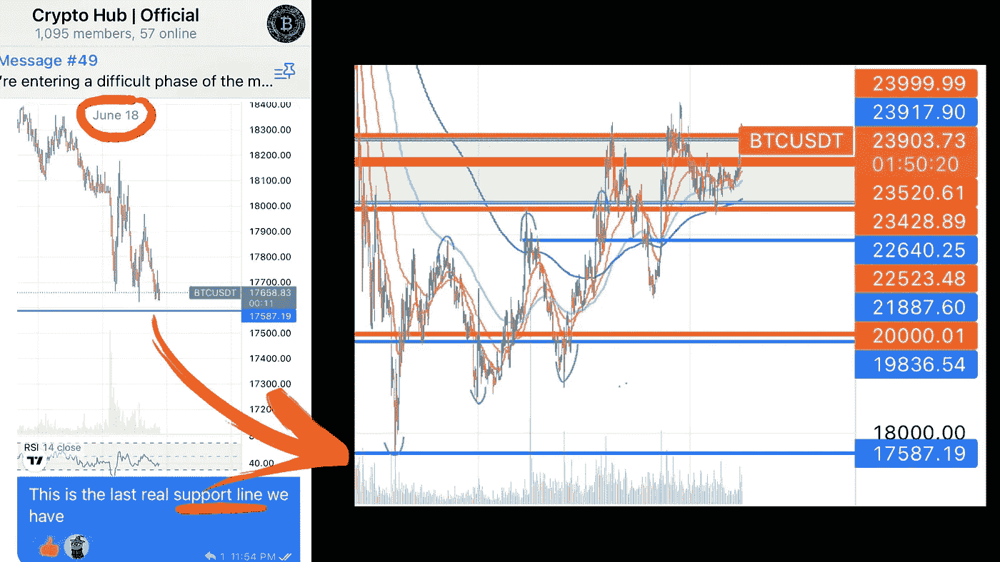

# 这就是我们如何找到绝对加密底部！

> 原文：<https://medium.com/coinmonks/this-is-how-we-found-the-absolute-crypto-bottom-c669ea5d9ee5?source=collection_archive---------10----------------------->

We called out the crypto bottom on June 18th in our [**Telegram group**](https://t.me/officialcryptohub)

如果你是一个**加密投资者**，你最有可能在过去几个月里遭受损失。不仅加密市场进入了一个**熊市** t，而且许多看似**安全**的加密项目，如 **Terra Luna** 、 **Celsius** 和 **Voyager** 都破产了，让他们的投资者损失惨重。然而，在最近几周，我们看到了所有加密货币的强劲复苏。我们在**加密中心**一直在分析…