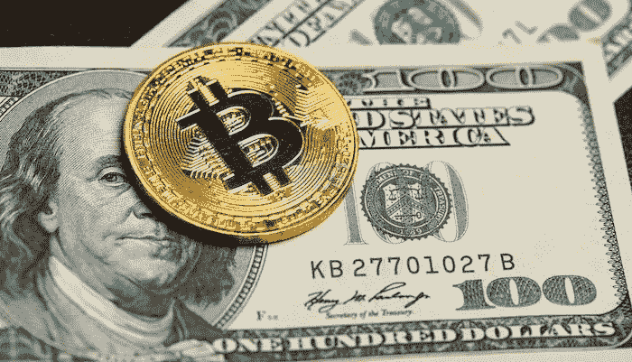
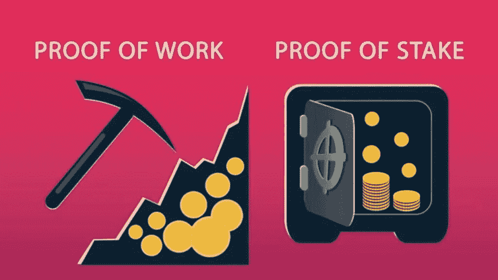
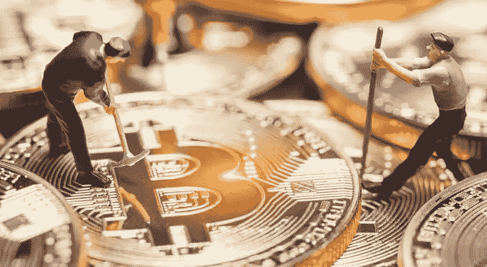

# 这就是你如何在 2022/2023 年用加密货币赚钱

> 原文：<https://medium.com/coinmonks/this-is-how-you-can-make-money-with-cryptocurrency-in-2022-2023-e7d1520b43e8?source=collection_archive---------66----------------------->

**在加密货币上赚钱可能吗，可以盈利多少，如何不入赤字？我们详细讨论加密交易**

用成功的手交易加密货币可以让你每年获得百分之几十的收益。但是如果所有的风险都实现了，你就可能失去所有投入的资本。在 [**加密货币**](https://bit.ly/ProjectSerenityCryptoOfficial) 市场中，行之有效的策略和所有风险的硬对冲都发挥了作用。让我们试着弄清楚在加密货币上是否有可能赚到，这样的收益能有多少。

**加密货币收益。基本方式**
交易所的加密货币交易是一项有风险也有回报的业务，每个决定要么带来收入，要么导致损失。加密货币的收益由几个指标决定，在专业交易中，它只取决于存款的规模。

中长期投资者同时使用几种盈利策略:

形成一套盈利硬币的证券投资；

hodling——被动投资:你把硬币放在钱包里，直到它们达到计划的盈利水平；

赌注是将带有佣金的加密货币存储在钱包中，用于支持区块链网络；

挖矿是一种在加密货币上赚钱的方式，在专门的设备上挖矿币；

对有前途的代币进行投资，希望其爆炸式增长的霍丁期权；

转诊方案的使用。

**如何建立加密货币投资组合**
要想在加密货币上赚钱，建立一个有能力的投资组合是有意义的。首先，它应该是平衡的，即它应该由 4-8 种加密货币组成，根据多个参数选择。

有两种类型的加密货币投资组合，其构建方式与传统资产类似。在风险最小的保守投资组合中，将会有可靠且经过验证的货币，而在进取型投资组合中，将会有充满希望的新货币，这意味着它们意味着一定的风险。

**保守的加密货币投资组合**
考虑一个保守的投资组合。主要份额——70%——应该落在五大加密货币(BTC、瑞士联邦理工学院、USDT)的可靠硬币上。

另外 25%可以是来自前 10 名的硬币，由在密码领域证明了自己的严肃公司支持(XRP、索尔、阿达)。

5%可以留给表现出快速增长的高波动性硬币——例如，2022 年 3 月将是 ApeCoin(猿)、Waves(波)、THORChain(符文)。即使出现大幅下跌，损失也会被大比例的靠谱币平衡。

**激进的加密货币投资组合**
现在我们来看一个激进投资组合的例子。在其中，可靠的硬币——比特币、以太、USDT 将占据 50%。
与此同时，前 50 名中有前途的硬币——SOL、ADA、RUNE 和其他——将占 25%，另外 25%——用于第 50 位至第 100 位范围内的高风险资产(BAT、OMG 和其他)。
在主要加密货币的成长期，这样一个投资组合的年收益率可以超过 100%。这是因为比特币的上涨总是伴随着替代币的季节——接下来主币价格上涨的时间。

**什么是 HODL，它为什么有益？**
Hodling 是最近流行的长期投资选项，可以让你在加密货币上获利。

钱包里一枚硬币长期留存的原理是基于什么？从长期来看，任何市场都在增长，但市场趋势的发展是周期性的，会有修正。因此，如果你购买一项资产，并持有它，例如，几年，那么进一步增长的概率超过了资产下跌的概率。与此同时，大幅、大幅度的市场逆势波动可以忽略不计。

对于霍德林来说，最好选择可靠且成熟的高市值加密货币:比特币、以太、USDT 和其他一些硬币。如果你选择了一种目前正在增长，但长期来看疲软的货币，那么你可能会因为硬币的深度贬值而失去你的钱。此外，弱势货币完全有可能不复存在。霍丁的利润可以达到百分之几十甚至几百倍。

**交易加密货币能赚多少**
加密货币能赚多少这个问题的答案很大程度上取决于投资者的策略。对于准备好亏损但希望获得高利润的风险投资者来说，抓住 x 是有意义的——即从由于多种因素的组合而突然上涨的硬币中获利。

例如，2021 年将因分散金融(DeFi)行业的迅猛增长和大量有前途的新项目的出现而被铭记。

例如，AVAX 是使用智能合约的 Avalanche 项目的本机令牌。回到 2021 年 1 月，AVAX 价值 4.6 美元，到 2022 年 7 月底，一枚硬币价值 25 美元。

**如何在加密货币上赚钱？比特币例子**

回到 2020 年 3 月，由于冠状病毒的传播引发恐慌，比特币的价格跌至略低于 4000 美元。在 2022 年 7 月，它的交易价格是 23690 美元。

比特币不仅在冠状病毒疫情引发的全球经济危机中幸存下来，还充分展示了其作为金融界主要防御资产之一的潜力。此外，它还受到了机构投资者的大量关注，这些投资者目前正在积极投资数亿美元用于加密货币。

**如何通过赌博赚钱**

存储硬币或赌注也是有利可图的——加密货币区块链在一些网络中的存在是保持它们运行的必要条件。

立桩按以下方式进行。验证者——保持区块链运转的节点——在一定时间内冻结他们的硬币，为此他们获得一部分奖励。冻结的硬币越多，收益越高。你不需要专用集成电路和强大的显卡来堆叠——一台笔记本电脑就足够了。

对于网络来说，这是一个比挖矿更不耗能的现象，对于验证者来说，这是一个获得生成币被动收入的机会。据专家称，在扣除设备和能源成本之前，以太坊 2.0 网络的收益在第一年将为 5%至 21%，这将是 5%至 20%。然而，考虑到 ETH 的价格波动，下注不一定总是有利可图。

**如何靠采矿赚钱**

从长远来看，BTC 采矿比开采任何替代硬币都更有利可图。后者波动性太大——利率可能飙升，也可能在短时间内迅速下降。

但如果你想尝试在另一个硬币上赚钱，最普遍的建议是只按大写挖掘前 20 个硬币。通常，这些都是经过时间考验的相对可靠的项目。在本文中，我们研究了 2022 年最有利可图的加密货币。

**如何在推荐项目上赚钱。**
与推荐项目合作是一项风险极小的业务，其基础是向第三方推荐区块链平台的服务和商品。

首先，您需要连接一个商业帐户，生成一个推荐链接并开始工作。奖励根据所有被邀请用户的消费金额计算，收入取决于活跃度。

想象一下，你设法邀请了 10 个活跃的交易者到加密货币交易所。根据当月的结果，交易员们完成了 200 笔盈利交易，并在交易所交易佣金上花费了 2000 美元。邀请他们的人有 10%的佣金，收入将是 200 美元。

[**如果您想了解更多关于如何利用加密货币赚取高额利润和被动收入的信息，请点击此处**](https://bit.ly/ProjectSerenityCryptoOfficial)

免责声明:本文中提供的信息仅是作者的观点，而非投资建议，仅用于教育目的。通过使用这些信息，您同意这些信息不构成任何投资或财务指示。在做出任何投资决定之前，一定要进行自己的研究，并咨询财务顾问。

> 加入 Coinmonks [电报频道](https://t.me/coincodecap)和 [Youtube 频道](https://www.youtube.com/c/coinmonks/videos)了解加密交易和投资

# 另外，阅读

*   [如何在加拿大购买加密货币？](https://coincodecap.com/how-to-buy-cryptocurrency-in-canada)
*   [无聊猿游艇俱乐部(BAYC)评论](https://coincodecap.com/bored-ape-yacht-club-bayc-review)
*   [5 款最佳加密交易终端](https://coincodecap.com/crypto-trading-terminals) | [最佳 DeFi 应用](https://coincodecap.com/best-defi-apps)
*   [在美国如何使用 BitMEX？](https://coincodecap.com/use-bitmex-in-usa) | [BitMEX 审查](https://coincodecap.com/bitmex-review)
*   [最佳期货交易信号](https://coincodecap.com/futures-trading-signals) | [流动性交易所评论](https://coincodecap.com/liquid-exchange-review)