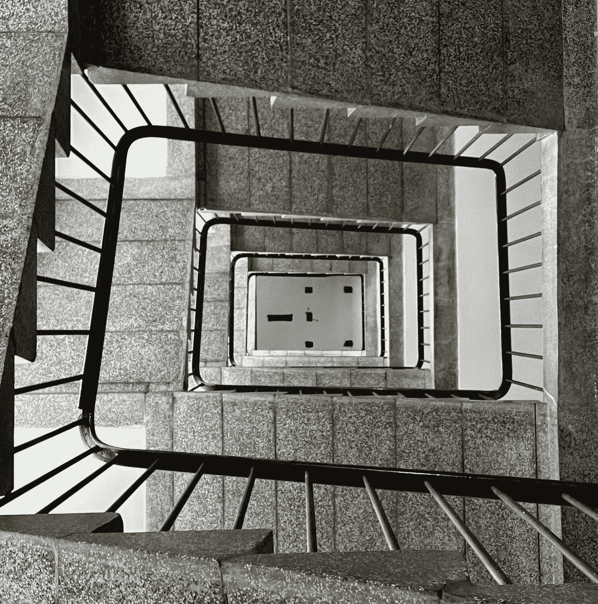

# 这不是我为之奋斗的未来

> 原文：<https://medium.com/coinmonks/this-is-not-the-future-i-am-fighting-for-8b69762b54d8?source=collection_archive---------31----------------------->

*以下节选自*[*2022 年 6 月专栏版*](https://centralizationstrikesagain.substack.com/p/centralization-strikes-again-june-24a) *我曾为链家的时事通讯* [*集权再次来袭*](http://centralizationstrikesagain.substack.com/) *。如果你觉得这个内容很吸引人，我们希望你能支持我们的 Substack！❤️*

如果你已经通读了本月[集权再次来袭简讯](https://centralizationstrikesagain.substack.com/p/centralization-strikes-again-june-24a)的**时间线**部分的每一条新闻公告，你无疑会看到一个邪恶的、反复出现的模式。老实说，感觉就像每两到三条新闻，我都在报道一些与加密市场集体崩溃有关的事情。这在很大程度上要归功于 ponzinomic games、分散剧院和 CeDeFi。当集中化的罪魁祸首是 FAANG 这样的大[兄弟]科技公司时，我更喜欢整理这份时事通讯。感谢我们在假装 DeFi 的朋友，这个月成为一个艰难的报道。这是我希望 web3 不会成为牺牲品的一切。

显然，我们目前在加密市场看到的许多问题都可以归咎于上个月的[UST/卢娜崩溃](https://www.ft.com/content/c10bc6f7-abbe-45dc-9367-042186c3336f)，这本身就与[三箭资本](https://www.cnbc.com/2022/06/29/crypto-hedge-fund-three-arrows-capital-plunges-into-liquidation.html)【3AC】[摄氏度](https://www.reuters.com/markets/us/crypto-lender-celsius-says-it-is-exploring-options-2022-06-30/)[block fi](https://www.axios.com/2022/07/01/blockfi-investors-wpied-out-crypto-lender)[Bancor](https://blockworks.co/bancor-halts-impermanent-loss-safeguard-to-fight-off-hostile-antagonist/)以及其他许多问题紧密相关。一些人幸运地相对毫发无损地逃脱了(除了他们的净资产大幅缩水)——但更多的人就没那么幸运了。有无数的报告称，用户要么发现他们获得的资金被中央决策者扼杀，要么完全无法获得他们的储蓄。放射性坠尘造成的损失仍有待计算。在很多方面肯定是[不可估量的](https://www.koreatimes.co.kr/www/nation/2022/06/113_331888.html)。

> 交易新手？尝试[加密交易机器人](/coinmonks/crypto-trading-bot-c2ffce8acb2a)或[复制交易](/coinmonks/top-10-crypto-copy-trading-platforms-for-beginners-d0c37c7d698c)

A tragedy: Korean family found underwater suspected to have been involved with Luna.

承诺“DeFi”产品的团队返回给用户的东西比你在 TradFi 中发现的要差得多。也就是说，因为在这里，投资者不仅暴露在短视的协议创始人和自大狂保证金交易者的巨大风险和贪婪之下，他们也没有受到监管的保护。这毕竟是 crypto 的狂野西部。现在想想刚刚发生了什么。我在这里提供一个监管的案例——作为一个绝对的网络 3/加密/自我监管的 maxi。

这不是我为之奋斗的未来。

该社区的很大一部分人没有努力实现财政自主的理想，而是屈服于放弃自我监管的陷阱。相反，我们陷入了一场醉醺醺的爱情，通过集中贷款平台获得了不可持续的收益率。猜猜他们用我们的资金做了什么？像部分储备一样使用它来玩他们在 TradFi 中玩的同样的闭门游戏——“你对此并不知情。你没有足够的资格去理解。”我们没有努力争取公开和透明，而是看着大型公司之间发生场外交易，以提供更多的流动性来“在一次交易中赚回来”。与其在某种程度上坚持不变性的价值观，*任何*程度上，我们选择牺牲协议，这样我们就可以免于清算。

恭喜你。我们完全复制了 TradFi。正如 ChainlinkGod 本月早些时候所说，“命运喜欢讽刺。”

那么，我们该何去何从呢？我们如何开始愈合的过程？对此我没有很好的答案。首先，在我看来，大众必须接受自我保管数字资产的教育。如果某件事听起来好得不像真的，那它很可能就是真的。不理解这个原则意味着我们下一次又回到同一个旋转木马上。同样的产品，不同的包装。

第二，也许我们必须教导大众看到 web3 技术，超越他们所认为的赌场。我赞同再生密码经济学的理想主义——存在三赢选择的可能性。要做到这一点，对公共产品的态度和看法必须发生根本性的文化转变。但是许多人正在朝着这个目标努力。迷因现在才开始扎根。

我仍然相信 web3。当然，自然恢复需要一些时间。但是我们已经有了工具，可以在下个世纪将人类的协调能力提升到平流层。我们只需要教育大众，也许还能帮助一些自大狂看清自己的真面目。

