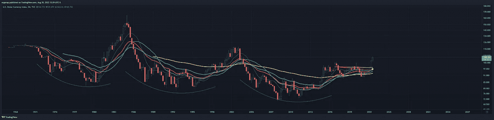
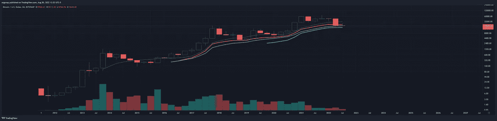
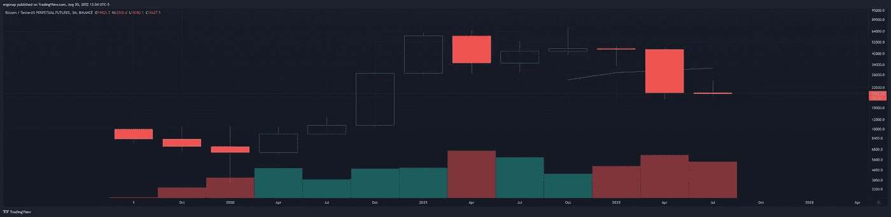
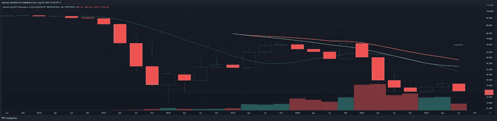

# 这就是问题所在——一切都以某种丑陋的方式联系在一起。

> 原文：<https://medium.com/coinmonks/this-is-the-problem-everything-ties-together-in-some-ugly-ways-dca4da338781?source=collection_archive---------36----------------------->

## 加密货币市场/比特币市场分析 8/30

首先看看下面的 DXY，这是一个宏观的头和肩膀倒置…所以…那可能是一年，两年？更多？肯定不会看好加密。

[https://www.tradingview.com/x/lmjBtqFy/](https://www.tradingview.com/x/lmjBtqFy/) — we have a macro inverted head and shoulders on the quarterly DXY.

季度 BTC 现在开始看跌。没错。我们从几个小时到 4 个小时，到每天，到每周，到 2 周，现在我们达到了 3 个月。事情现在真的开始变糟了。这 3 个月的熊使大约 2 年的密码失效。

[https://www.tradingview.com/x/s7Z7H7ok/](https://www.tradingview.com/x/s7Z7H7ok/) — 3 month BTC

问题是，这是从宏观角度来看的 bitstamp，所以让我们看看币安的交易量，他是市场的领导者。这不是一个快乐的三个月，即使还有一个月**要过**也没有什么可以确定 BTC 会在 9 月收盘时跌破 33k。即使是看涨的反应也只是在进一步下跌之前确认这是一次获利回吐的努力。

[https://www.tradingview.com/x/jOs3DecF/](https://www.tradingview.com/x/jOs3DecF/)

与此同时 BTC。d 继续流血。当然，提醒一下，到目前为止，这是让 alt 运行比什么都多，因为人们比 BTC 更祈祷 alt。只要你忽略可能发生的事情，这是没问题的。

[https://www.tradingview.com/x/oAC3WKXC/](https://www.tradingview.com/x/oAC3WKXC/)

BTC 应该。正如我多次警告的那样，这是正确的——整体而言，它将走向这个市场周期的终结或加密泡沫的终结。时间会告诉我们厄运会持续多久。我们显然看跌。

与此同时，币安想要什么？他们希望你成为他们的退出流动性。

这是“请向我们购买以下产品，以便我们可以退出”。另一方面，提醒人们[的龙卷风场景是混乱的](https://www.eff.org/deeplinks/2022/08/code-speech-and-tornado-cash-mixer)(直接来自言论自由问题上的 EFF)，但如果不是公认的——朝鲜和俄国都卷入其中，就不会如此。

这也是人们变得愚蠢并宣称世界新秩序的地方。俄罗斯和伊朗当然乐于获得加密货币，尤其是通过 Tornadocash。

[https://coin telegraph . com/news/Russian-pm-take-cue-from-Iran-s-crypto-payment-permit-for-imports](https://cointelegraph.com/news/russian-pm-takes-cue-from-iran-s-crypto-payment-permit-for-imports)

我能指望他们成功吗？哈哈，不。不是当美国基本上远离加密。

 [## Crypto 的大规模营销努力没有吸引到多少新投资者

### 在过去的一年里，像 Crypto.com、FTX 和比特币基地这样的加密公司已经花费了数千万美元来…

www.washingtonpost.com](https://www.washingtonpost.com/business/2022/08/24/cryptos-massive-marketing-efforts-have-drawn-few-new-investors/) 

这就是他们希望你退出流动性的原因——因为没人想这样。以及为什么他们试图转向第三世界国家采用加密技术。

不要成为倒下的人。

> 交易新手？试试[加密交易机器人](/coinmonks/crypto-trading-bot-c2ffce8acb2a)或者[复制交易](/coinmonks/top-10-crypto-copy-trading-platforms-for-beginners-d0c37c7d698c)