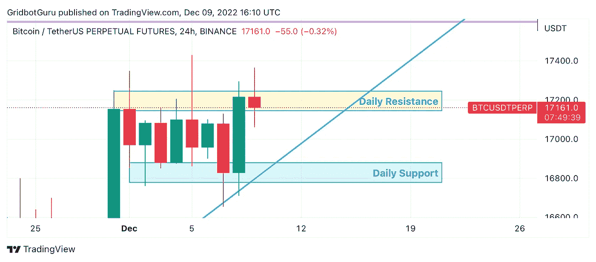

# 这就是 BTC 要做的！—点击诱饵🤣🤣

> 原文：<https://medium.com/coinmonks/this-is-what-btc-will-do-clickbait-7034a543c415?source=collection_archive---------12----------------------->

我们都坐在这里，看着图表，想知道到底会发生什么。我们是向上走，还是向下走？说实话，只有时间会证明。我可以坐在这里告诉你，它会这样做…或者它会那样做，但说实话，我们必须等待。然而，我的立场是给人们一些想法，让他们在交易前思考和思考。

如果你看下面我的图片，这只是我的想法，而不是关于如何处理你的钱的建议，DYOR，但你可以在日线图上看到，我们在 17.2 附近有一个区域，它像一个阻力区。我们在 16.8 附近也有一个区域，看起来像是一个支撑区域。

想法:最终，这些区域中的一个将被打破，我们将以某种方式运行，同样，只有时间会告诉我们。我的直觉是，没有任何重大消息表明我们将或应该转向牛市。所以我相信我们还是会下降。

想法:你可以在这里做两件大事。第一件事是，如果你有机会在这一点上做空市场，你可以尝试做空到 16.8 区域。你也可以等待 16，8 区域，然后看看它在那个点做什么。

同样，这都是想法，而不是财务建议，你应该一如既往地做自己的研究。

交易愉快，保持绿色！

根西岛

如果我的帖子对你有帮助，请随时捐款！也给我的 YT 频道看看，如果你喜欢任何视频，请喜欢并订阅它们！

**链接**

YouTube 上的 grid bot Guru:[点击这里！](https://www.youtube.com/c/gridbotguru)

美国公民的 pionex:[点击这里！](https://pionex.us/en-US/sign/ref/RnIZeirs)

全球公民 pionex:[点击此处！](https://www.pionex.com/en-US/sign/ref/zVt0KmHU)

报名参加比特币基地:[点击这里！](https://www.coinbase.com/join/wyatt_h)

USDT(TRC 20):taiedlxa 7 mlvwoybwr 46 mmqefifyq1htj

BTC:3 ftbppewnaoyxbpa 1 mpdhdjn 7 e 41 mz hry

> *交易新手？试试* [*密码交易机器人*](/coinmonks/crypto-trading-bot-c2ffce8acb2a) *或* [*复制交易*](/coinmonks/top-10-crypto-copy-trading-platforms-for-beginners-d0c37c7d698c)
> 
> *分散加密持股，了解一下* [*币安的替代品*](https://coincodecap.com/binance-alternatives)
> 
> *加入 Coinmonks* [*电报频道*](https://t.me/coincodecap) *和* [*Youtube 频道*](https://www.youtube.com/c/coinmonks/videos) *获取每日* [*加密新闻*](http://coincodecap.com/)

# 另外，阅读

*   [复制交易](/coinmonks/top-10-crypto-copy-trading-platforms-for-beginners-d0c37c7d698c) | [加密税务软件](/coinmonks/crypto-tax-software-ed4b4810e338)
*   [网格交易](https://coincodecap.com/grid-trading) | [加密硬件钱包](/coinmonks/the-best-cryptocurrency-hardware-wallets-of-2020-e28b1c124069)
*   [密码电报信号](/coinmonks/top-3-telegram-channels-for-crypto-traders-in-2021-8385f4411ff4) | [密码交易机器人](/coinmonks/crypto-trading-bot-c2ffce8acb2a)
*   [最佳加密交易所](/coinmonks/crypto-exchange-dd2f9d6f3769) | [印度最佳加密交易所](/coinmonks/bitcoin-exchange-in-india-7f1fe79715c9)
*   [面向开发人员的最佳加密 API](/coinmonks/best-crypto-apis-for-developers-5efe3a597a9f)
*   最佳[密码借贷平台](/coinmonks/top-5-crypto-lending-platforms-in-2020-that-you-need-to-know-a1b675cec3fa)
*   [免费加密信号](/coinmonks/free-crypto-signals-48b25e61a8da) | [加密交易机器人](/coinmonks/crypto-trading-bot-c2ffce8acb2a)
*   [杠杆代币终极指南](/coinmonks/leveraged-token-3f5257808b22)