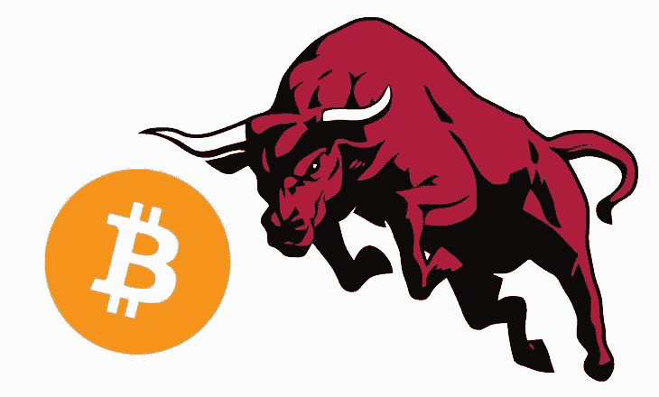

# 这是比特币将迎来下一轮牛市的时候

> 原文：<https://medium.com/coinmonks/this-is-when-bitcoin-will-have-the-next-bull-run-8309fbdc26d9?source=collection_archive---------45----------------------->

我只是想帮忙，希望你能从中学到些什么。当比特币价值 3000 到 5000 美元时，我让人们投资比特币，让他们赚了很多钱。我说得再清楚不过了，告诉他们在 2021 年 4 月和 2021 年 10 月退出，也就是我说的卖出比特币的时候。

我有水晶球吗？我来自未来吗？我会告诉你这是因为这不是我的第一次竞技。这叫做经验、能力和分析，或者尽职调查。2017 年及之前也发生过同样的事情，2022 年还会再次发生。我想告诉你一些能帮你省下很多钱，也能让你赚很多钱的事情。我看着这些在 2020 年才发现加密技术的加密 YouTubers 和有影响力的人。这是一个典型的“盲人摸象”的例子。我觉得这很有趣，很可爱，同时也很值得一提。大的一次发生在 2020 年 5 月，下一次要到 2024 年上半年才会发生。从那时起，比特币可能需要 12 到 18 个月才能达到顶峰。这意味着下一轮牛市的顶峰可能会在 2025 年中期，前后相差几个月。

> 交易新手？在[最佳密码交易所](/coinmonks/crypto-exchange-dd2f9d6f3769)上尝试[密码交易机器人](/coinmonks/crypto-trading-bot-c2ffce8acb2a)或[复制交易](/coinmonks/top-10-crypto-copy-trading-platforms-for-beginners-d0c37c7d698c)

这是基本情况，我想让你们思考一下。我刚刚谈到了 2023 年、2024 年和 2025 年。让我告诉你更多这方面的情况。美联储的转向将分为三个阶段。当我们谈论美联储和货币政策时，股票市场和秘密市场之间有很多重叠。当美联储完全转向时，他们将降息并实施量化宽松。首先是经济将会增长，这将有利于加密货币。第二个是美元会变弱，这将有利于大多数商品，包括比特币。现在，量化紧缩正在摧毁金融市场，包括加密市场。我说的是债务市场、股票市场和房地产市场。我不是魔术师；我只知道美联储、金融市场和经济学。这就是为什么我知道这一切会像我预测的那样发生。我的问题是，你怎么没想到会这样？如果是因为你是新来的，那没关系；每个人都是从初学者开始。

我们都知道，美联储正在收紧货币政策以遏制通货膨胀。这对比特币和其他加密货币来说是逆风。量化紧缩和美元的强势将会逆转。只是时间问题。就凭我刚才跟你说的，你怎么可能不赚钱？这种逆转预计将在 2023 年发生。2023 年，利率会下降，美元会变弱。2024 年我们拿到比特币的时候，下一轮牛市就要悄然开始了。运行实际的减半事件，所以不要对此感到困惑。实际事件不会遇到烟花和价格大幅上涨。反之，就会很无聊。2025 年，来自 2024 年的供需和良好的宏观经济环境将成为 cryptos 的顺风。那是你想离开的时候。你想低买高卖。当你卖出你的出场时，同样的事情也会发生。听着，如果你不知道你在做什么，请小心。我建议你尽快学会，运用常识，并注意自己。我还想邀请你跟我来。我只是想帮助别人，我也让你看看我在做什么。

请记住，这是我的个人意见，而不是财务建议。