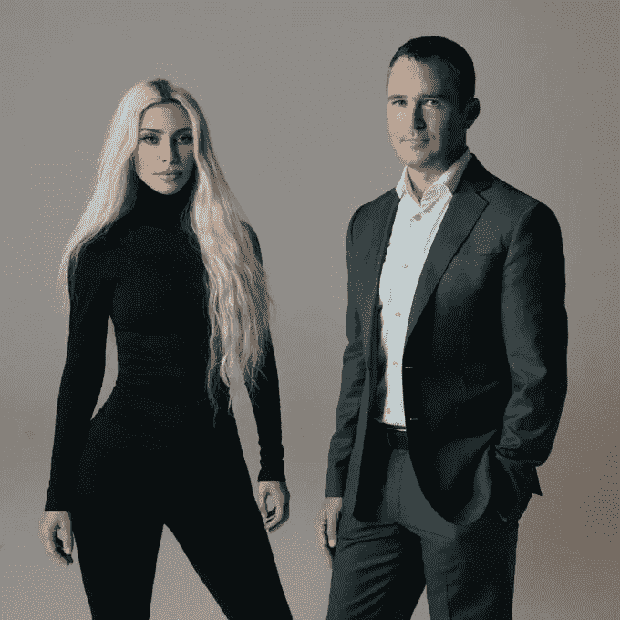

# 这就是为什么金·卡戴珊创办自己的投资基金非常有意义。

> 原文：<https://medium.com/coinmonks/this-is-why-kim-kardashian-starting-her-own-investment-fund-makes-so-much-sense-43c65e5b9f2a?source=collection_archive---------42----------------------->

Kim Kardashian is a lot more capable and successful than we give her credit for.

世界著名的电视真人秀明星。

非常成功的企业家。

净资产超过 18 亿美元

史上最成功的超级巨星家族。

自从成为帕丽斯·希尔顿的私人助理以来，这是她最疯狂的成名之路。

史上最臭名昭著的性爱录像带的主人。

她正在创办一家名为 SKKY Partners 的私募股权公司。

根据这份报告，该公司将在消费品、酒店、奢侈品、数字商务和媒体等领域进行投资

这对金来说很有意义。

她已经拥有了两个非常成功的企业，每个价值超过了 1B 元。

Kim Kardashian’s Skims valued at $3.2 billion in new funding round.

Skims 已经超过了它最大的竞争对手 Spanx，价值 32 亿美元。

想象一下金正日所拥有的丰富经验和资源。

这些年她已经在做个人投资了。

这家新的私募股权公司将让她把精力和资源集中在高质量的交易和大规模投资上。

dealflow 呢？

她的名人身份。

她的明星身份和数亿粉丝是她的超能力。

这就是她带来的东西。

一条推文或 Instagram 帖子，她就能把自己投资组合中初创公司的估值推高到月球上。

在她的社交媒体上一提，全世界都会知道她在做什么。

这是当今媒体中很少有人能买到的受欢迎程度和相关性。

也许现在只有她的前任 Kanye West 和 MrBeast 能与之匹敌。

我唯一的不满？

被上帝遗弃的网站。

谷歌一下，自己看看。

我不确定它是否正常工作，也不知道它有什么问题。

没有公司的信息，也没有他们正在做的任何事情的细节。

**Kim Kardashian** and Jay **Sammons** are working together on a new private equity firm, Skky Partners.

我希望这是一个正在进行中的工作，因为下次我看到它时，它最好是令人惊讶的。

似乎当你是金·卡戴珊时，你真的不需要一个网站。

我认为她会在这家新的私募股权公司取得成功吗？

当然可以。

凭借她作为超级大国的明星地位和她武库中的大量相关资源，她肯定能在投资优质创业公司方面做得很好。

她甚至把家里的姐妹和妈妈都拉了进来。

说到引进大人物。

我认为这是金正日方面的一个战略和明智之举，以进一步扩大她的帝国。

-

金·卡戴珊成立投资公司是一步好棋吗？

-

#创业#商业#创业#成长#成功#社交媒体#文化#创业#战略#金卡戴珊#金卡戴珊# skimps # skky partners # private equity #投资

> 交易新手？试试[密码交易机器人](/coinmonks/crypto-trading-bot-c2ffce8acb2a)或者[复制交易](/coinmonks/top-10-crypto-copy-trading-platforms-for-beginners-d0c37c7d698c)