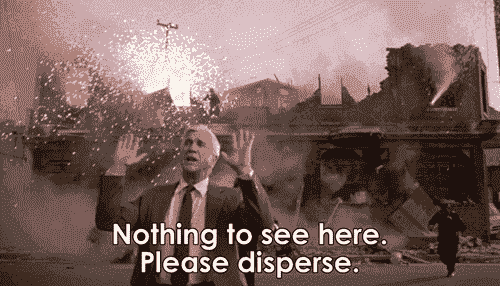
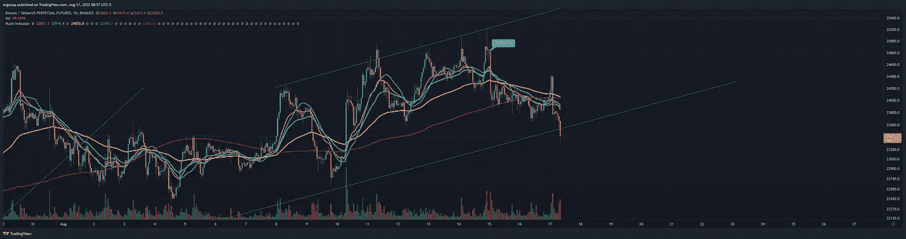
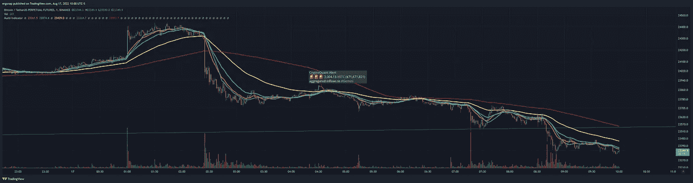
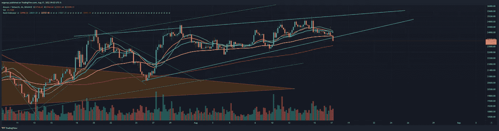
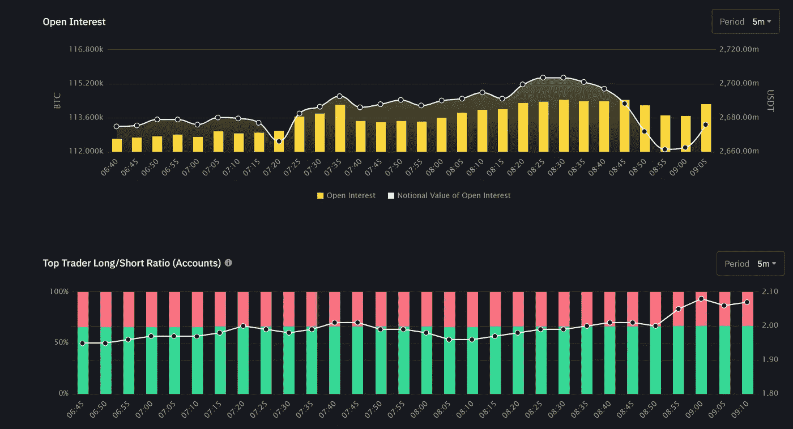

# 这种下移看似真实，实则危险。

> 原文：<https://medium.com/coinmonks/this-move-down-looks-real-and-thats-dangerous-78cb6a1facf5?source=collection_archive---------41----------------------->

加密货币市场/比特币分析 8/17

我对此没有任何乐观的看法，但要真正确认还需要几个小时。如果我们要从这里下去的话，看起来这次集会就要结束了。对于那些讨厌我看跌的人来说，如果这种情况发生了，那么是时候大放异彩了。我有希望吗？我当然想。但是现在还早。

this is me getting ready to open shorts, and the rest is retail.

can’t say I’m too surprised, but hey. [https://www.tradingview.com/x/I6e0E4L2/](https://www.tradingview.com/x/I6e0E4L2/)

看起来昨晚中途有人也匆忙离开了。这比正常情况要大得多，而且是在中途发生的。

> 🚨🚨🚨3，004.13 # BTC(＄71，671，821)
> 流入#双子座的资金总额

请允许我想象一下:

yeah, that’s emergency exit on a drop. [https://www.tradingview.com/x/YNIUdQ28/](https://www.tradingview.com/x/YNIUdQ28/)

啊，对了，这是我的楔子。另一个只是一个阻力点。

if this holds, see ya at the bottom. [https://www.tradingview.com/x/25O5wTGg/](https://www.tradingview.com/x/25O5wTGg/)

最短的时间，看起来空头正在涌入。

see that last spike? longs are not impacting OI, this is shorts town.

> 交易新手？试试[加密交易机器人](/coinmonks/crypto-trading-bot-c2ffce8acb2a)或者[复制交易](/coinmonks/top-10-crypto-copy-trading-platforms-for-beginners-d0c37c7d698c)