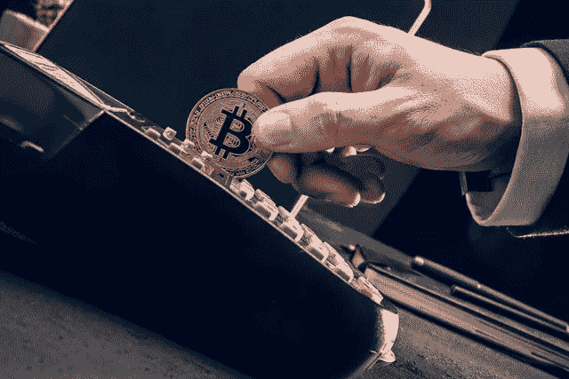

# 这个神秘的钱包在 1 周内收到了 30 亿美元的比特币

> 原文：<https://medium.com/coinmonks/this-mysterious-wallet-received-3-billion-in-bitcoins-within-1-week-7ba8046435bb?source=collection_archive---------18----------------------->

一个神秘的比特币钱包在过去的一个月里收到了大量的 BTC。目前为止，还不知道这个钱包属于谁，或者是用来做什么的，但是这个钱包的管理员可不是小角色。

# 30 亿美元

这是一个在 6 月 14 日制作的钱包。在很长一段时间里，它几乎没有发生任何事情，直到 7 月 19 日大量比特币被存入。当天凌晨 2 点左右，多达 3000 个比特币被转入这个钱包。这在当时价值约 6700 万美元。

当时人们不知道的是，这个钱包会在一周内多收到大约 13 万个比特币。不，不是价值 13 万美元的比特币，而是 13 万比特币。在撰写本文时，这一价值接近 30 亿美元。上周，有多笔存款被存入[这个钱包地址](https://www.blockchain.com/btc/address/1LQoWist8KkaUXSPKZHNvEyfrEkPHzSsCd)。

# 最后一笔存款

你可以看到存入的金额有多大。这偶尔会达到 30000 个比特币。在下图中，你可以看到这个钱包增值的速度有多快。甚至没用一周就把这些比特币全部转到了它那里。

Source: Bitinfocharts

正如你在图表上看到的，最后一笔存款是在 7 月 22 日。这是 3 天前，这是最长的一段时间没有任何存款。所以问题是它是否就此止步，这些比特币会发生什么，它们属于谁。30 亿美元不是一个小数目，应该密切关注。

# 什么会引发这种情况？

[比特币](https://bitnewsbot.com/tag/bitcoin)目前总市值近 4200 亿美元，这个钱包目前持有价值近 30 亿美元的比特币。所以这意味着这个所谓的“鲸鱼”持有世界上所有比特币的大约 0.7%。

这些都不是小数字，很可能会导致价格大幅波动。因此，如果这个钱包能提供一些透明度就好了。如果这是一个长期持有人，没有什么好担心的，但如果这些比特币很快被出售，可能会在市场上引起轩然大波。

*原载于 2022 年 7 月 30 日 https://bitnewsbot.com**[*。*](https://bitnewsbot.com/this-mysterious-wallet-received-3-billion-in-bitcoins-within-1-week/)*

> *交易新手？尝试[加密交易机器人](/coinmonks/crypto-trading-bot-c2ffce8acb2a)或[复制交易](/coinmonks/top-10-crypto-copy-trading-platforms-for-beginners-d0c37c7d698c)*