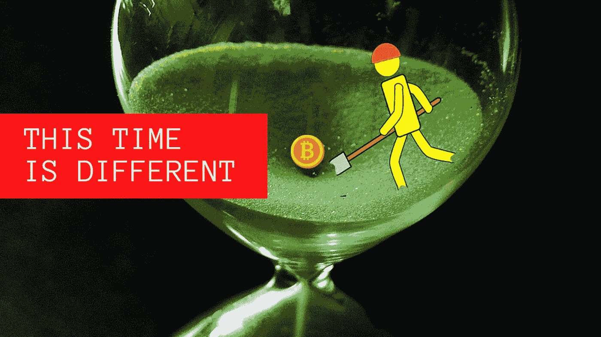
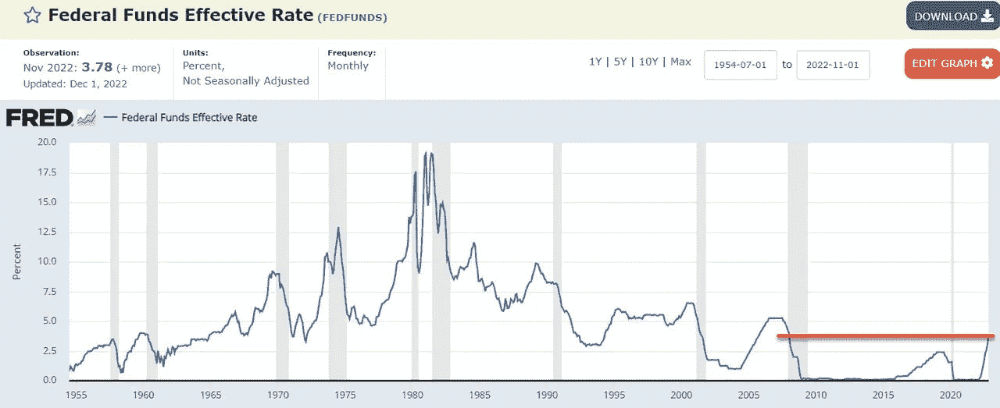
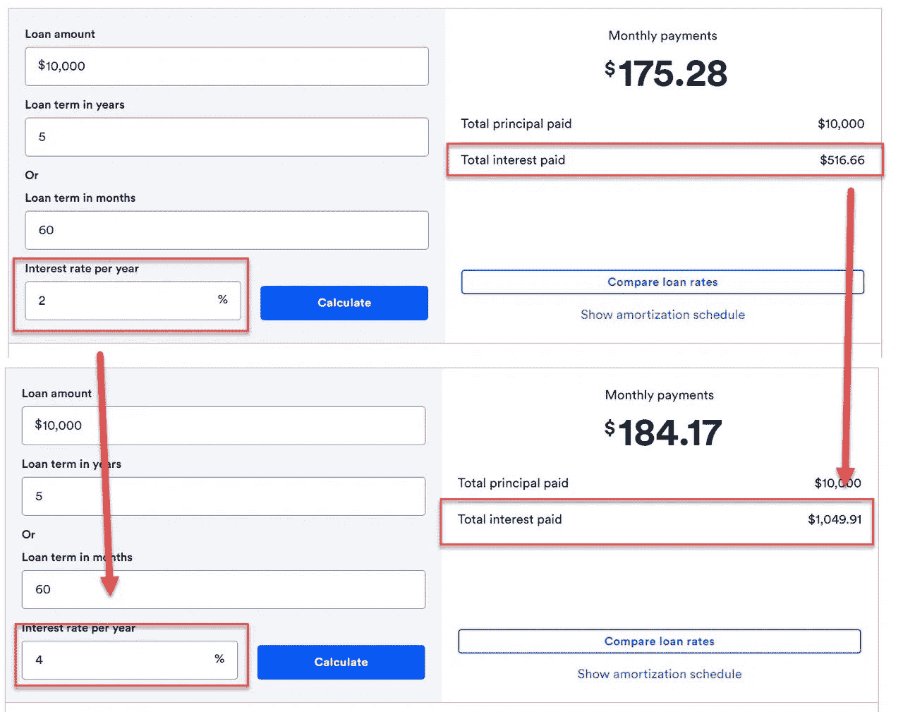
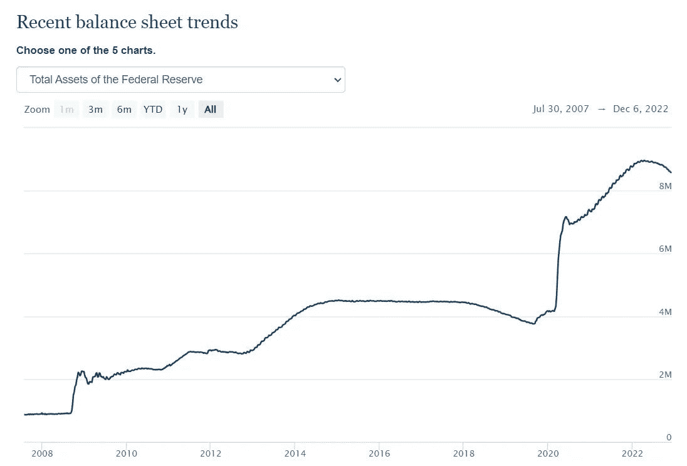
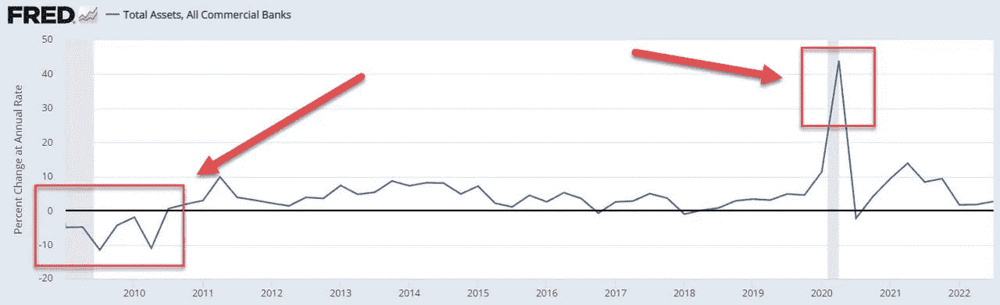

# 这个时间对于加密是不同的

> 原文：<https://medium.com/coinmonks/this-time-is-different-for-crypto-e83c11598f3f?source=collection_archive---------17----------------------->

一个新的货币环境正等待着下一轮加密牛市。

在大多数牛市的高峰期，可以听到人们反复念叨的“这次不一样”。这是投资者和狂热人群经常告诉自己的，为什么任何繁荣或泡沫都不会破裂，新一轮繁荣将永远存在。

然而，下一轮牛市会有所不同吗？

如果我们看看比特币的历史，它只存在于超低利率环境中。

[来源](https://fred.stlouisfed.org/series/FEDFUNDS)

这里你可以看到，我们的最高利率是短暂上升到 2.5%，然后迅速回落到 0%。我们目前的利率是前比特币时代以来最高的。

美联储还表示，加息尚未结束，因此我们可以预计明年将继续加息。这对加密市场和高通胀市场意味着什么？

随着借款利率的提高，投机和加密资产的增长可能会减少。加密似乎与科技股高度相关，这是一个在低利率环境下表现出色的市场，但也在遭受损失。

[来源](https://www.bankrate.com/loans/loan-calculator/)

作为一个例子，我们可以看到，以 2%和现在的 4%的利率借入 1 万美元的成本意味着利息支付增加了 100%以上。

如果借款利率达到 6%，那么利息支出将增加 300%。

这似乎对加密的价格不利，如果利率保持在这些水平或更高，我们将进入新的领域。这会对下一轮牛市产生负面影响吗？

另一方面，我们也可能面临更高的通胀，在这种情况下，菲亚特的加密定价可能会推高价格。

[来源](https://www.federalreserve.gov/monetarypolicy/bst_recenttrends.htm)

在过去的两年里，美联储已经将其资产负债表扩大了一倍，我认为这场通胀危机是进一步货币刺激的完美借口，需要再扩大一倍或更多。

[来源](https://fred.stlouisfed.org/series/TLAACBQ158SBOG)

这通常是衡量经济健康状况的一个很好的指标，你可以从商业银行的总资产中看出，这是 2007-08 年金融危机后的负数。

还可以看到科罗纳危机爆发时不安全感导致的巨大借贷高峰。这些图表将如何展望未来并影响加密市场？

随着利率的提高，人们现在将有更大的动力持有菲亚特，因为他们将多年来第一次从储蓄中获得正回报。人们会有兴趣持有密码吗？

未来的问题是，银行将如何通过提高利率来大幅增加法定货币供应量。这是因为消费者不太愿意以更高的利率借钱，除非他们能够像土耳其里拉那样进行良好的套利交易。

到目前为止，使用的伎俩是人为地将价格固定得更高，然后有效地给人们钱，作为这些价格上涨的“政府帮助计划”，然后作为双重支出有效地进一步增加通货膨胀。

因此，似乎很明显，更高的通胀和利率是想要的，这是生活成本危机议程的一部分。在一个非常通货膨胀的环境下，为什么我们没有看到相对于菲亚特的加密技术的增长？

加息的力量是主要因素吗？

感谢阅读。

**学分:**

用来自[源](https://pixabay.com/de/illustrations/sanduhr-eieruhr-zeitdifferenz-1162958/)和[源](https://pixabay.com/users/jmang_-7305231/?tab=latest)的图像创建的标题图像。

**我们来连线:** [mypathtofire](https://linktr.ee/mypathtofire)

> 交易新手？尝试[加密交易机器人](/coinmonks/crypto-trading-bot-c2ffce8acb2a)或[复制交易](/coinmonks/top-10-crypto-copy-trading-platforms-for-beginners-d0c37c7d698c)