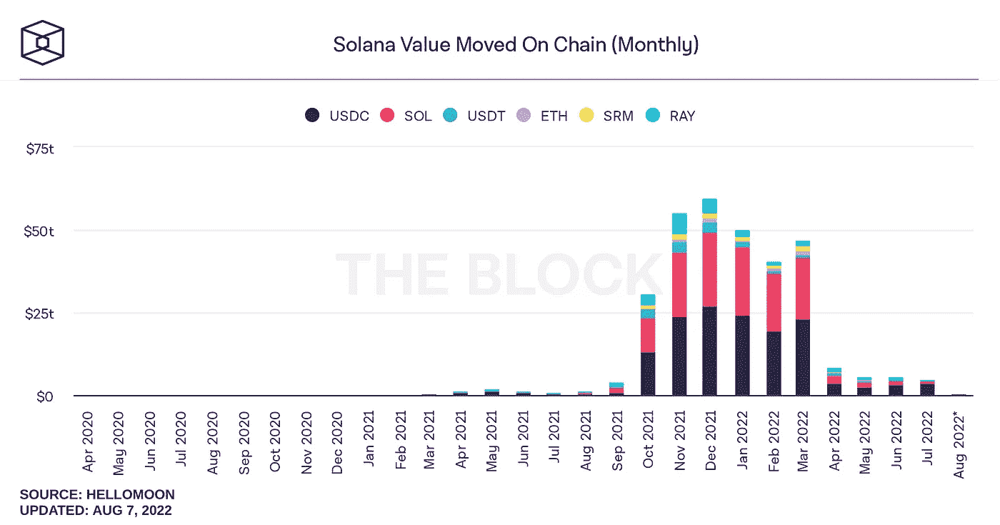

# 本周在 Crypto(8 月 1 日至 8 月 7 日)

> 原文：<https://medium.com/coinmonks/this-week-in-crypto-august-1-august-7-64980437d19b?source=collection_archive---------18----------------------->

本周，索拉纳网络和生态系统受到了两大负面发展的打击。

首先，在攻击者能够访问通过 Slope wallet 移动应用程序创建的钱包后，网络上的 5000 个热钱包耗尽了他们的 SOL 令牌。

其次，就在这个周末，Coindesk 披露了两个德克萨斯兄弟如何有效地伪造了 Solana 网络上主要 DeFi 协议的总价值锁定(TVL)增长。Saber DEX 的首席架构师 Ian Macalinao 使用了多达 11 个开发人员假名来创建一个独立应用程序的生态系统，这些应用程序与 Saber 相连，以发展该协议的 TVL。尽管他能够做到这一点令人印象深刻，但许多项目匿名开发的事实凸显了团队不惜一切代价竞相发展的欺诈风险。TVL 是用于评估 DeFi 协议市值的主要 KPI。

在 TradFi 新闻中，比特币基地正与贝莱德合作，为贝莱德端到端投资管理平台阿拉丁的机构客户提供直接访问加密的服务，从比特币开始，通过比特币基地 Prime 连接。此举凸显了贝莱德通过投资和战略合作伙伴关系向加密领域的持续扩张。

在 DeFi news，AAVE，最大的 DeFi 贷款平台，逐步接近推出自己的全抵押稳定令牌所谓的 GHO。这一举措在 7 月 31 日通过了社区投票。GHO 代币将允许用户在该平台上发行以其存款为担保的美元计价稳定债券，同时也能从抵押品中获得收益。

本周的大阅读集中在以太坊向股权验证(POS)过渡的影响，也被称为合并。这两篇文章介绍了此举对当前工作证明(POW)验证器的意义，以及并非所有人都赞成这一举措，这增加了第二大区块链出现分叉的可能性。

主要标题:

**匿名大师:密码开发者如何伪造 DeFi 生态系统**

 [## 匿名大师:一个密码开发者如何伪造一个 DeFi 生态系统

### 丹尼是 CoinDesk 的副商业编辑。他拥有 BTC、ETH 和 SOL。特雷西·王是……的副总编辑

www.coindesk.com](https://www.coindesk.com/layer2/2022/08/04/master-of-anons-how-a-crypto-developer-faked-a-defi-ecosystem/) 

**Nomad 价值 1.9 亿美元的桥梁开发吸引了 300 个地址的疯狂下载**

 [## nomad 1.9 亿美元的桥梁开发吸引了 300 个地址的黑客攻击

### 安全公司 PeckShield 告诉 Block，周一有 300 多个地址与 Nomad 的桥梁漏洞有关。

www.theblock.co](https://www.theblock.co/post/160851/nomads-190-million-bridge-exploit-drew-hacking-feeding-frenzy-of-300-addresses) 

**索拉纳实验室回应钱包漏洞，称没有证据表明网络是罪魁祸首**

 [## 索拉纳实验室回应钱包漏洞，称没有证据表明是网络造成的

### 大约 5000 个钱包似乎受到了正在进行的索拉纳网络攻击的影响。形势在发展。

www.theblock.co](https://www.theblock.co/post/161115/more-than-5000-wallets-drained-in-apparent-exploit-on-solana-network) 

**丽都道在条款调整后批准向蜻蜓资本出售国债代币**

 [## 丽都道批准向蜻蜓资本出售国债代币

### 丽都金融向蜻蜓资本出售 1000 万枚 LDO 代币的计划最初于上月被否决。

www.theblock.co](https://www.theblock.co/post/161461/lido-dao-approves-treasury-token-sale-to-dragonfly-capital) 

**比特币基地被贝莱德选中；通过比特币基地 Prime** 为阿拉丁客户提供加密交易和托管服务

 [## 贝莱德选中的比特币基地；通过以下方式为阿拉丁客户提供加密交易和托管服务…

### TL；博士:比特币基地和贝莱德通过连接比特币基地，为机构加密的采用创造新的接入点…

blog.coinbase.com](https://blog.coinbase.com/coinbase-selected-by-blackrock-provide-aladdin-clients-access-to-crypto-trading-and-custody-via-b9e7144f313d) 

**新 Aave Stablecoin 扫清第一关**

 [## 新的 Aave Stablecoin 清除第一个障碍-挑衅

### 一个团体投票支持 GHO·托肯，还有两票即将到来，这一举动可能会扰乱稳定的硬币市场，一个团体…

thedefiant.io](https://thedefiant.io/new-aave-stablecoin-clears-first-hurdle) 

大阅读:

PoW 顽固分子计划在合并后分叉并开采他们自己的以太坊链

 [## 战俘的顽固分子计划在合并后开发他们自己的以太坊链——挑衅者

### 在一个 PoS 世界里操作并不容易，毫无疑问，DeFi 是令人兴奋的。最大的升级…

thedefiant.io](https://thedefiant.io/pow-die-hards-plan-to-fork-and-mine-original-ethereum-after-the-merge) 

**ETHPoW vs ETH2**

 [## ETHPoW 与 ETH2

### (以下表达的任何观点不应构成投资决策的基础，也不应被解释为…

blog.bitmex.com](https://blog.bitmex.com/ethpow-vs-eth2/?r=9wojr&utm_source=substack&utm_medium=email) 

本周图表:

Both on-chain volume and TVL’s have dropped substantially on the Solana network in the second half of 2022\. News about the how the Macalinao brothers faked DeFi activity will add to the negative momentum.

> 加入 Coinmonks [电报频道](https://t.me/coincodecap)和 [Youtube 频道](https://www.youtube.com/c/coinmonks/videos)了解加密交易和投资

# 另外，阅读

*   [Bookmap 评论](https://coincodecap.com/bookmap-review-2021-best-trading-software) | [美国 5 大最佳加密交易所](https://coincodecap.com/crypto-exchange-usa)
*   [加密交易机器人](/coinmonks/crypto-trading-bot-c2ffce8acb2a) | [造币评论](https://coincodecap.com/coingate-review)
*   最佳加密[硬件钱包](/coinmonks/hardware-wallets-dfa1211730c6) | [Bitbns 评论](/coinmonks/bitbns-review-38256a07e161)
*   [新加坡十大最佳加密交易所](https://coincodecap.com/crypto-exchange-in-singapore) | [购买 AXS](https://coincodecap.com/buy-axs-token)
*   [红狗赌场评论](https://coincodecap.com/red-dog-casino-review) | [Swyftx 评论](https://coincodecap.com/swyftx-review)