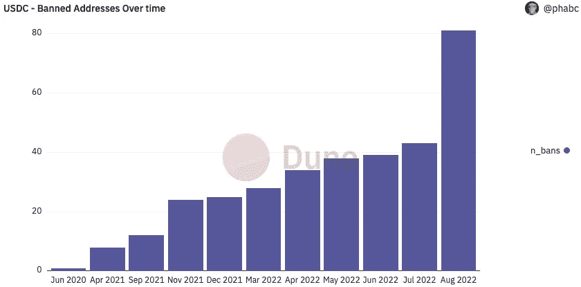

# 本周在 Crypto(8 月 15 日至 8 月 21 日)

> 原文：<https://medium.com/coinmonks/this-week-in-crypto-august-15-august-21-ee2c6aa3a605?source=collection_archive---------62----------------------->

过去一周,“龙卷风”现金制裁的余波在加密领域回荡。后果包括 Uniswap 对加密地址的额外封锁，为该应用程序编写开源代码的 Tornado Cash dev 令人担忧的被捕，以及比特币基地首席执行官发人深省的评论，如果联邦政府将发布额外的制裁。

对 Tornado Cash dev 阿列克谢·佩尔采夫(Alexey Pertsev)的制裁尤其令人担忧，因为他可能编写了去中心化应用程序背后的代码，但对其使用方式没有任何影响。此外，在美国，编写软件代码受宪法保护的言论自由第一修正案的保护。观察围绕开放创新、言论自由和监管的辩论在未来几个月如何展开将是一件有趣的事情。

在其他头条新闻中，Tether 提高了其现金持有量的透明度。BDO 的报告显示，USDT 的绝大部分资产是由美国国债、货币市场基金、现金和等价物支持的。总的来说，该公司持有的商业票据从 200 亿美元减少到 85 亿美元，并计划在年底前获得现金或等价物的全额支持。

本周的长篇阅读概述了 Celsius 糟糕的决策和投资管理流程。英国《金融时报》的文章分享了亚历克斯·马辛斯基如何在 2022 年初控制交易。这些轶事进一步表明，即使是处于加密货币新时代范式的公司也可能成为糟糕的交易选择和追逐回报的受害者。

主要标题:

**开发商，家人抗议在阿姆斯特丹逮捕龙卷风现金开发商**

 [## 开发商，家庭抗议逮捕龙卷风现金开发商在阿姆斯特丹

### 一群加密和隐私倡导者抗议逮捕 Tornado Cash 开发者 Alexey Pertsev。

www.theblock.co](https://www.theblock.co/post/164657/developers-family-protest-arrest-of-tornado-cash-developer-in-amsterdam) 

**比特币基地首席执行官:如果被迫审查交易，将退出赌博业**

 [## 比特币基地首席执行官:如果被迫审查交易，会退出赌博业吗

### 美国最大的交易所占所有股份的 14%经过几天的压力，比特币基地联合创始人和…

thedefiant.io](https://thedefiant.io/coinbase-staking-censorship) 

**Uniswap 已经封锁了 253 个与被盗资金或制裁相关的加密地址**

 [## Uniswap 已经封锁了 253 个与被盗资金或制裁有关的加密地址

### 分散式 exchange Uniswap 提供了迄今为止已封锁的地址及其原因的细分数据。数据是…

www.theblock.co](https://www.theblock.co/post/164626/uniswap-has-blocked-253-crypto-addresses-related-to-stolen-funds-or-sanctions) 

美联储指示银行报告加密活动

 [## 美联储指示银行报告加密活动-挑衅

### 美国央行表示，大规模采用稳定货币可能会给金融稳定监管机构带来严重风险…

thedefiant.io](https://thedefiant.io/fed-watching-crypto?utm_source=substack&utm_medium=email) 

**连接到 Solana 进行 DeFi 访问的加密托管铜**

 [## 加密保管铜连接到索拉纳的 DeFi 访问

### 加密货币托管机构 Copper 表示，它将支持与 Solana 的分散金融(DeFi)连接

www.coindesk.com](https://www.coindesk.com/business/2022/08/18/crypto-custodian-copper-to-connect-to-solana-for-defi-access/?utm_source=substack&utm_medium=email) 

**美联储州长给美国 CBDC 踩刹车，支持费德诺**

 [## 美联储州长给美国 CBDC 踩刹车，支持费德诺

### 美联储的一名官员正在为美联储的…对密码行业的几个领域进行反击

www.theblock.co](https://www.theblock.co/post/164085/federal-reserve-governor-pumps-the-brakes-on-us-cbdc-in-favor-of-fednow) 

**联邦存款保险公司就存款保险向 FTX 美国公司和其他加密公司发出停止函**

 [## 联邦存款保险公司就存款保险问题向 FTX 美国公司和其他加密公司发出停止函

### 联邦存款保险公司(FDIC)周五表示，它已经向五家加密公司发出了停止信函

www.theblock.co](https://www.theblock.co/post/164553/fdic-issues-cease-and-desist-letters-to-ftx-us-other-crypto-firms-over-deposit-insurance) 

**最新披露显示 289 亿美元美国国库券**

 [## 最新披露的系绳显示，289 亿美元的美国国债

### 该报告显示，商业票据持有量比上一季度下降了 58%以上，从 200 亿美元降至 85 亿美元…

www.theblock.co](https://www.theblock.co/post/164502/latest-tether-disclosures-show-28-9-billion-in-us-treasury-bills) 

长阅读:

破产前几个月，亚历克斯·马辛斯基接管了 Celsius trading strategy

 [## 亚历克斯·马辛斯基在破产前几个月接管了 Celsius trading strategy

### 一月份，Celsius Network 的老板亚历克斯·马辛斯基召集了他的投资团队，告诉他们他将接管…

www.ft.com](https://www.ft.com/content/43d4fb5d-72a1-468c-aac8-9e11c4693f4e?utm_source=substack&utm_medium=email) 

本周图表:

> 交易新手？尝试[加密交易机器人](/coinmonks/crypto-trading-bot-c2ffce8acb2a)或[复制交易](/coinmonks/top-10-crypto-copy-trading-platforms-for-beginners-d0c37c7d698c)