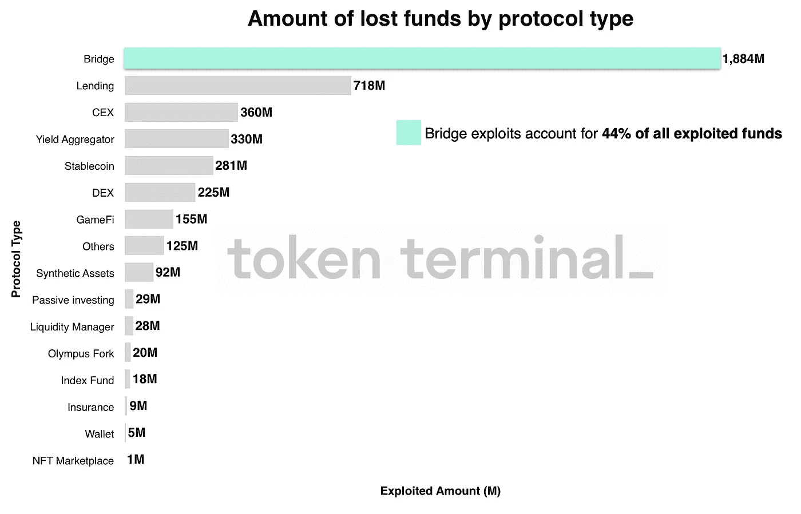

# 本周在 Crypto(8 月 21 日至 8 月 28 日)

> 原文：<https://medium.com/coinmonks/this-week-in-crypto-august-21-august-28-f8ab601aa4e5?source=collection_archive---------20----------------------->

更广泛的宏观经济新闻主导了加密货币市场的价格叙事。上周，杰伊·鲍威尔(Jay Powell)的言论终结了美联储(Federal Reserves)将退出大幅收紧政策的希望。作为回应，包括加密货币在内的风险资产大幅下跌。

在接下来的几周内，以太坊合并将会占据头条新闻，预计 9 月 15 日将会举行这个备受期待的活动。合并对供应链的可扩展性和通货膨胀指标的影响还没有定论。下面是关于合并的最新消息以及对合并后吞吐量的深入分析。

Tether 坚持其不冻结与 Tornado Cash 有关联的受制裁钱包地址的决定。USDT 背后的基金会表示，它没有收到美国执法部门或监管机构冻结账户的任何请求。有趣的是，不冻结的决定与 USDC 背后的公司 Circle 以及许多已建立的 DeFi 项目对 OFAC 制裁新闻的反应相反。

一个引人入胜的 DeFi 形势值得关注的是 Fei 协议的解散计划。Fei 是一个分散的算法支持的 stablecoin 项目，于 2021 年春天首次亮相。从一开始，这个项目就在合同漏洞中挣扎，今年晚些时候，当它的母公司 TribeDAO 与 Rari Capital 合并时，又遇到了黑客攻击。该活动将开创一个先例，说明大型 DeFi 项目如何通过其 DAO 结构来展开其运营。

在其他主要的 L1 升级新闻中，Jump Capital 公布了与 Solana 基金会合作的计划，以改进其验证器客户端，目标是提高网络的可靠性和速度。在过去的一年中，索拉纳一直在与几次引人注目的停电做斗争。

最后，本周的长篇阅读呈现了令牌终端 DeFi 攻击的精彩概述。这篇文章从数据驱动的角度审视了前几年最大规模黑客攻击的根本原因、模式和机制。

主要标题:

**随着美元升值，合并炒作降温，加密价格暴跌**

 [## 随着美元升值，合并炒作降温，加密技术暴跌

### 6.08 亿杠杆加密头寸已被清算加密市场周五早盘暴跌，抹去了两周的牛市…

thedefiant.io](https://thedefiant.io/crypto-drops-dollar-rises) 

**费社区因解散计划而大动肝火**

 [## 费社区在解散计划上大动肝火——目中无人

### 该团队将技术挑战和未来法规列为“不断增加的技术、财务和未来……

thedefiant.io](https://thedefiant.io/fei-shutdown-uproar) 

**合并不会给以太坊带来巨大的可扩展性收益，但是 EIP-4844 可能会**

 [## 合并不会给以太坊带来巨大的可扩展性收益，但是 EIP-4844 可能会——挑战

### Proto-Danksharding 可以将第 2 层汇总的吞吐量提高 100 倍，所有人都在关注以太坊即将推出的…

thedefiant.io](https://thedefiant.io/ethereum-scaling-eip-4844) 

**以太坊与贝拉特里克斯的合并将于 9 月 6 日开始**

 [## 以太坊与贝拉特里克斯的合并将于 9 月 6 日拉开序幕

### 以太坊的共识层将在合并的第一阶段更新，以太坊的两部分过渡到 ESG 友好…

thedefiant.io](https://thedefiant.io/ethereum-bellatrix-sep-6) 

**Tether 表示，它不会冻结 Tornado 的现金地址，除非政府通知它**

 [## Tether 表示，除非政府要求，否则不会冻结龙卷风的现金地址

### Tether 发表了一份声明，解释了为什么不冻结与 Tornado 现金相关的钱包地址。

www.theblock.co](https://www.theblock.co/post/165513/tether-says-its-not-freezing-tornado-cash-until-government-tells-it-to) 

**跳跃密码检修索拉纳**

 [## 跳跃密码检修索拉纳-挑衅

### 一个新的开源验证客户端计划跳转加密将与索拉纳基金会合作开发一个新的…

thedefiant.io](https://thedefiant.io/jump-crypto-solana-overhaul) 

**澳大利亚公布不同于“世界上任何其他地方”的加密法规计划**

 [## 澳大利亚公布了不同于“世界上任何其他地方”的加密法规计划

### 澳大利亚的密码监管机构正试图进入政府从未涉足的领域。那是根据他们的说法…

decrypt.co](https://decrypt.co/107943/australia-unveils-plans-crypto-regulations-unlike-anywhere-else-in-the-world) 

长阅读:

**DeFi 利用:趋势、模式和经验教训**

 [## DeFi 利用:趋势、模式和经验教训

### 尽管 DeFi 呈现爆炸式增长，但在过去两年中，由于缺乏安全性，已有超过 42 亿美元被盗…

tokenterminal.substack.com](https://tokenterminal.substack.com/p/defi-exploits-trends-patterns-and?r=9wojr&s=r&utm_campaign=post&utm_medium=email) 

本周图表:

> 交易新手？尝试[加密交易机器人](/coinmonks/crypto-trading-bot-c2ffce8acb2a)或[复制交易](/coinmonks/top-10-crypto-copy-trading-platforms-for-beginners-d0c37c7d698c)