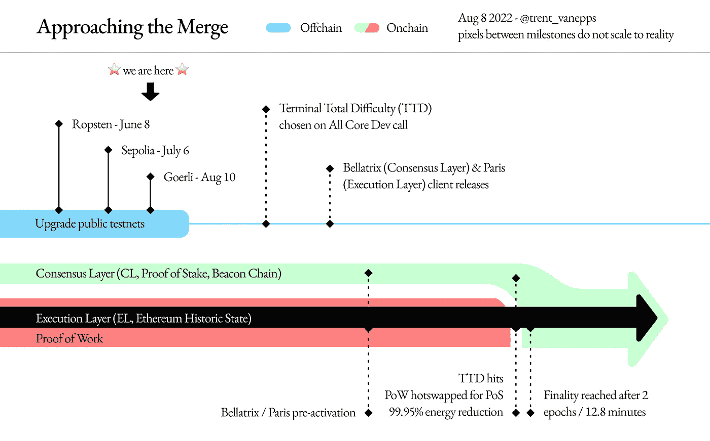

# 本周在 Crypto(8 月 8 日至 8 月 14 日)

> 原文：<https://medium.com/coinmonks/this-week-in-crypto-august-8-august-14-f02bd1fa3106?source=collection_archive---------23----------------------->

过去一周，有两大新闻占据了加密领域。首先，美国财政部对加密货币混合器 Tornado Cash 的制裁。第二，以太网的阻碍合并。

Tornado Cash 是一种分散式协议，允许用户通过智能合约在几个地址混合资金进行私下交易。黑客利用该协议将非法获得的加密货币与合法货币混在一起。美国财政部声称，龙卷风现金被一个朝鲜黑客组织用于洗钱约 70 亿美元，其中约 5 亿美元。

然而，财政部的声明是有史以来第一次互联网上的软件受到制裁。制裁通常涉及个人或企业，而不是分散的应用程序。监管机构首先让 DeFi 和加密市场参与者争先恐后地找出对他们的业务和整个空间的影响。

圈，USDC 的支持者，已经宣布，它将继续冻结 USDC 与龙卷风现金。一些 DeFi 协议已经禁止与该协议交互的钱包地址使用它们的服务。MakerDOA 是 DeFi 领域最大的参与者之一，也是 DAI stablecoin 背后的 DOA，它宣布了应急计划，如果其 stablecoin 受到美国的制裁，因为 DAI 得到了 USDC 的部分支持。

在其他新闻中，以太坊向股权证明机制的历史性转变越来越近，暂定日期为 9 月初。在过去的两个月里，由于预期代币经济和赌注机制的改善，ETH 的价格上涨了 100%以上。这个历史性的、期待已久的时刻在本周的长篇阅读中有详细描述。除了解释合并的意义之外，文章还探讨了在 Howey 测试下 POS 机制是否可以转化为安全性的问题。

最后，贝莱德继续进军加密领域，推出了跟踪比特币现货价格的私人信托。该信托将提供给总部位于美国的机构客户，可能是基于此前宣布的与比特币基地的合作关系。

主要标题:

**美国财政部制裁加密货币混合器 Tornado Cash**

 [## 美国财政部制裁加密货币搅拌机龙卷风现金

### 这是继对 Blender.io 采取行动之后，该机构对混合服务的第二次制裁。

www.theblock.co](https://www.theblock.co/post/162105/us-treasury-sanctions-cryptocurrency-mixer-tornado-cash) 

**龙卷风制裁后中心禁止 USDC 地址**

 [## 龙卷风制裁后，中心禁止 USDC 讲话

### 投资者关注分散的稳定资本，因为财团的 38 个地址稳定资本再次成为焦点…

thedefiant.io](https://thedefiant.io/usdc-addresses-banned) 

**圈子回应:未标明|信任的责任**

 [## 未知|信任的责任

### 这是正在进行的 Circle 系列的第八篇博客。Circle 是一家受监管的公司，它创建了，现在管理和…

www.circle.com](https://www.circle.com/blog/the-responsibility-of-trust?utm_source=substack&utm_medium=email) 

**美国财政部新闻稿**

 [## 美国财政部制裁臭名昭著的虚拟货币搅拌机龙卷风现金

### 今天，美国财政部外国资产控制办公室(OFAC)批准了虚拟…

home.treasury.gov](https://home.treasury.gov/news/press-releases/jy0916?utm_source=substack&utm_medium=email) 

**制裁打击戴，马可道可能实施‘紧急关停’**

 [## 如果制裁打击了目中无人的戴，马可道可能会实施“紧急关闭”

### 现在轮到马克尔道了。DeFi 蓝筹股是受到美国财政部冲击波冲击的最新协议…

thedefiant.io](https://thedefiant.io/tornado-impact-makerdao-dai) 

**以太坊核心开发者建议合并的暂定日期**

 [## 以太坊核心开发者建议合并的暂定日期

### 以太坊核心开发者已经提出了合并的可能日期，这是 crypto 最受期待的事件之一

www.theblock.co](https://www.theblock.co/post/162988/ethereum-foundation-suggests-tentative-dates-for-the-merge) 

联合国发展机构称禁止银行持有密码

 [## 联合国发展机构称禁止银行持有密码

### Jack Schickler 是一名 CoinDesk 记者，常驻比利时布鲁塞尔，主要关注加密法规。他没有任何…

www.coindesk.com](https://www.coindesk.com/policy/2022/08/11/ban-banks-from-holding-crypto-un-development-body-says/?utm_source=substack&utm_medium=email) 

**贝莱德推出私人信托，提供直接比特币敞口**

 [## 贝莱德推出私人信托，提供直接比特币敞口

### 一周前，贝莱德与比特币基地达成协议，向其客户提供加密服务。

www.theblock.co](https://www.theblock.co/post/162987/blackrock-launches-private-trust-offering-direct-bitcoin-exposure?utm_source=twitter&utm_medium=social) 

长阅读:

利害攸关的是:合并会把以太变成证券吗？

 [## 利害攸关的是:合并会把以太变成证券吗？

### 弗雷德里克·穆纳瓦是 Coindesk 的科技记者。他介绍了区块链协议，特别关注比特币…

www.coindesk.com](https://www.coindesk.com/tech/2022/08/10/whats-at-stake-will-the-merge-turn-ether-into-a-security/?utm_source=substack&utm_medium=email) 

本周图表:

> 交易新手？尝试[加密交易机器人](/coinmonks/crypto-trading-bot-c2ffce8acb2a)或[复制交易](/coinmonks/top-10-crypto-copy-trading-platforms-for-beginners-d0c37c7d698c)