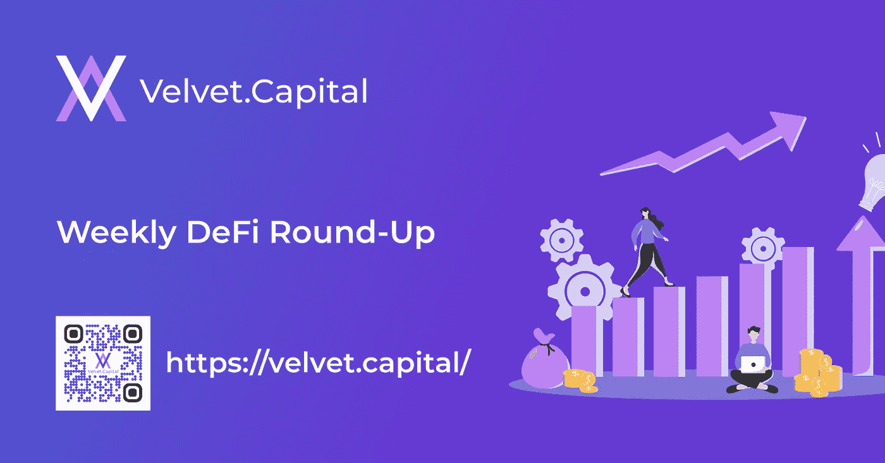
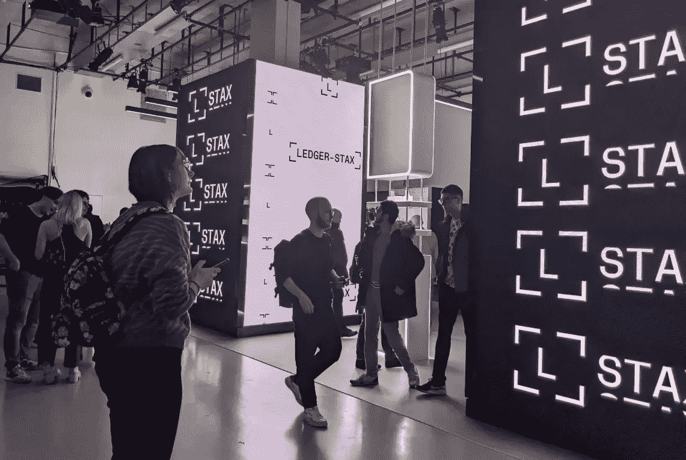
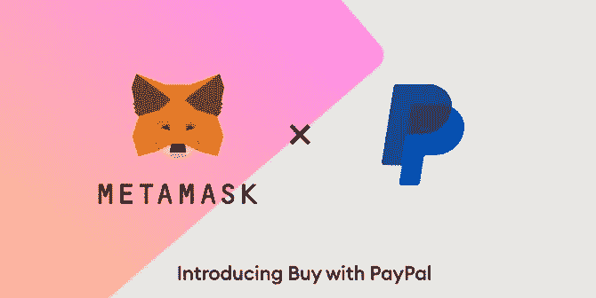
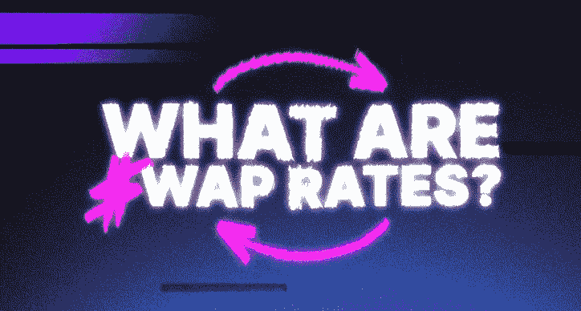

# 本周在 Crypto(12 月 12 日-19 日)

> 原文：<https://medium.com/coinmonks/this-week-in-crypto-december-12th-19th-f9f9498374fa?source=collection_archive---------52----------------------->

又是一天，又是一个数字美元天鹅绒家庭。随着我们的世界杯庆祝活动的结束，是时候回到加密的世界了。还有什么比每个人都喜欢的数字资产管理器的快速更新更好的开始方式呢！查看所有我们喜欢的适合印刷的新闻(我的意思是，没有人真的再阅读印刷媒体了…是吗？).记住:你可能会度过艰难的一周，但不是被困在巴哈马的监狱里，没有纯素食或英雄联盟——艰难。

[巴黎莱杰公开赛你错过了什么](https://nftevening.com/what-you-missed-at-ledger-op3n-in-paris-2022/)

法国万岁！你是说在巴黎的另一个 web3 会议？！答对了。莱杰刚刚在巴黎举行的年度会议上发布了一些重要公告。值得注意的是，他们宣布了新的触摸屏硬件钱包:Ledger Stax。这种新设备是由 iPod 的发明者发明的，它能让你在交互式屏幕上看到你的 NFTs。此外，他们的新浏览器 Ledger Connect 将与您的 Stax wallet 接口，以促进更无缝的交易。这标志着该公司全面推动改善其用户体验，并与 NFTs 进行更自然的交互。不管是不是 HODL，很明显 NFT 已经是加密时代精神的一部分。

[最高法院将对 Gonzalez 诉谷歌案做出判决](https://inside.com/cryptocurrency/posts/the-supreme-court-will-reach-a-verdict-on-the-gonzalez-v-google-case-potential-path-for-blockchain-tech-334754)

最高法院预计将很快对冈萨雷斯诉谷歌案做出判决，这可能会为 web3 开创一个重要的先例。1996 年的电信法案规定“互联网公司对其用户发布的内容不负法律责任。”原告认为，互联网平台对他女儿的早逝负有责任。如果被废除，这将真正撼动大型科技领域，并为区块链科技创造一个扭转乾坤的机会。许多 Web3 爱好者认为，该案件可能会引领社交媒体平台在区块链的存在——同时保护和证明我们的身份。

[PayPal 与 MetaMask 合作](https://nftlately.com/paypal-partners-with-crypto-wallet-metamask-for-ethereum-transactions/)

时候到了！人类的一小步——加密应用的下一个大飞跃！美国的精选 MetaMask 用户将能够使用 PayPal 购买乙醚。PayPal 一直处于金融科技的最前沿，并希望进入加密领域变得更加主流。这是 PayPal 一系列亲加密策略中的最后一个。自 2021 年以来，用户已经能够使用 crypto 支付某些交易。关于 DeFi 垮台的讨论将被证明为时过早，因为机构巨头们仍在努力使其合法化。

什么是掉期利率？

知识就是力量！挑衅者提出了一个有用的解释 DeFi 交换率。你有没有想过如何在数万种不同的加密货币之间切换，而不会出现算法爆炸？掉期利率是一种估值系统，它为加密货币的内在价格提供了连续性。虽然它们因交易所而异，但却惊人地一致。阅读文章的其余部分，了解更多信息！

[香港推出两只加密 ETF](https://inside.com/cryptocurrency/posts/hong-kong-launches-two-crypto-etfs-despite-market-downturn-335645)

CSOP 资产管理公司刚刚创建了两个比特币和以太 ETF。这标志着香港出现了第一批加密期货基金，让投资者能够在受监管的情况下投资这些资产。尽管整体市场情绪对加密技术不乐观，但 CSOP 量化投资主管王怡认为，香港对数字资产仍持开放态度。无论如何，比特币和以太显然已经成为 TradFi 投资者的既定资产。

> *交易新手？试试* [*密码交易机器人*](/coinmonks/crypto-trading-bot-c2ffce8acb2a) *或* [*复制交易*](/coinmonks/top-10-crypto-copy-trading-platforms-for-beginners-d0c37c7d698c)
> 
> *分散加密持股，了解* [*币安的替代方案*](https://coincodecap.com/binance-alternatives)
> 
> *加入 Coinmonks* [*电报频道*](https://t.me/coincodecap) *和* [*Youtube 频道*](https://www.youtube.com/c/coinmonks/videos) *获取每日* [*加密新闻*](http://coincodecap.com/)

# 另外，阅读

*   [复制交易](/coinmonks/top-10-crypto-copy-trading-platforms-for-beginners-d0c37c7d698c) | [加密税务软件](/coinmonks/crypto-tax-software-ed4b4810e338)
*   [网格交易](https://coincodecap.com/grid-trading) | [加密硬件钱包](/coinmonks/the-best-cryptocurrency-hardware-wallets-of-2020-e28b1c124069)
*   [密码电报信号](/coinmonks/top-3-telegram-channels-for-crypto-traders-in-2021-8385f4411ff4) | [密码交易机器人](/coinmonks/crypto-trading-bot-c2ffce8acb2a)
*   [最佳加密交易所](/coinmonks/crypto-exchange-dd2f9d6f3769) | [印度最佳加密交易所](/coinmonks/bitcoin-exchange-in-india-7f1fe79715c9)
*   [开发人员的最佳加密 API](/coinmonks/best-crypto-apis-for-developers-5efe3a597a9f)
*   最佳[密码借贷平台](/coinmonks/top-5-crypto-lending-platforms-in-2020-that-you-need-to-know-a1b675cec3fa)
*   [免费加密信号](/coinmonks/free-crypto-signals-48b25e61a8da) | [加密交易机器人](/coinmonks/crypto-trading-bot-c2ffce8acb2a)
*   杠杆代币的终极指南