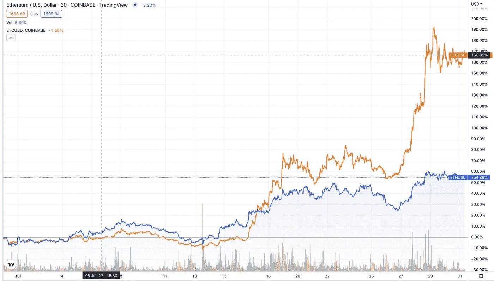

# 本周在 Crypto(7 月 24 日至 7 月 31 日)

> 原文：<https://medium.com/coinmonks/this-week-in-crypto-july-24-july-31-cdb90cac2d8d?source=collection_archive---------23----------------------->

美国监管机构玩了一场有趣的游戏，主张对数字资产的管辖权。美国证券交易委员会(SEC)以涉嫌内幕交易为由提出指控，同时宣布几个代币为证券。此后，在一次不同寻常的反驳中，CFTC 专员发表声明，呼吁监管机构给予更多合作，同时称 SEC 的行为是“强制监管”。

随着集中化数字资产参与者和贷款机构的后果继续在破产法庭上演，美联储澄清说，一些人可能提出了不真实的 FDIC 保险索赔。Voyager 早先因其贷款组合融化而暂停客户提款，错误地宣称其客户存款有保险。

最后，在夏季的几个月里，更广泛的加密市场正在经历缓慢的价格复苏。特别是以太坊，随着利率的定价和区块链向被称为“合并”的股权证明验证机制的过渡，以太坊已经上涨了 50%以上。

从更长远的角度来看，我推荐潘迪拉资本的区块链信，这封信认为，DeFi 在市场动荡中发挥了应有的作用，成为头条新闻的恶作剧实际上是由集中金融内部的失败造成的。

头条新闻:

**在比特币基地内幕交易指控后，SEC 将九种加密令牌列为证券**

 [## 在比特币基地内幕交易指控后，SEC 将九种加密令牌列为证券

### SEC 在比特币基地列出了 9 种它认为是证券的加密货币，进一步澄清了它的观点。

www.theblock.co](https://www.theblock.co/post/158973/sec-lists-nine-crypto-tokens-as-securities-following-coinbase-insider-trading-charges) 

**美国证券交易委员会备案内幕交易案后，CFTC 委员大声疾呼**

 [## 美国证券交易委员会提交加密内幕交易案后，CFTC 委员大声疾呼

### 在美国证券交易委员会(SEC)提起数字资产诉讼后，CFTC 成员强调了监管合作的重要性

www.theblock.co](https://www.theblock.co/post/159098/cftc-commissioners-speak-up-after-sec-files-crypto-insider-trading-case)  [## Caroline D. Pham 专员关于 SEC 诉 Wahi 案的声明

### “用《联邦党人》第 49 号的话来说，‘人民是权力的唯一合法源泉，正是从他们那里……

www.cftc.gov](https://www.cftc.gov/PressRoom/SpeechesTestimony/phamstatement072122) 

**美联储和联邦存款保险公司指控航海家数码公司保险索赔“虚假和误导”**

 [## 美国联邦储备银行、联邦存款保险公司指控航海家数码公司保险索赔“虚假和误导”

### 美国美联储和联邦存款保险公司(FDIC)向……发出了联合停止函

www.theblock.co](https://www.theblock.co/post/160174/us-fed-fdic-accuse-voyager-digital-of-false-and-misleading-insurance-claims) 

**以太坊上涨 10%,因美联储加息信号生效**

 [## 以太坊上涨 10%,因美联储发出加息信号——挑衅

### 在美国美联储将基准利率提高了……后，加密市场在周三和周四上涨

thedefiant.io](https://thedefiant.io/markets-rally-fed-hike/?utm_source=substack&utm_medium=email) 

随着以太坊通过另一项关键测试，合并越来越近

 [## 随着以太坊通过另一项关键测试——挑战，合并越来越近

### 通过了合并前一系列关键测试中的最新一项，以太坊完成了第十个 mainnet 影子分支…

thedefiant.io](https://thedefiant.io/the-merge-shadow-fork-pass-test/) 

大阅读:

**DeFi 工作出色**

 [## DeFi 工作出色|潘迪拉

### DEFI 非常成功“加密货币持续暴跌。。。混乱已经蔓延到 DeFi: Celsius，一家加密贷款公司…

panteracapital.com](https://panteracapital.com/blockchain-letter/defi-worked-great/) 

本周图表:

ETC and ETH rally driven by the income merge of the Ethereum network.

> 交易新手？试试[密码交易机器人](/coinmonks/crypto-trading-bot-c2ffce8acb2a)或者[复制交易](/coinmonks/top-10-crypto-copy-trading-platforms-for-beginners-d0c37c7d698c)