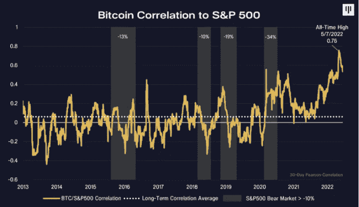

# 本周在 Crypto(6 月 26 日至 7 月 3 日)

> 原文：<https://medium.com/coinmonks/this-week-in-crypto-june-26-july-3-f75474d13de7?source=collection_archive---------40----------------------->

2022 年，加密领域的好日子还会到来吗？现在下结论可能还为时过早，但积极的迹象已经出现。

FTX 与最大的密码贷方之一 BlockFi 达成了一项交易。同一周，该公司否认了通过收购 Robinhood 进入 TradFi 世界的计划。

基于以太坊的 stablecoin DAI 背后的协议 Maker 正在投票将其国库储备分配到美国国债和债券。Maker 的过度抵押的 stablecoin 模型在市场崩溃中证明是稳健的，向传统资产的转移可以给协议带来现实世界的盈利能力。

> 交易新手？试试[加密交易机器人](/coinmonks/crypto-trading-bot-c2ffce8acb2a)或者[复制交易](/coinmonks/top-10-crypto-copy-trading-platforms-for-beginners-d0c37c7d698c)

在更广泛的监管更新中，欧盟就其具有里程碑意义的加密资产市场(MiCA)指令达成了临时协议，为多年来关于如何监管数字资产行业的辩论画上了非正式的句号。

最后，埃尔·萨尔瓦多雷公司再次决定“购买”这一次，以 19000 美元的价格再购买 80 个 BTC，使其总余额超过 2000 BTC。

**创客治理投票决定投资 5 亿美元美国国债**

 [## 创客治理投票决定投资 5 亿美元美国国债

### MakerDAO 正在就如何部署价值 5 亿美元的戴投资于低风险的美国国债和债券进行投票。

www.theblock.co](https://www.theblock.co/post/154515/maker-governance-is-voting-to-invest-500-million-in-us-treasury-bills?utm_source=substack&utm_medium=email) 

FTX 不再声称计划收购罗宾汉

 [## FTX 否认其计划收购罗宾汉-布洛克公司

### 据彭博报道，FTX 数字资产交易所正计划收购专注于 TradFi 的经纪公司 Bankman-Fried…

blockworks.co](https://blockworks.co/ftx-denies-claims-to-acquire-robinhood/?utm_source=substack&utm_medium=email) 

**英国和美国在伦敦会议上关注央行数字货币和稳定货币**

 [## 英国和美国在伦敦会议上关注央行数字货币和稳定货币

### 英国和美国本周齐聚伦敦，讨论加密和数字资产监管。

www.theblock.co](https://www.theblock.co/post/155463/uk-us-eye-central-bank-digital-currencies-and-stablecoins-in-london-meeting) 

**加密去杠杆化即将结束的美好未来——摩根大通**

 [## 加密去杠杆化即将结束，美好的日子即将到来

### 加密货币市场历史性的去杠杆化可能即将结束，这可能标志着…

cointelegraph.com](https://cointelegraph.com/news/better-days-ahead-with-crypto-deleveraging-coming-to-an-end-jpmorgan?utm_source=substack&utm_medium=email) 

**欧盟就里程碑式的加密规则达成临时协议**

[https://www . Bloomberg . com/news/articles/2022-06-30/eu-reaches-temporary-deal-on-landmark-crypto-rules](https://www.bloomberg.com/news/articles/2022-06-30/eu-reaches-provisional-deal-on-landmark-crypto-rules)

**BlockFi 与美国 FTX 达成信贷交易，勾勒收购路径**

 [## BlockFi 与美国 FTX 达成信贷协议，勾勒收购路径

### BlockFi 与 FTX 达成了一笔 6.8 亿美元的交易。该公司周五宣布。

www.theblock.co](https://www.theblock.co/post/155516/blockfi-strikes-680-million-credit-deal-with-ftx-us-outlines-acquisition-path) 

**萨尔瓦多额外购买 80 辆 BTC，每辆 19000 美元**

 [## 萨尔瓦多再购买 80 架 BTC，每架 19000 美元

### 萨尔瓦多今天早些时候以每枚 19000 美元的价格额外购买了 80 枚比特币。

www.theblock.co](https://www.theblock.co/post/155321/el-salvador-purchases-80-additional-btc-at-19000-each) 

本周图表:

Though the one of the promises of cryptocurrencies has been its decoupling from broader markets, the year has proved the reverse has been true. BTCs correlation to the S&P500 was at its highest in 2022\. The chart proves another point, when investors are scared they will sell all risky assets driving correlations to 1.