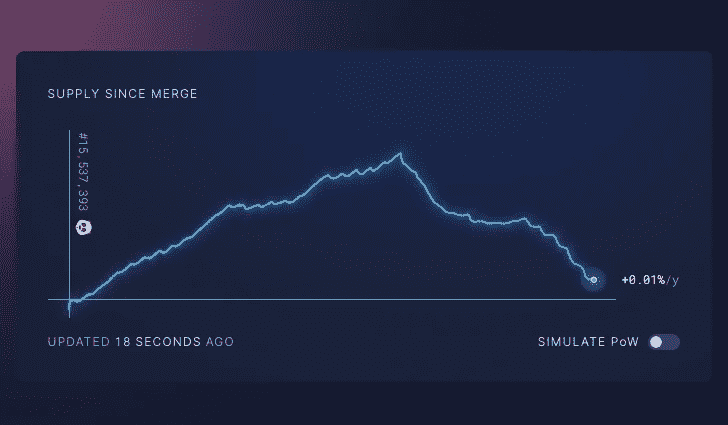
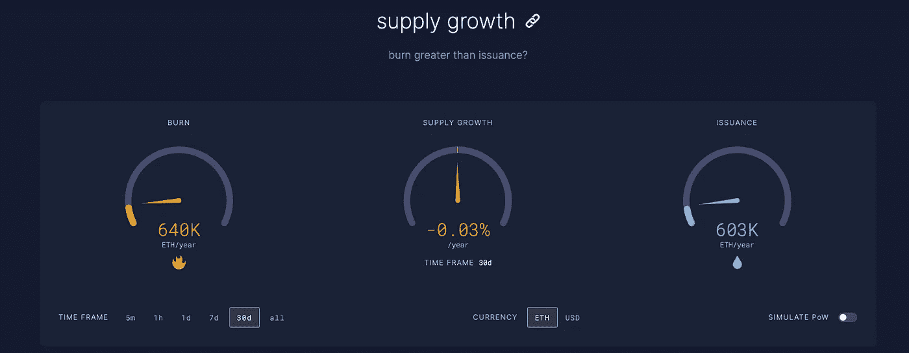
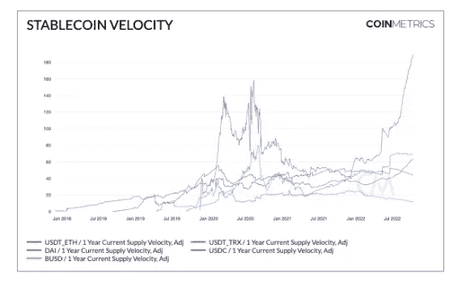

# 本周在 Crypto(10 月 16 日至 10 月 23 日)

> 原文：<https://medium.com/coinmonks/this-week-in-crypto-october-16-october-23-2a1775b9e733?source=collection_archive---------37----------------------->

机构转向数字资产和加密空间的步伐并未放缓。在本周伦敦举行的 Blockworks 数字资产峰会上，富达数字资产部门计划在未来 6 个月内再增加 100 名新员工，使员工总数达到 500 人。

富达公司早已深入到加密领域。该公司管理着 9.9 万亿美元，最近推出了以太坊指数基金，并与查尔斯·施瓦布和 Citadel securities 一起推出了数字资产交易所。独立子公司富达数字资产(Fidelity Digital Assets)最近宣布，除了现有的比特币交易和托管服务之外，该公司将于本月底开始向机构客户提供以太网服务。

围绕加密领域未来监管的讨论如此之多，FTX 首席执行官 Sam Bankman-Friedman 打破了他理想的监管框架。在一个高层次上，他建议使用黑名单或黑名单进行监管，在这种模式下，个人可以自由交易，除非得到明确的批准。FTX 跟进了最初的建议，在其网站上分享了一份名为[“可能的数字资产行业标准”](https://www.ftxpolicy.com/posts/possible-digital-asset-industry-standards)的完整文件。

这项提议并非没有批评者。区块链和加密货币行业的许多个人批评了这项提议，认为它束缚了分散的金融，同时有利于他自己的业务。这场辩论是一个重要的过程，围绕 DeFi 平台与集中式平台相比应如何对待。

围绕 DeFi 平台的辩论与监管机构如何对待 Tornado Cash 及其对区块链隐私工具的混乱制裁密切相关。本周，非营利的区块链倡导组织硬币中心(Coin Center)就美国财政部的龙卷风现金制裁提起诉讼，称此举实际上是对希望在使用自己的加密资产时保护自己隐私的美国公民进行刑事定罪。

在广泛的 L1 新闻中，备受期待的 Aptos projected 今天发布了其 mainnet，这是四年技术开发和 10 亿美元估值的高潮。Aptos 的投资者、领先的 FTX 交易所已经宣布，将于周三上市 Aptos 的 APT token。

Aptos 是 Meta(当时的脸书)区块链项目 Libra 的一个分支，后来更名为 Diem，由于监管问题而停止。

最后，合并成功的好消息是，在以太坊转向股权证明的六周之后，看起来这个承诺正在变成现实。该网络在过去 30 天里产生了负面发行。

本周的长篇阅读介绍了散户投资者对 Terra 创始人权进行义务警员追捕的有趣故事。

**重大头条:**

富达数字资产公司计划在未来六个月内再雇佣 100 名加密人员

 [## 富达数字资产公司计划在未来六个月内再雇佣 100 名加密人员

### 富达数字资产公司加倍雇用加密人员，计划在下一年增加 20%以上的员工…

www.theblock.co](https://www.theblock.co/post/178910/fidelity-digital-assets-plans-100-more-cryto-hires-within-the-next-six-months?utm_source=rss&utm_medium=rss) 

金融科技巨头格子跃入 Web3

 [## 金融科技巨头格莱德跳入 Web3 -挑衅

### 钱包板载支持 300 多个加密钱包格子，领先的软件供应商，允许用户链接他们的…

thedefiant.io](https://thedefiant.io/plaid-crypto-integration) 

Sam Bankman-Fried 在 Crypto 中推销“制裁、允许名单和黑名单”

 [## Sam Bankman-Fried 在 Crypto - Decrypt 中推销“制裁、允许名单和黑名单”

### 周三，FTX 老板萨姆·班克曼·弗里德彻底打破了他对密码行业的理想监管框架…

decrypt.co](https://decrypt.co/112436/sam-bankman-fried-pitches-sanctions-allowlists-and-blacklists-in-crypto) 

Sam Bankman-Fried 在监管提案后受到 DeFi 支持者的抨击

 [## Sam Bankman-Fried 在监管提案后受到 DeFi 支持者的抨击

### 山姆·班克曼-弗里德的监管提议并没有得到区块链和加密货币行业的许多人的认可…

www.theblock.co](https://www.theblock.co/post/178542/sam-bankman-fried-draws-fire-from-defi-proponents-after-regulation-proposal) 

索拉纳·黑仔的 Aptos 推出备受期待的 Mainnet

 [## 索拉纳·黑仔的 Aptos 推出备受期待的 Mainnet - Decrypt

### 有了 Meta 内部的秘方，以及提供“最安全、最可扩展的第 1 层……

decrypt.co](https://decrypt.co/112219/solana-killer-aptos-launches-its-highly-anticipated-mainnet) 

乙醚发行转为负数，因为合并兑现了通缩承诺

 [## 乙醚发行转为负数，因为合并兑现了通缩承诺

### 这是合并最大的承诺之一——以太网将会通货紧缩。

thedefiant.io](https://thedefiant.io/ether-goes-deflationary) 

芒果市场剥削者全盘招供，声称所有行为都是合法的

 [## 芒果市场剥削者全盘招供，声称所有行为都是合法的

### Avraham Eisenberg 已经证实他是芒果市场袭击事件的幕后黑手，该事件导致 1 . 14 亿美元的损失。

www.theblock.co](https://www.theblock.co/post/177424/mango-markets-exploiter-comes-clean-claims-all-actions-were-legal) 

硬币中心起诉财政部的龙卷风现金制裁

 [## 硬币中心起诉财政部的龙卷风现金制裁

### 由 Shalini nagara Jan/2022 年 10 月 13 日，上午 11:00 美国东部时间用户被“除尘”仍然面临刑事责任和…

blockworks.co](https://blockworks.co/coin-center-sues-over-treasurys-tornado-cash-sanctions/?utm_source=Sailthru&utm_medium=email&utm_campaign=Daily%20NL%20Thursday%2010.13.22&utm_term=Daily%20Newsletter) 

**大阅读:**

散户投资者成为寻找 crypto 头号通缉犯的义务警员

 [## 散户投资者成为寻找 crypto 头号通缉犯的义务警员

### Kang Hyung-suk 对加密货币的信心被跆拳道加密货币运营商 400 亿美元的倒闭所粉碎…

www.ft.com](https://www.ft.com/content/1a7d82ff-9986-4890-99e8-048940ce8553) 

可能的数字资产行业标准

[https://www . ftx policy . com/posts/possible-digital-asset-industry-standards](https://www.ftxpolicy.com/posts/possible-digital-asset-industry-standards)

**本周图表:**

> 交易新手？尝试[加密交易机器人](/coinmonks/crypto-trading-bot-c2ffce8acb2a)或[复制交易](/coinmonks/top-10-crypto-copy-trading-platforms-for-beginners-d0c37c7d698c)