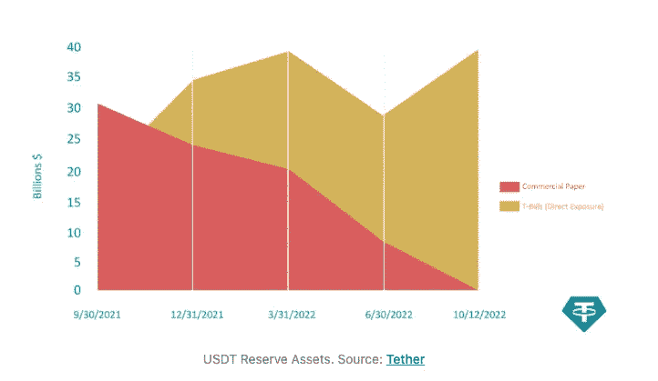
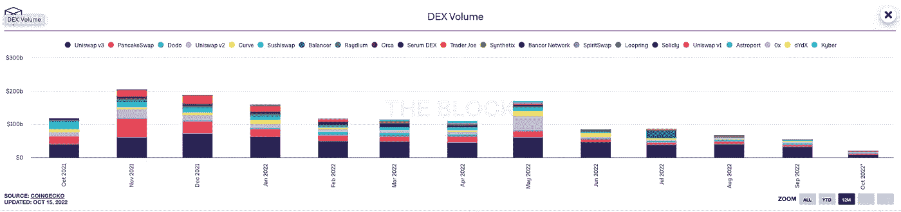
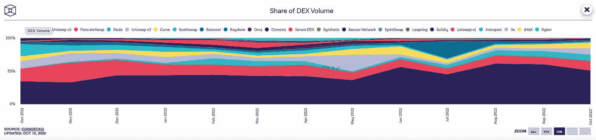

# 本周在 Crypto(10 月 9 日至 10 月 16 日)

> 原文：<https://medium.com/coinmonks/this-week-in-crypto-october-2-october-9-6096f359ee0?source=collection_archive---------17----------------------->

随着加密市场继续横向交易，焦点是该空间如何为未来定位。9 月份有超过 205 笔风投交易，吸引了约 23 亿美元的风投资金。这高于 8 月份的数据——当时约有 145 笔交易，总额为 18 亿美元——但整体加密融资仍连续第二个季度下降，这是自 2018 年以来的第一次。

9 月份最受欢迎的两个投资类别是 NFT/区块链博彩和基础设施，与上月相同，共吸引了超过 14 亿美元的资金。

过去一周，领先的 DEX Uniswap 背后的公司 Uniswap Labs 在 B 轮融资中筹集了高达 1.65 亿美元的资金。这一轮由 Polychain Capital 领投，包括 Andreessen Horowitz、Paradigm、SV Angel 和 Variant Fund，对 Uniswap 的估值为 17 亿美元。

在机构方面，作为世界上最大、历史最悠久的托管银行之一，BNY 梅隆银行宣布了其数字资产托管平台，该平台将托管 BTC 和瑞士联邦理工学院。该银行计划推出业内首个连接数字和传统资产托管的多资产平台。

监管辩论随着对宇迦实验室的新调查而继续，该实验室是 Bored Ape 游艇俱乐部和其他引人注目的收藏品背后的 NFT 巨头。据报道，SEC 官员正在调查该公司发行的 NFT 是否应该遵守与股票等传统证券类似的披露规则。美国证券交易委员会也在调查硬币的销售。要深入了解证券法及其在加密领域的应用，请阅读本周的文章[“以太坊的新‘赌注’模型并不能让 ETH 成为证券”](https://www.paradigm.xyz/2022/10/ethereums-new-staking-model-does-not-make-eth-a-security?utm_source=substack&utm_medium=email)。

由 G20 各国央行行长和金融监管者组成的金融稳定委员会(Financial Stability Board)在一份新报告中警告称，稳定的货币并不稳定。该报告指出，稳定的货币“没有可信的机制来支持其价格稳定的承诺”，列举了赎回的风险以及在市场动荡的情况下维持盯住汇率的能力。尽管如此，鉴于当今货币和通胀数据的波动性，许多观察人士可能会认为同样缺乏可信的机制，央行的决策也有问题。

最后，与 stablecoins 保持一致的是，USDT(crypto 最大的 stable coins，市值 690 亿美元)背后的公司 Tether 已经完全将商业票据从其储备中剔除。

USDT 是由法定货币 1:1 支持的稳定货币，但其储备多年来多次受到质疑，包括纽约州总检察长办公室(NYAG)的质疑。通过放弃商业票据，转而支持风险较低的短期国库券，该公司无疑是在寻求消除任何挥之不去的疑虑。

**主要头条:**

BNY 梅隆推出新的数字资产托管平台

 [## BNY 梅隆推出新的数字资产托管平台

### 纽约州 2022 年 10 月 11 日电/美通社/--BNY 梅隆大学今天宣布，其数字资产托管平台将于…

www.prnewswire.co.uk](https://www.prnewswire.co.uk/news-releases/bny-mellon-launches-new-digital-asset-custody-platform-301645324.html?utm_source=substack&utm_medium=email) 

9 月 crypto VC 综述:融资较上月略有增加

 [## 9 月 crypto VC 综述:融资较上月略有增加

### 9 月份，风险投资家向加密初创公司投资了约 23 亿美元，略高于…

www.theblockcrypto.com](https://www.theblockcrypto.com/news+/177439/september-crypto-funding-roundup-vc-deals) 

Uniswap 以 1.65 亿美元融资完成其独角兽命运

 [## Uniswap 以 1 . 65 亿美元融资完成其独角兽命运-挑战

### 领先的 DeFi 球员加入精英俱乐部的$1B+风险投资的成员部署德克斯在另一个网络的 DeFi 公司著名的…

thedefiant.io](https://thedefiant.io/uniswap-becomes-unicorn) 

美国证券交易委员会调查宇迦实验室的 NFTs 和令牌的发行:报告

 [## 证券交易委员会调查宇迦实验室的 NFTs 和令牌的发行:报告-挑衅

### 据报道，监管机构正在审查无聊猿工作室，因为镇压加剧宇迦实验室公司，NFT 巨头背后…

thedefiant.io](https://thedefiant.io/sec-investigates-yuga) 

20 国集团央行行长警告稳定的货币不“稳定”，建议围绕加密资产采取行动

 [## 20 国集团央行行长警告稳定的货币不“稳定”，建议围绕加密资产采取行动

### 一组关于加密资产的高级建议，以及关于稳定硬币和其他数字货币的警告…

www.theblock.co](https://www.theblock.co/post/176025/g20-central-bankers-warn-stablecoins-arent-stable-recommend-action-around-crypto-assets) 

Tether 从 USDT 储备中撤出商业票据

 [## 泰瑟从 USDT 储备银行抛出商业票据——挑衅

### 大部分储备都分配给了美国国库债券有限公司，USDT 背后的公司，crypto 最大的稳定加入…

thedefiant.io](https://thedefiant.io/tether-drops-commercial-paper) 

欧盟里程碑式的数字资产立法在欧洲议会通过委员会投票

 [## 欧盟里程碑式的数字资产立法在欧洲议会通过委员会投票

### 两年后的周一，欧洲议会为加密资产监管市场开了最后一次绿灯…

www.theblock.co](https://www.theblock.co/post/175842/eus-landmark-digital-asset-legislation-passes-committee-vote-in-european-parliament?utm_source=substack&utm_medium=email) 

芒果市场剥削者全盘招供，声称所有行为都是合法的

 [## 芒果市场剥削者全盘招供，声称所有行为都是合法的

### Avraham Eisenberg 已经证实他是芒果市场袭击事件的幕后黑手，该事件导致 1 . 14 亿美元的损失。

www.theblock.co](https://www.theblock.co/post/177424/mango-markets-exploiter-comes-clean-claims-all-actions-were-legal) 

**大阅读:**

以太坊的新“赌注”模式并没有让 ETH 成为一种证券。

 [## 以太坊的新“赌注”模式并没有让 ETH 成为一种证券。-范例

### 随着以太坊向利益相关者共识机制(“合并”)的转变，各种评论者已经…

www.paradigm.xyz](https://www.paradigm.xyz/2022/10/ethereums-new-staking-model-does-not-make-eth-a-security?utm_source=substack&utm_medium=email) 

**本周图表:**

> 交易新手？试试[加密交易机器人](/coinmonks/crypto-trading-bot-c2ffce8acb2a)或者[复制交易](/coinmonks/top-10-crypto-copy-trading-platforms-for-beginners-d0c37c7d698c)