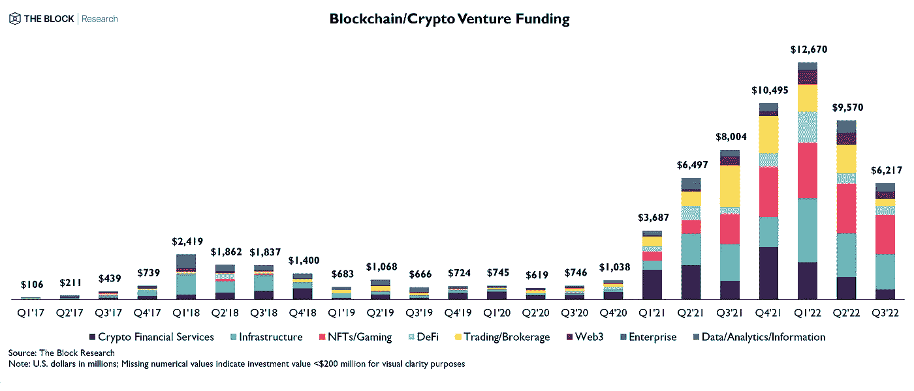
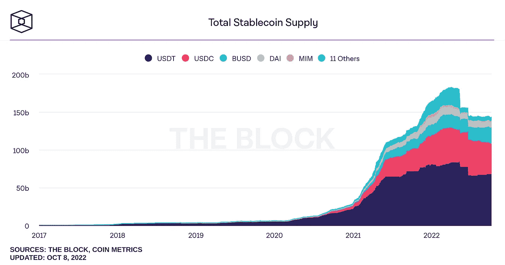

# 本周在 Crypto(10 月 2 日至 10 月 9 日)

> 原文：<https://medium.com/coinmonks/this-week-in-crypto-october-2-october-9-abbcc1dd9968?source=collection_archive---------26----------------------->

从增长新闻开始，Circle 和杰克·多西的 TBD(Block 的子公司)宣布合作，为全球投资者提供与美元挂钩的跨境稳定货币转账和储蓄。这两家公司周三在旧金山举行的 Circle converge 22 会议上公布了他们的合作关系。TBD 是一个开源开发平台，一直致力于一个名为 TBDex 的分散加密交换。

火币环球宣布将把大部分股份出售给总部位于香港的资本管理投资公司。在竞争日益激烈的集中交易市场，这些交易据说有助于该交易所在 2021 年完全退出中国后的国际扩张。

在以太坊新闻中，一名研究人员发布了一份报告，显示 Flashbots 正在审查 Tornado 现金交易。Flashbots 在 MEV Boost 上运行最广泛使用的继电器之一。MEV 是指可以从区块生产中提取的最大价值，并且可以通过对区块中的交易进行重新排序来实现。在以太坊的区块链股份证明上，MEV 是由 MEV Boost 实现的，MEV Boost 是一种开源中间件机制，用于帮助收集事务和提出块，并将它们转发给块验证器。

这条消息很重要，原因有二。首先，这表明网络参与者正在遵守美国的制裁要求。第二，也是更重要的，它强调了如果不是所有的验证者都知道参与者在验证过程的早期是如何组织中继和事务的，那么事务可以被多快地审查。这种审查违背了以太坊等分布式和去中心化网络存在的本质。

DeFi news 报道，治理 MakerDAO 的社区，stablecoin DAI 背后的分散自治组织(DAO)，已拨款 5 亿美元投资美国国债和公司债券。这些资金将来自超额抵押的稳定债券，其中 80%将购买美国短期国债，20%将购买投资级公司债券。

以全球监管新闻结尾。印度储备银行发布了一份关于央行数字货币的概念说明，称数字卢比原型将“很快”推出。它还讨论了几种发行模式，特别是批发 CBDC 将基于账户并由中央银行发行，而消费者 CBDC 将基于令牌并由中介机构管理。

在欧洲，周三上午，欧洲理事会通过了欧盟具有里程碑意义的加密资产市场(MiCA)法规。MiCA 着手将加密货币的发行置于机构监管之下，并首次为欧盟成员国的加密资产服务提供商建立了一个制度。

本周的长篇阅读零在亚洲的 TradFi 玩家兑现和赶上加密空间，即使监管变化。英国《金融时报》的这篇文章研究了在新加坡、香港和澳大利亚推出的新 ETF 和基金产品。

**主要头条:**

杰克·多西的 TBD 与 Circle 合作，将美元稳定的外币储蓄和汇款推向全球

 [## 杰克·多西的 TBD 与 Circle 合作，将美元稳定的外币储蓄和汇款推向全球

### Krisztian Sandor 是美国市场团队的记者，专注于稳定债券和机构投资。他持有…

www.coindesk.com](https://www.coindesk.com/business/2022/09/29/jack-dorseys-tbd-teams-up-with-circle-to-take-us-dollar-stablecoin-savings-and-remittances-global/?utm_source=substack&utm_medium=email) 

火币将被香港资本管理公司收购

 [## 火币将被香港资本管理公司收购

### 火币交易所宣布将接受一家总部位于香港的资本管理公司的收购。

www.theblock.co](https://www.theblock.co/post/175691/huobi-will-be-acquired-by-hong-kong-based-about-capital-management) 

至少 23%的以太坊遵守美国的制裁

 [## 至少 23%的以太坊遵守美国的制裁

### 以太坊社区的一些成员担心这种法规遵从性等同于审查。

www.theblock.co](https://www.theblock.co/post/173417/at-least-23-of-ethereum-blocks-are-complying-with-us-sanctions) 

丽都的 stETH Token 扩展到第 2 层网络乐观和武断

 [## 丽都的 stETH Token 扩展到第 2 层网络乐观和武断

### Sam 是 CoinDesk 的记者，专注于分散技术、DeFi 和 DAOs。他拥有瑞士联邦理工学院、BTC 和马蒂奇。利多，那个…

www.coindesk.com](https://www.coindesk.com/tech/2022/10/06/lidos-steth-token-expands-to-layer-2-networks-optimism-and-arbitrum/?utm_source=substack&utm_medium=email) 

Celsius 的高管们在破产前从 Crypto 套现 1700 万美元

 [## Celsius 的高管们在破产前从 Crypto 套现 1700 万美元

### Krisztian Sandor 是美国市场团队的记者，专注于稳定债券和机构投资。他持有…

www.coindesk.com](https://www.coindesk.com/business/2022/10/06/celsius-top-execs-cashed-out-17m-in-crypto-before-bankruptcy/) 

稳定的硬币发行商将向美国国债和公司债券投资 5 亿美元

 [## 稳定的硬币发行商将向美国国债和公司债券投资 5 亿美元

### Amitoj Singh 是 CoinDesk 报道印度的监管记者。他认为 BTC 和 ETH 低于 CoinDesk 的披露…

www.coindesk.com](https://www.coindesk.com/business/2022/10/06/stablecoin-issuer-makerdao-allocates-500m-for-treasuries-corporate-bond-investment/?utm_source=substack&utm_medium=email) 

印度央行将启动数字卢比试点

 [## 印度央行将启动数字卢比试点

### 印度储备银行表示，央行数字货币原型可能“很快”就会推出。

www.theblock.co](https://www.theblock.co/post/175519/indias-central-bank-to-launch-digital-rupee-pilot) 

欧洲理事会通过 MiCA，欧盟的全面加密法规

 [## 欧洲理事会通过 MiCA，欧盟的全面加密法规

### 如果获得批准，相关法律最早将于 2024 年初出台。

www.theblock.co](https://www.theblock.co/post/174994/the-european-council-passes-mica-eus-comprehensive-crypto-regulation?utm_source=substack&utm_medium=email) 

**大阅读:**

亚洲的加密热潮刺激了大量基金的发行

 [## 亚洲的加密热潮刺激了大量基金的发行

### 访问我们的 ETF 中心，了解更多信息，并探索我们的深入数据和比较工具，亚洲人对加密的狂热…

www.ft.com](https://www.ft.com/content/bed8eb61-a173-48c9-b7ce-0c02ca930652) 

**本周图表:**

> 交易新手？尝试[加密交易机器人](/coinmonks/crypto-trading-bot-c2ffce8acb2a)或[复制交易](/coinmonks/top-10-crypto-copy-trading-platforms-for-beginners-d0c37c7d698c)