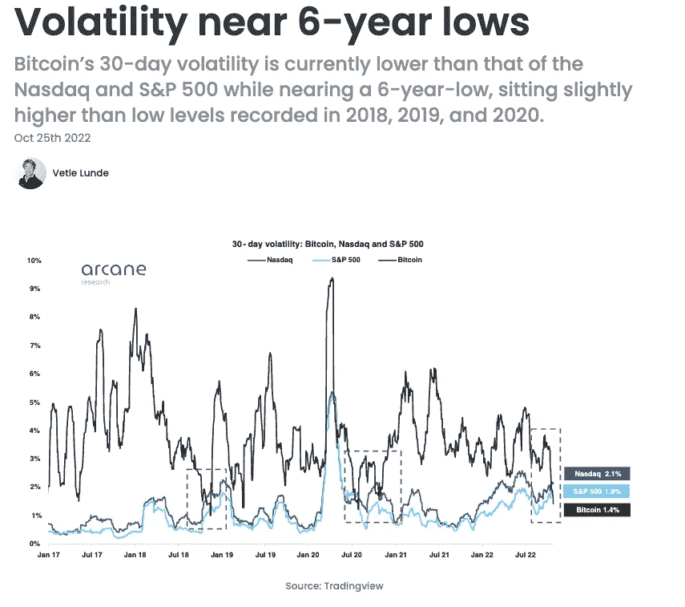

# 本周在 Crypto(10 月 24 日—10 月 31 日)

> 原文：<https://medium.com/coinmonks/this-week-in-crypto-october-24-october-31-677b53f34d32?source=collection_archive---------39----------------------->

过去一周，Web2 领域现有的最大公司与 Web3 新世界的互动传出了重大新闻。从苹果开始，该公司宣布了一系列关于用户如何在其生态系统中访问和使用 NFTs 的变化。首先，该政策表示，用户可以在其商店中的应用程序上购买和销售 NFT，但必须使用其应用内支付系统。应用程序还必须在它们运行的国家获得许可。新闻分享了进一步的见解，即监管者可能不是唯一制定如何塑造 Web3 的规则的人。

接下来，谷歌推出了新的按需区块链节点服务，最初支持以太坊验证器。谷歌进军加密领域代表了一种吸引更多人——即开发者——加入其云服务的方式。最后，来自网络 2 巨头的 Meta(脸书除外)宣布其元宇宙子公司 Reality Labs 今年第三季度亏损 37 亿美元。这使得 Reality Labs 今年迄今的亏损达到惊人的 94 亿美元。该数字突显了 Meta 对该技术的高度信任，然而，其市值的急剧下降表明，并非所有投资者都认同其愿景。

稳定币世界的两个主要公告。首先，FTX 正准备发行自己的稳定币，此前币安已将 BUSD 币作为其交易所的主要稳定币。其次，Near Foundation 宣布成立一项基金，以补充 USN stablecoin(区块链附近的本地 stablecoin)中 4000 万美元的抵押赤字。USN 背后的开发商，分散银行，宣布将逐步减少稳定币。

在监管方面，新加坡金融管理局(MAS)正寻求禁止散户投资者进行债务融资和杠杆加密交易。该提议是新加坡金融管理局发布的咨询文件的一部分，旨在进一步收紧该国的加密监管制度。在这些规定出台之前，包括三箭资本(Three Arrows Capital)和 Celsius 在内的多家知名加密公司今年纷纷倒闭。

本周的长篇阅读呈现了来自潘迪拉首都的最新区块链来信。该读物深入研究了今年的宏观经济形势，研究了加密和传统资产类别之间的回报相关性。

**主要头条:**

在严格的新规则下，苹果欢迎应用商店中的 NFTs

 [## 苹果在严格的新规则下欢迎应用程序商店中的 NFTs 挑衅

### 加密支持者担心计算机巨头的“传统思维”不适合加密，更新了其应用商店评论…

thedefiant.io](https://thedefiant.io/apple-nft-app-policy) 

谷歌通过节点管理产品提升 Web3 战略

 [## 谷歌用节点管理产品提升 Web3 战略——挑衅

### 搜索巨头的云部门推出了针对 Web3 开发者的服务，此举加强了谷歌对 web3 的承诺。

thedefiant.io](https://thedefiant.io/google-node-management-services) 

Meta 在元宇宙的年度亏损高达 94 亿美元

 [## Meta 在元宇宙的年度亏损高达 94 亿美元

### Meta 的元宇宙子公司 Reality Labs 今年第三季度亏损 37 亿美元。

www.theblock.co](https://www.theblock.co/post/180126/metas-metaverse-losses-top-9-4-billion-for-the-year?utm_source=twitter&utm_medium=social) 

从下个月开始，Revolut 将增加加密支付功能

 [## 从下个月开始，Revolut 将增加加密支付功能

### 金融科技公司 Revolut 计划在 11 月 1 日推出一项“从加密中消费”的功能。

www.theblock.co](https://www.theblock.co/post/180628/revolut-to-add-crypto-payment-feature-starting-next-month?utm_source=substack&utm_medium=email) 

FTX 准备发射稳定币:报道

 [## FTX 准备发射稳定币:报告-挑衅

### 继币安之后，FTX 也开始发行自己的盯住美元的货币。FTX 的稳定货币正在酝酿之中，可能于 2010 年推出

thedefiant.io](https://thedefiant.io/ftx-prepares-stablecoin-for-launch-report) 

Near Foundation 花费 4000 万美元替换 USN stablecoin 的“抵押品缺口”

 [## Near Foundation 花费 4000 万美元替换 USN stablecoin 的“抵押品缺口”

### Near Foundation 宣布了一项 4000 万美元的拨款，用于弥补 USN 的抵押缺口，这是一家分散的稳定公司…

www.theblock.co](https://www.theblock.co/post/179605/near-foundation-spends-40-million-to-replace-usn-stablecoins-collateral-gap) 

新加坡监管机构提议禁止借入资金进行加密交易

 [## 新加坡监管机构提议禁止借入资金进行加密交易

### 新加坡金融管理局为零售加密投资者提出了一系列规则，包括他们…

www.theblock.co](https://www.theblock.co/post/179929/singapore-regulator-proposes-banning-crypto-trading-with-borrowed-capital) 

据报道，马斯克计划担任首席执行官，币安被确认为 Twitter 收购案的投资者

 [## 据报道，马斯克计划担任首席执行官，币安被确认为 Twitter 收购案的投资者

### 加密交易所运营商币安是埃隆马斯克收购币安 Twitter 的确认股权投资者…

www.theblock.co](https://www.theblock.co/post/180752/binance-confirmed-as-investor-in-twitter-takeover-as-musk-reportedly-plans-to-take-reins-as-ceo?utm_source=substack&utm_medium=email) 

**大阅读:**

潘迪拉资本区块链信 2022 年 10 月:区块链的 2003 年时刻

 [## 区块链的 2003 年时刻|潘迪拉

### 区块链脱钩许多资产类别都直接与利率挂钩。但是，有一些资产…

panteracapital.com](https://panteracapital.com/blockchain-letter/blockchains-2003-moment/) 

**本周图表:**

> 交易新手？试试[密码交易机器人](/coinmonks/crypto-trading-bot-c2ffce8acb2a)或[复制交易](/coinmonks/top-10-crypto-copy-trading-platforms-for-beginners-d0c37c7d698c)