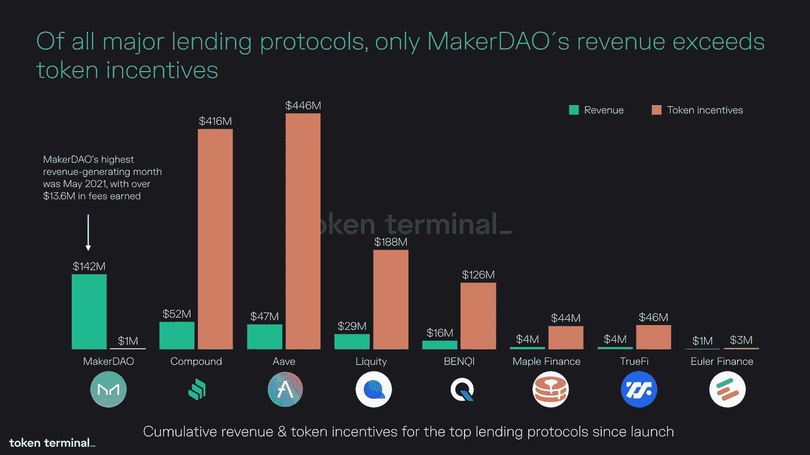

# 本周在 Crypto(9 月 26 日至 10 月 2 日)

> 原文：<https://medium.com/coinmonks/this-week-in-crypto-september-26-october-2-74500cdb0d51?source=collection_archive---------12----------------------->

过去的一周将我们带到了一个新的、有希望是最后的阶段，即从今年早些时候开始的破产集中式加密贷款机构的解禁。FTX 以 14 亿美元的出价赢得了航海家数码公司及其资产的拍卖。Celsius 的首席执行官亚历克斯·马辛斯基(Alex Mashinsky)宣布，在公司债权人委员会要求他辞职后，他将辞职。此后，FTX 表示也在考虑竞购 Celsius 的资产。

商品期货交易委员会(CFTC)通过两项新的执法行动，进一步巩固了自己作为美国加密技术事实上的监管者的地位。第一起是 CFTC 在美国加州北区地方法院对 Ooki DAO 提起诉讼，指控该 DAO 是一个非法人团体，参与了经营未经许可的交易所的非法活动，在多个区块链上提供保证金和期货交易。

第二，专员 Caroline Pham 提议在 CFTC 设立一个新的“零售倡导办公室”。新办公室将专注于零售市场保护，并寻求将“影子”加密金融系统纳入主流监管。

在机构方面，允许跨境支付的银行间报文传送系统 SWIFT 宣布与区块链的价格信息和其他数据提供商 Chainlink 就跨链互操作性协议(CCIP)达成合作伙伴关系，这是一项初步的概念验证。鉴于这两个系统分别对 TradFi 机构和 DeFi 世界的重要性，这种伙伴关系可能会产生深远的影响。

本周的长篇阅读集中在寻求进入 DeFi 空间的道路的集中交易所在制造商 DAO 面前的诱人报价。这篇文章概述了 Gemini 和比特币基地提出的吸引 Maker 将其稳定的币储备存入各自平台的提议。

**主要头条:**

FTX 赢得破产加密贷款商 Voyager 的拍卖

 [## FTX 赢得破产加密贷款商 Voyager 的拍卖

### FTX 以大约 14 亿美元的出价赢得了对破产贷款人 Voyager Digital 及其资产的拍卖。

www.theblock.co](https://www.theblock.co/post/172946/ftx-wins-auction-for-bankrupt-crypto-lender-voyager) 

FTX 的班克曼-弗里德考虑摄氏出价:彭博

 [## FTX 的班克曼-弗里德考虑摄氏出价:彭博

### 彭博周二晚间报道称，FTX 正在考虑竞购 Celsius Network 的资产。

www.theblock.co](https://www.theblock.co/post/173275/sbf-considering-celsius-bid-bloomberg) 

道斯的下一步是什么？分解 CFTC 的最新执法行动

 [## 道斯的下一步是什么？分解 CFTC 的最新执法行动

### CFTC 指控道违反了法律。以下是密码律师和其他人对新闻的解读。

www.theblock.co](https://www.theblock.co/post/172416/whats-next-for-daos-breaking-down-the-cftcs-latest-enforcement-action) 

CFTC 的 Pham 呼吁新的办公室关注零售交易商，着眼于密码保护

 [## CFTC 的 Pham 呼吁新的办公室关注零售交易商，着眼于密码保护

### 一名 CFTC 委员正寻求反驳对该委员会监管加密市场能力的批评。

www.theblock.co](https://www.theblock.co/post/173418/cftcs-pham-calls-for-new-office-focused-on-retail-traders-with-eye-to-crypto-protections) 

加利福尼亚州、纽约州和美国其他州对加密贷款机构 Nexo 采取行动

 [## 加利福尼亚州、纽约州和美国其他州对加密贷款机构 Nexo 采取行动

### 加州的金融保护和创新部发布了一项停止和终止对加密贷款 Nexo…

www.theblock.co](https://www.theblock.co/post/172900/california-issues-cease-and-desist-against-crypto-lender-nexo) 

SWIFT 与加密数据提供商 Chainlink 在 TradFi Play 中的跨链协议上合作

 [## SWIFT 与加密数据提供商 Chainlink 在 TradFi Play 中的跨链协议上合作

### Aoyon Ashraf 是执行主编，在报道股票市场 SWIFT、银行间同业…

www.coindesk.com](https://www.coindesk.com/business/2022/09/28/swift-partners-with-crypto-data-provider-chainlink-on-cross-chain-protocol-in-tradfi-play/?utm_source=substack&utm_medium=email) 

**大阅读:**

文克莱沃斯提供马克尔岛交易，但克里斯滕森可能不感兴趣

 [## 文克莱沃斯提供了马克尔岛交易，但克里斯滕森可能不感兴趣-目中无人

### 双子座的提议存款稳定硬币与制造商是最新的诱人 CeFi MakerDAO，领先的 DeFi 协议，是…

thedefiant.io](https://thedefiant.io/makerdao-gemini-deal) 

**本周图表:**

> 交易新手？试试[密码交易机器人](/coinmonks/crypto-trading-bot-c2ffce8acb2a)或[复制交易](/coinmonks/top-10-crypto-copy-trading-platforms-for-beginners-d0c37c7d698c)