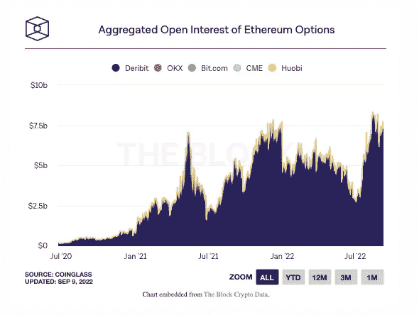

# 本周在 Crypto(9 月 4 日至 9 月 11 日)

> 原文：<https://medium.com/coinmonks/this-week-in-crypto-september-4-september-11-ae628ce4d62?source=collection_archive---------23----------------------->

从工作证明到利益证明块验证机制的合并已经并将主导未来几周的头条新闻。合并预计在 9 月 13 日到 15 日之间进行。在此期间要注意的要点是:POW ETH 令牌是否会出现硬分叉，以及 2)投资者将部署以利用的交易策略。ETH 衍生品已经绕过了所有以前的交易和未平仓合约记录(见下文)。

随着交易量最大的加密货币交易所币安宣布将终止对 USDC 和其他稳定货币的支持，转而支持自己的代币 BUSD，稳定货币战争正在升温。币安将优先考虑自己的稳定币，目的是提高其平台上的交易流动性和资本效率。从中期来看，观察这一举措是否有助于 BUSD 在本土交易平台之外扩大应用将是一件有趣的事情。其次，这是否会对其他 stablecoins 产生负面影响，特别是那些在分散交换和 DeFi 协议中使用的 stable coins。

在监管方面，过去一周，关于加密技术是好是坏的传统争论仍在继续。美国证券交易委员会主席加里·詹斯勒重申了他的坚定信念，即大多数代币都是通过豪威测试的证券。而在更积极和务实的举措中，银行监管内部人士声称，有一种日益增长的趋势是鼓励银行更加开放地参与加密，以此作为注入一些监管严格性的间接方式。

在更广泛的加密采用新闻中，在美国以外的加密领域工作的人的全球趋势可能会提供对 stablecoins 未来使用的见解。56%接受调查的公司将稳定硬币作为主要支付选项，几乎所有公司都提供与美元挂钩的美元硬币支付(USDC)。随着时间的推移，采用率越来越高，风险投资者大举投资加密令牌支付基础设施也就不足为奇了。

最后，本周的阅读材料探讨了在现实世界中使用密码的话题。下面，FT 探索用密码购买房地产的新兴趋势。具体来说，记录了葡萄牙的第一个房地产销售和未来的趋势。

主要标题:

**以太坊激活贝拉特里克斯升级，作为合并前的最后一步**

 [## 以太坊激活贝拉特里克斯升级作为合并前的最后一步

### 以太坊开发者已经激活了贝拉特里克斯，这是一个关键的升级，将为合并准备信标链。

www.theblock.co](https://www.theblock.co/post/167962/ethereum-activates-bellatrix-upgrade-as-last-step-before-the-merge?utm_source=rss&utm_medium=rss) 

**随着合并的临近，以太衍生品打破了左右两边的里程碑**

 [## 当合并迫在眉睫时，以太衍生品打破了左右两边的里程碑

### 八月对于以太坊来说是一个重要的月份，因为区块链正在为九月的合并做准备。

www.theblock.co](https://www.theblock.co/post/167454/ether-derivatives-smash-milestones-left-and-right-as-the-merge-looms) 

**币安停止支持 USDC，另外两个稳定的国家支持自己的 BUSD**

 [## 币安将终止对 USDC 的支持，而另外两个稳定的国家支持自己的 BUSD

### 币安正采取行动，在其加密货币交易所优先考虑本国的稳定货币 BUSD。

www.theblock.co](https://www.theblock.co/post/167885/binance-to-end-support-for-usdc-other-stablecoins-in-favor-of-its-own-busd) 

**前美国监管机构称数字资产属于传统银行业**

 [## 前美国监管机构称，数字资产属于传统银行业

### 至少一些人认为，更多的加密业务和创新应该转移到传统银行业

www.theblock.co](https://www.theblock.co/post/168063/digital-assets-belong-in-traditional-banking-ex-u-s-regulator-says) 

**Gensler:美国证券交易委员会已经“明确”了加密货币**

 [## Gensler: SEC 对加密货币已经“明确”了

### 加里·詹斯勒并没有从密码行业退缩。

www.theblock.co](https://www.theblock.co/post/168600/gensler-sec-has-been-clear-on-cryptocurrencies) 

**研究显示，美国以外的 Web3 员工更喜欢加密支付**

 [## 研究显示，美国以外的员工更喜欢加密支付

### 美国加密工程师的工资中位数是 150，000 美元，美国以外的大多数加密员工的工资是…

thedefiant.io](https://thedefiant.io/web3-salary-study) 

**8 月 crypto VC 综述:融资创 15 个月新低**

[https://www . the block crypto . com/news+/168379/August-crypto-funding-round up-VC-deals](https://www.theblockcrypto.com/news+/168379/august-crypto-funding-roundup-vc-deals)

大阅读:

**加密房地产:建立在数字资产上的房地产市场**

 [## 加密房地产:建立在数字资产上的房地产市场

### 葡萄牙首次以加密货币进行的房地产销售可能看起来不起眼，但对那些人来说并不这么认为…

www.ft.com](https://www.ft.com/content/51e207fa-8ecb-4068-82f9-74a789375524) 

本周图表:

> 交易新手？尝试[加密交易机器人](/coinmonks/crypto-trading-bot-c2ffce8acb2a)或[复制交易](/coinmonks/top-10-crypto-copy-trading-platforms-for-beginners-d0c37c7d698c)